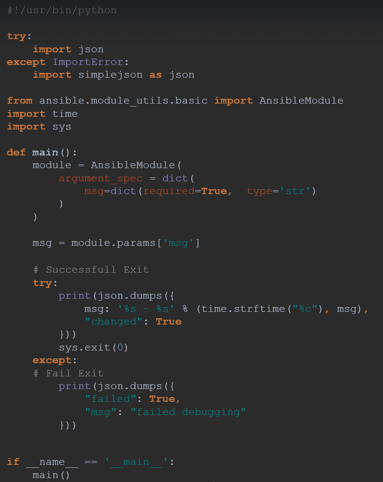

# 12.0 - Custom Modules

Status: Done

# 12.1 - Introdcution

- Modules are each item in a task that carries out a particular command, this can be for anything such as:
    - System management
    - Running commands
    - Managing files
- Each module is a set of python script(s) to perform a particular action - this leads to the potential problem of "what if there is no ready-made solution?"

# 12.2 - Example: Custom Debug

- For any custom plugins, one must develop a custom python script to support it. This can then be stored in the project and referred to via an environment variable, or stored alongside other ansible modules downloaded.
- Example:

- AnsibleModule helps parse arguments
    - Initiated by providing an argument_spec, a spec outlining how arguments should be provided to the module in a playbook, specifying parameters such as:
        - Type
        - Required (Boolean)
    - module.params['argname'] then passes the arguments into the code for usage
    - Any other actions with the code can then follow.

---

# 12.3 - Best Practices

- Modules should always come with documentation for live viewing and in the ansible docs
- `ansible-doc <module name>`
- For the CLI, this is defined in the same .py file for the module as YAML e.g.

- Example Use Cases can also be added - again added under the main python code

- All built-in modules are located by default at `/usr/lib/python/dist-packages/ansible/modules`
- If to be used by a role, add the module under "library" folder in a project
- For cross-projects, place anywhere and call it via the env `ANSIBLE_LIBRARY`

---

# Guidance

- Additional guidance for testing is available in the ansible docs.