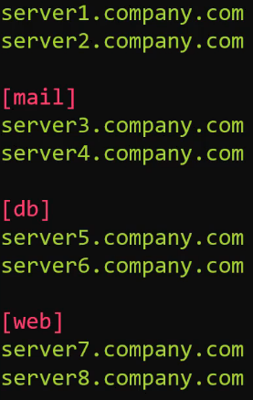

# 03.1 - Ansible Inventory

Complete: No
Flash Cards: No
Lab: No
Read: Yes
Status: Complete
Watch: Yes
You done?: 🔥🔥🌚🌚

# Notes

- Ansible can work with one or multiple systems in the system at the same time
    - This requires it to establish connection via SSH (Linux) or Powershell Remoting (Windows)
- This makes Ansible agentless - no additional packages are required for connection to be established to the target machines, unlike similar tools.
- Information regarding the target machines is noted in an Inventory file, stored by default in /etc/ansible/hosts , an example follows:
    - Servers can be listed one after another as standalone entries or as part of a group, denoted by [groupname]
    
    
    

- Aliases for hosts, for ease of reference, can be added in a manner similar to:

```bash
<alias> ansible_host=server.company.com
```

---

- Other parameters are available for use in inventory files, such as:
    - ansible_connection - ssh/winrm/localhost
        - Determines how ansible connects to the target server - Linux or Windows-based system, or applying changes to localhost
    - ansible_port - 22/5896
        - 22 for SSH by default
    - ansible_user - root/administrator
        - User logging in to make changes, set to root by default
    - ansible_ssh_pass - Password
        - ssh password for linux - NOT RECOMMENDED to do this in plaintext, ssh key-based passwordless authentication should be used, especially in production environments.