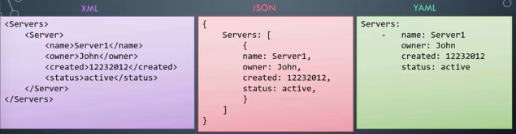

# 04.1 - Introduction to YAML

Complete: No
Flash Cards: No
Lab: Yes
Read: Yes
Status: Complete
Watch: Yes
You done?: 🔥🔥🔥🌚

## Notes

- All Ansible Playbooks are written in YAML
- Text or Configuration files
- Analagous to the likes of JSON and XML, YAML is just another way of representing data



---

- Generally, data is presented in key-value pairs i.e.
- Key-Value Pair:

```yaml
key1: value1
```

- Arrays:
  - `-` indicates an element of an array

```yaml
array1:
- key1: value1
- key2: value2
```

- Dictionaries:
  - All entries in a particular dictionary offset by a set amount of spaces.

```yaml
dictionary:
  key1: value1
  key2: value2

dictionary2:
  key1: value1
```

- Spacing determines what data is a property of which, any values that are child properties of a particular parent must have the same amount of spaces before definition.
- Note:
  - You may have a need to store different sets of information for a particular "thing".
  - Dictionary within dictionaries are used for using multiple values of different types
  - Arrays used for different values of the same types
  - Use a list of dictionaries for storing the same set of information for multiple entries of similar nature. In the example below, each element in the array is in fact a dictionary.

    ```yaml
    Fruits:
    - Banana:
        calories: value
        fat: value
        carbs: value
    - Grape:
        calories: value
        fat: value
        carbs: value
    ```

- When to use dictionaries v lists:
  - Dictionary = Unordered data
  - List = Ordered

    ---

## Exercises

  1. Given a dictionary with the property `property1` and value `value1`

  Add an additional property `property2` and value `value2`.

  ```yaml
  property1: value1
  property2: value2
  ```

  1.

  Given a dictionary with the property `name` and value `apple`. Add additional properties to the dictionary.

  | Key/Property | Value |
  | --- | --- |
  | name | apple |
  | color | red |
  | weight | 90g |

  ```yaml
  name: apple
  color: red
  weight: 90g
  ```

  1.

  A dictionary `employee` is given. Add the remaining properties to it using information from the table below.

  | Key/Property | Value |
  | --- | --- |
  | name | john |
  | gender | male |
  | age | 24 |

  ```yaml
  employee:
      name: john
      gender: male
      age: 24
  ```

  1. Now try adding the address information. Note the address is a dictionary

  | Key/Property | Value |
  | --- | --- |
  | name | john |
  | gender | male |
  | age | 24 |
  | address | Key/PropertyValuecityedisonstatenew jerseycountryunited states |

  ```yaml
  employee:
      name: john
      gender: male
      age: 24
      address:
        city: edison
        state: new jersey
        country: united states
  ```

  1. Given an array of apples. Add a new apple to the list to make it a total of 4.
  2. add two more
  3. add two mangoes to the list

  ```yaml
  - apple
  - apple
  - apple
  - apple
  - apple
  - apple
  - mango
  - mango
  ```

  1.

  We would like to add additional details for each item, such as color, weight etc. We have updated the first one for you. Similarly modify the remaining items to match the below data.

  | Fruit | Color | Weight |
  | --- | --- | --- |
  | apple | red | 100g |
  | apple | red | 90g |
  | mango | yellow | 150g |

  ```yaml
  -
      name: apple
      color: red
      weight: 100g
  - name: apple
    color: red
    weight: 90g
  - name: mango
    color: yellow
    weight: 150g
  ```

  1. We would like to record information about multiple employees. Convert the dictionary `employee` to an array `employees`

  ```yaml
  employees:
  -   name: john
      gender: male
      age: 24
  ```

  1. Add an additional employee to the list using the below information.

  | Key/Property | Value |
  | --- | --- |
  | name | sarah |
  | gender | female |
  | age | 28 |

  ```yaml
  employees:
      -
          name: john
          gender: male
          age: 24
      - name: sarah
        gender: female
        age: 28
  ```

  1.

  Now try adding the pay information. Remember while `address` is a dictionary, `payslips` is an array of `month` and `amount`

  | Key/Property | Value |
  | --- | --- |
  | name | john |
  | gender | male |
  | age | 24 |
  | address | ... |
  | payslips | #monthamount1june14002july24003august3400 |

  ```yaml
  employee:
      name: john
      gender: male
      age: 24
      address:
          city: edison
          state: 'new jersey'
          country: 'united states'
      payslips:
      - month: june
        amount: 1400
      - month: july
        amount: 2400
      - month: august
        amount: 3400
  ```
