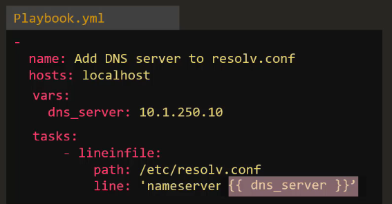
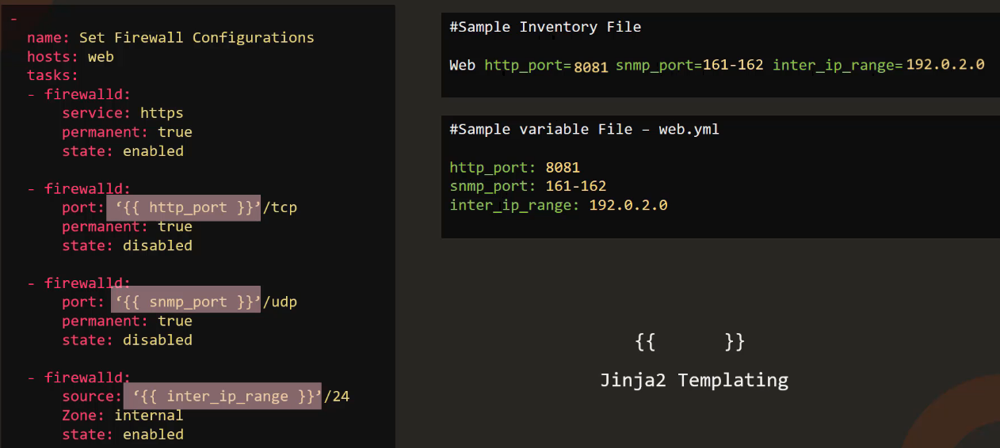

# 07.1 - Ansible Variables

- [07.1 - Ansible Variables](#071---ansible-variables)
  - [Introduction](#introduction)
    - [Using Variables](#using-variables)

## Introduction

- Variables are used in a very similar manner to other programming / scripting languages.
- Could be used to allow changeability of username / host details.
- Ansible inventory files can be the prime point for variables
- Variables can be added in playbooks in a similar manner to:

- Alternatively, they can be included in a separate variables file and referenced by "incudes" functions, more on that in a later section:

### Using Variables

- To use variables, enter the variable name in ‘{{}}' i.e.

- Example two - using inventory file playbooks. variable yaml files etc:

- Note - This is Jinja Templating!
