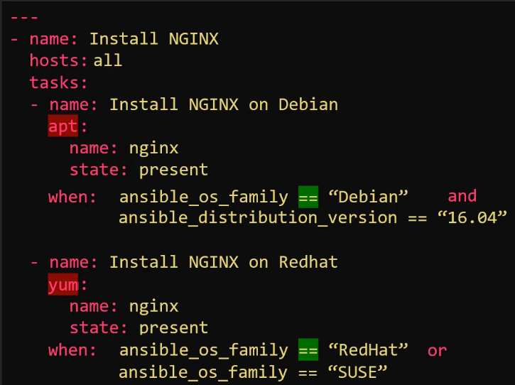

# 08.1 - Conditionals

Complete: No
Flash Cards: No
Lab: No
Read: No
Status: Complete
Watch: No
You done?: 🌚🌚🌚🌚

# Notes

- Consider two Playbooks that look to install NGINX, but one on Red Hat, another on Debian. This requires the use of the yum and apt packages respectively.

- Rather than have two separate playbooks for this same task, it's more advisable to bring the task into one playbook and use a conditional to perform the appropriate module.
- Conditionals are typically used via "when" statements e.g.:

- And and Or separators can be used for multiple conditions

- Conditionals may also be used in loops, an example follows, where the packages will only be installed if required is set to true:

- Conditionals can also be used in conjunction with the outputs of prior tasks, this would require the use of the register module.
    - The example causes a mail message to be sent to the email address provided only if the httpd service is shown to be down

