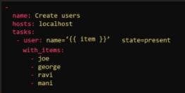

# 09.1 - Loops

Complete: No
Flash Cards: No
Lab: No
Read: No
Status: Complete
Watch: No
You done?: 🌚🌚🌚🌚

# Notes

- Loops allow the same command(s) to be ran iteratively to accommodate an ever-changing value(s)
- A common example is creating users

- Note: **‘{{ item }}'** is used to call the loop iteration variable
- What happens if you have multiple sets of variables e.g. user name and user id
    - Use a list of dictionaries in the loop

- Note: Would now refer to items in the list of dictionaries / arrays to call separate variables e.g.:
    - item.name
    - item.uid
- Note: The loop module is new to ansible, it was previously covered by the with_ module; an example follows:

---

- With_ allows more flexibilty compared to loops e.g.:
    - with_items
    - with_files
    - with_url
    - with_env
- These are all custom plugins primarily focused on lookup tasks.