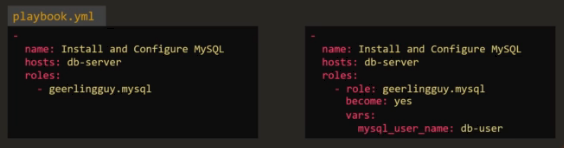

# 10.1 - Ansible Roles

Complete: No
Flash Cards: No
Lab: No
Read: No
Status: Complete
Watch: No
You done?: 🌚🌚🌚🌚

# Notes

- Roles can be assigned to each server involved in an Ansible playbook to allow them to perform particular tasks.
- Assigning a role in Ansible requires the performance of tasks such that the server can perform the required task. Example:
  - mysql
    - Prerequisite and mysql packages should be installed
    - mysql service configuration
    - database and user configuration
  - nginx
    - Prerequisite and nginxpackages should be installed
    - Service configuration
- Example playbook:


- If the tasks can be done on a Playbook, why are roles required?
- Whilst it's true that you could use a playbook that you can share with others, there may be changes required for each user.
- Instead, one can package this playbook as a role, which can then be called in a playbook for easier reusability


- Roles therefore allow the best-practices of Ansible to be adhered to.
- Typical directory structure:
  - Role
    - tasks carried out by role(s)
    - variables used by tasks
    - defaults values for tasks
    - handlers
    - templates used by playbooks
- Roles also allow easier sharing of code and roles within the community - Ansible Galaxy being a primary example

---

## Getting Started with a Role

- Create the directory structure
- Run the ansible-galaxy command:

```bash
ansible-galaxy init <role-name>
```

- This will create the skeleton structure required for the role, and the code can then be moved into it as required.
- When referencing a role in a playbook, one must specify its location.
  - One option would be to create a designated directory for the roles
  - Ansible by default will look in /etc/ansible/roles
- Roles can then be shared via GitHub in Ansible Galaxy
- Ansible-galaxy's UI or CLI have search functionality to help look for "suitable" roles for users.
- To install a role:

```bash
ansible-galaxy install <role name>
```

- This will extract the role to the default directory defined by the ansible config file
- Roles can then be referenced in the Playbook(s) where required, either on its own or as a list of dictionaries; the latter offering the option to add more variable inputs.


