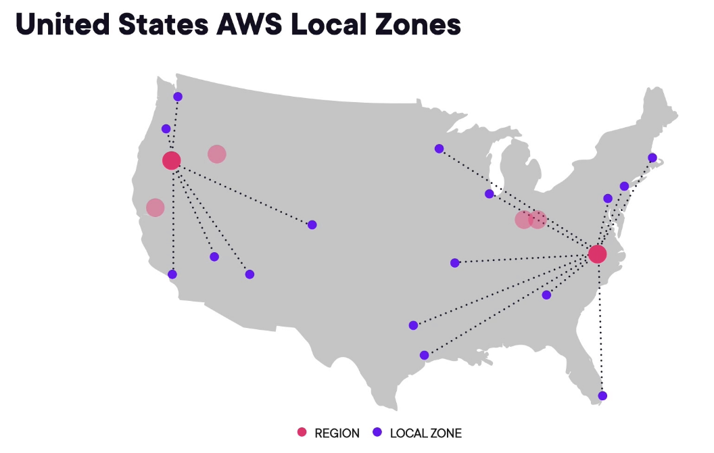
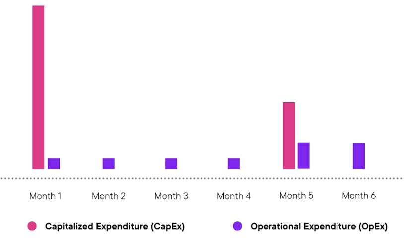
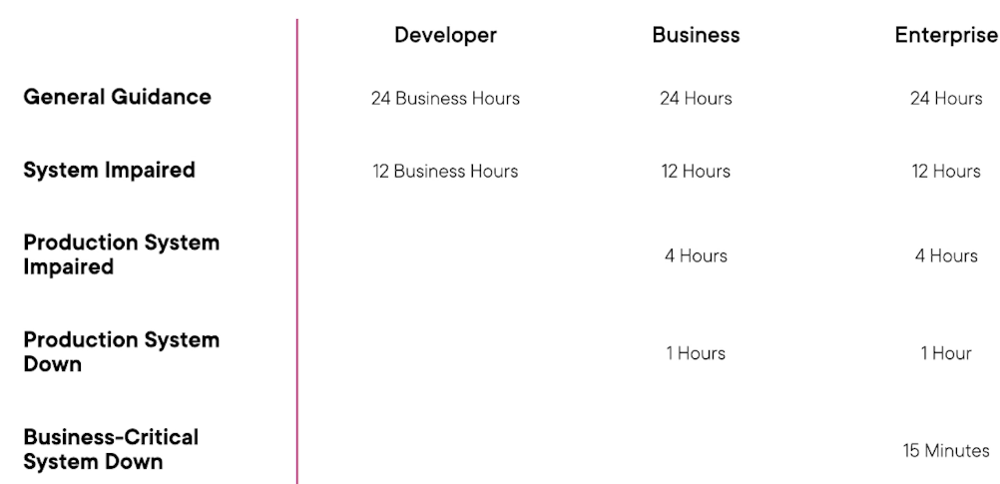

# Fundamental Cloud Concepts

Tags: Done

# Course Overview

- AWS Certs add value for technical and non-technical resources.
- Covers:
  - Cloud Computing Concepts
  - Organization of AWS Global Infrastructure
  - Economics of Cloud Computing
  - Tools and Services

# Understanding Cloud Computing

## Setting up an AWS Account

- [aws.amazon.com](http://aws.amazon.com) → Create AWS Account
  - Add root email address and account name
- Verify the email address
- Create root user password
- Add contact information and account information e.g. address and name
- Add payment details
- Confirm identity via SMS or call.
- Select support option (free will suffice)
- Go to AWS Management Console → Root User → Login

### Set Up Billing Alerts

- Account dropdown → Billing management
- Budgets → Create budget → Create from template (if desired)
  - Fill out fields as appropriate.

## Traditional Data Centres

- Consider a company not on the cloud:
  - They focus their application release in the US first, in US-based datacentres
  - They want to launch in Asia and Europe and require funding to have infrastructure built there to support the needs
  - Resources needed include:
    - Web servers
    - File servers
    - Database servers
- Manually setting all this up for each region is long, arduous, and error-strewn.
- Further problems arise when demand scales in any of the pre-existing regions.
- Moving to cloud resolves all of these problems:
  - No large upfront investment and planning required
  - Use resources as required rather than full unpredictable forecasting
  - New data centres and servers can be spun up / torn down as required
  - Lower maintenance costs
  - Security and compliance burden is alleviated from the organization.

## Benefits of Cloud Computing

- Trade capital expense for variable expense
  - No need for initial investment to build out a datacentre
  - Only pay for the resources used and how long they’re used for
- Economies of scale
  - AWS buys the datacentre resources on a large scale, allowing them to provision the resources on such a price - savings are passed to the customers
- No need to guess capacity - cloud computing can allow scaling on demand.
- Speed and agility increased - resources for testing and deployment can be spun up / torn down at will for minimal costs.
  - Reduces time required to maintain infrastructure
  - Reduced risk for the organisation around security and compliance
  - Provides access to emerging technologies
- No more cost for maintaining data centres - more focus on the employees and other resources
- Data can be easily switched to different regions.

<aside>
💡 **Elasticity:**

The ability to acquire resources as needed and release when no longer required.

**Reliability:**

A solution’s ability to provide functionality for its users when needed.

</aside>

## Types of Cloud Computing

<aside>
💡 Cloud Computing:

The on-demand delivery of compute power, database storage, applications, and other IT resources through a cloud services platform via the internet with pay-as-you-go pricing.

</aside>

### Cloud Computing Models

- Models vary based on the control users want to have over the resources
- Infrastructure as a Service (IaaS)
  - Any servers users deploy to the cloud
  - Can be configured to our desire and users are responsible for maintenance
- Platform as a Service (PaaS)
  - A service preconfigured and available for users
  - It can then be customised by users as appropriate e.g. Wordpress, AWS Elastic Beanstalk
- Software as a Service (SaaS)
  - Any software users have access to and can use
  - Users do not need to consider or maintain the infrastructure.

### Cloud Deployment Models

- Public Cloud: Deployment to a provider like AWS
- On-Premises Private Cloud: Deployment to a cloud-like platform in a private datacenter (VMware is a common example)
- Hybrid: A combination of both e.g. cloud applications connected to a private data center.

## Cloud Computing Scenarios

## Scenario 1

- Several production workloads in its datacentre
- VMware to manage infrastructure in their data centre
- Want to use AWS and integrate it with their data center for new workloads.
- What would they be following?
  - Hybrid - Both public and private cloud used.

## Scenario 2

- Company determining whether to fund a new line of business
- Team looking to monetize a new emerging technology
- New business line requires new infrastructure
- What benefit is most relevant?
  - Increased agility and elasticity
  - Pay-as-you-go

## Scenario 3

- Insurance company
- Moving to cloud instead of colocating servers
- Want to have maximum control for security and compliance reasons
- What cloud computing model
  - IaaS - Servers can be configured as required and maintained.

---

# AWS Global Infrastructure

## AWS Regions and Availability Zones

- AWS Regions
  - Resource / Service deployment location as geographic regions
  - Each geographic location has a cluster of data centres
- Availability Zones
  - A zone of one or more data centres
  - Multiple availability zones are included per AWS region
  - All located within the geographic area of the AWS region (sub-regions effectively)
  - Have redundant power, networking and connectivity for disaster recovery / high availability purposes.
- Example - US has 6 regions, each with at least 3 availability zones
- **Availability:** The extent to which an application is fulfilling its intended purpose. Applications that are highly-available are built in a manner where a single failure won’t lessen its ability to be fully operational.

### Region and Availability Zone Naming

- Example: us-east-2a
- **Format:** <AREA>-<SUB-AREA>-<NUMBER><Availability Zone Letter>

## Local and Wavelength Zones

### **Local Zone**

- Aim to place compute, storage, database, and other AWS services closer to end-users
- An extension of a particular AWS region
- Provides high-bandwidth, secure connections betwen local workloads and those running in AWS region.
  - Allows seasmless connection to the full range of in-region services through the same APIs and toolsets.

### Wavelength Zones

- AWS infrastructure deployments that embed AWS compute and storage services within communication service providers 5G networks.
- Allows application traffic from 5G devices to reach application servers without leaving the telecommunication networks.

## AWS Edge Locations

### **Points of Prescence:**

- Elements of AWS global infrastructure that exist outside of AWS regions.
- Located in or around populated areas - specific AWS services use them to deliver content to end users as quickly as possible.
- 2 Types of infrastructure per point of prescence:
  - Edge locations
  - Regional edge caches

### Edge Locations

- Used as nodes of a global content delivery network
- Primarily used by Amazon CloudFront and AWS Route 53
- Allows AWS to serve content from locations closest to users.

## Visualizing AWS Global Infrastructure

- **[Global infrastructure](https://aws.amazon.com/about-aws/global-infrastructure)**
- Edge locations listed per region amongst other information

## Scenarios

### Scenario 1

- Looking to transfer to AWS with a few workloads
- Requirement to store backup data in multiple geographic areas
- What element of AWS Global Infrastructure will help best?
  - AWS Regions - Regions are geographical areas e.g. could store data in one and run the applications in another.

### Scenario 2

- Content served across the world
- Wanting to optimize performance to users worldwide
- Want to leverage a content delivery network
- What element is best suited to help this from AWS infrastructure?
  - Edge Locations

### Scenario 3

- Legacy applications transitioning to AWS
- 99.5% uptime required
- Don’t want issues at single datacentres to cause outages
- What element of the global infrastructure will help?
  - Availability zones

# Understanding Cloud Economics

## Economics of the Cloud

- **Capitalized Expenditure (CapEx):**
  - Upfront costs or investments to attain a fixed asset
  - Example for building a datacenter would be the building, servers, etc.
- **Operating Expenditure (OpEx)**
  - Day-to-day business activities
  - Example being maintenance costs

### Handling Demand in Data Centre

- As application usage grows, data centres need to grow with it in capacity
- When first launched, there would be a lot of unused capacity
- Eventually, demand would exceed capacity → data centre capacity needs to be increased
- In terms of CapEx vs OpEx
  - CapEx starts out large due to initial acquiring
  - OpEx maintained at generally consistent levels.
  - Any time the capacity needs to be increased, CapEx goes up.

### Handling Demand in the Cloud

- Companies in the cloud can ensure the capacity is always “just enough” to ensure the demand is met
- As the cloud resources are being leveraged, there is no CapEx costs, instead, the OpEx costs vary depending on the application usage adn the demand.

### Financial Implications

| Own Data Centre                                                  | Cloud Infrastructure                                                    |
| ---------------------------------------------------------------- | ----------------------------------------------------------------------- |
| Large CapEx                                                      | No upfront investment                                                   |
| Potential for under used capacity or unmet demand                | Pay as you go for infrastructure (OpEx)                                 |
| Increasing capacity takes time and additional investment (CapEx) | Capacity scales to meet user demand and can be immediately provisioned  |
| Monthly costs will map to predicted infrastructure needs         | Costs mirror usage levels - use more, pay more, use less, pay less etc. |

## Organizing and Optimizing AWS Costs

- **AWS Cost Explorer**
  - User Interface for AWS Cost Analysis
  - Provides breakdowns per:
    - Service
    - Cost tag
  - Provides 3-monthly forecasting.
  - Provides recommendations for cost optimizations.
  - Data accessible via API
- **AWS Budgets**
  - Takes data from AWS Cost explorer to plan and track usage across services.
  - Tracks cost per service, service usage, reserved instance utilisation and coverage, and savings plans utilisation and coverage.
- **AWS Cost Planning Tools:**
  - **AWS Pricing Calculator**
    - Allows in-depth analysis of cost for multiple AWS services for cloud-based workloads.
  - **AWS Migration Hub:**
    - Provides recommendations and a business case for transitioning workloads to the cloud.
- **Deprecated Tools:**
  - AWS TCO Calculator - Enabled estimated savings for using cloud infrastructure to be determined
  - AWS Simple Monthly Calculator
- **AWS Resource Tags:**
  - Metadata assigned to specific AWS resources
  - Key/Value
  - Common usage includes department, environment, or project.
  - Cost allocation can report can include costs grouped by active tags.
- **AWS Organizations:**
  - Allows organisations to manage multiple accounts under a single master account
  - Offers consolidated billing for all accounts.
  - Facilitates centralized logging and security standard implementation.

## Building a Business Case for the Cloud

- Steps to build a business case:
  - Analyze the current workloads
  - Forecast the infrastructure needs
  - Create a Total Cost of Ownership (TCO) for both options.
- Tools available:
  - **AWS Migration Hub** - Gathers information from multiple services and tools in AWS to forecast required infrastructure.
  - **Migration Evaluator** - Similar to the migration hub but provides a more in-depth analysis.

## AWS Pricing Calculator

- Used to estimate future workloads
- Accessible at calculator.aws
- Create Estimate → Fill out desired fields i.e.:
  - Location or Service Type
  - Configure Services:
    - Quick Estimate or Advanced Estimate
    - Service Details e.g. for EC2 check the resources
    - Expected utilisation
    - Pricing Strategies
    - Any sub-services e.g. Elastic Block Storage (EBS) for EC2 Instances
- Upfront, Monthly and Total 12 month costs are provided upon completion.
- Any additional services can then be added to the estimate as required e.g. Amazon RDS for PostgreSQL
- The estimate can then be exported or shared.
- Additionally estimates can be grouped within the estimate e.g. group based on “application” or “function”.

## Reviewing Costs - Costs Explorer

- AWS Accounts → Profile Dropdown → Billing Dashboard → Cost Explorer → Launch Cost Explorer
- Provides initial overviews such as:
  - Current monthly cost
  - Forecast month-end costs
  - Daily cost grouping
    - Can be filtered per AWS Service, region, resource, etc.
- From LHS pane → Reports
  - Includes reports such as:
    - Monthly costs per account
    - Daily costs

## Applying Cloud Economics

### Scenario 1

- Multiple departments within AWS
- FInance requesting clean separation of AWS costs within departments
- All resources are within a single AWS Account
- What approach would meet this need for future costs with minimal effort?
  - Resource tags

### Scenario 2

- Company considering transition to the cloud
- 2 physical data centres
- Stakeholders wanting financial insight
- Which approach to make a business case?
  - Use the migration hub or migration evaluator

### Scenario 3

- Web developer
- Looking to move site to cloud.
- Financial estimates needed.
- What approach?
  - Use the pricing calculator.

# Supporting AWS Infrastructure

## Support Resources

- AWS support → Allows support tickets to be submitted
  - Includes Personal Health Dashboard. and Trusted Advisor
- **AWS Support:**
  - Enables support from AWS resources for workloads running in the cloud
  - Provided in different tiers based on need and scope
  - Includes tools to provide automated answers and recommendations
- **AWS Personal Health Dashboard**
  - Provides alerts and remediation guidance when events occur in AWS that may impact you e.g. regional outages
- **AWS Trusted Advisor**
  - An automated tool to check AWS usage against best practices
  - Accessible from the AWS console
  - Provides multiple checks based on the support plan tier, in addition to core checks
  - Checks include:
    - Cost optimization
    - Performance
    - Security
    - Fault Tolerance
    - Service Limits

## AWS Support Plan Tiers

- Support plan tiers are based on:
  - Communication method
  - Response Time
  - Cost
  - Type of guidance offered
- **Basic Support**
  - Provided for all customers
  - Access to trusted advisor (7 core checks)
  - Documentation, forums, and 24x7 customer service access
  - AWS Personal health dashboard
  - Free
- **Developer Support**
  - Everything in basic
  - Includes access to support engineers via email during business hours
  - 1 Primary contact
  - $29/month
- **Business support**
  - All of developer support
  - Full set of trusted advisor checks
  - 24x7 phone, email and chat access to support engineers
  - unlimited contacts for support requests
  - Third-party software support provided
  - $100/month (based on AWS usage)
- **Enterprise Support:**
  - All features of business support
  - Includes technical account manager (TAM)
  - Includes concierge support team
  - $15,000/month
- Support Response Times dependent upon the nature of the request:
  - General Guidance
  - System Impaired
  - Production System Impaired
  - Production System Down
  - Business-Critical System Down

## AWS Support Tools

- AWS Console → Health View and Trusted Advisor are automatically included as widgets
  - Also accessible from search bar
- **Trusted Advisor:**
  - Shows summary and recommendation categories
  - Recommendations only provided based on checks available.
  - Details on recommended actions provided, with remediation steps.
  - Will show checks which aren’t included for reference.
  - Checks can be downloaded.
- **AWS Health Dashboard**
  - Service health dashboard
  - Issue and events logs
  - Service history.

## When You Need Help

- Resources available for help:
  - AWS Quickstart - Provides steps for standard platform deployments
  - AWS Partner Network Consulting Partners - 3rd Party Consultants that are Partners with AWS
  - AWS Professional Services

## Infrastructure Support Scenarios

### Scenario 1

- Moving multiple workloads into AWS
- One workload is mission-critical
- 24/7 support needed
- What support level? - Business Support

### Scenario 2

- Evaluating AWS for future or workloads
- Workloads supports multiple offices globally
- Email text or call to support needed.
- Response within 15 mins needed.
- What support plan? Enterprise

### Scenario 3

- Account for a personal project
- No Technical Guidance needed
- Want access to Trusted Advisor etc
- Basic Support plan needed.
