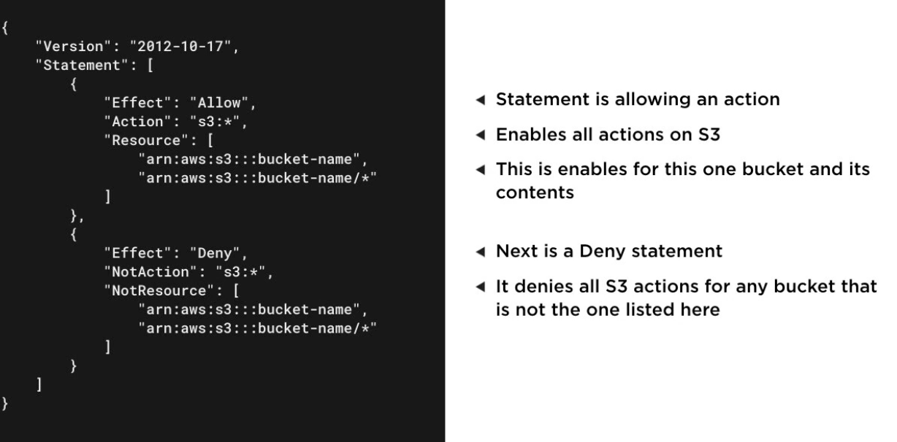

# Introduction to Security and architecture on AWS

Tags: Done

# AWS Architecture Core Concepts

## Security and Architecture overview

- All AWS users must remain in line with AWS's Acceptable Use Policy - determines acceptable / unacceptable usage.
- Unacceptable usage includes:
  - Sending unsolicited mass emails
  - Hosting or distributing harmful content
- Details penetration testing for specific services.

### Least Privilege Access

- When granting access to a service, grant only the minimum privileges required to complete the task
- Also suggests not to use root accounts for daily account activities.

## Shared Responsibility Model

- When working in the cloud, security and compliance is a shared responsibility between AWS and the customer.
- **AWS Responsibility - Security of the cloud**
  - Access and training for Amazon employees
  - Global data centre and underlying data network maintenance
  - Hardware for global infrastructure maintenance
  - Configuration management for infrastructure
  - Patching cloud infrastructure and services
- **Customer Responsibility - Security for what they do in the cloud**
  - Individual access to cloud resources and training
  - Data security and encryption (in transit and at rest)
  - Operating system, network and firewall configuration (if using IaaS)
  - Code deployed onto cloud infrastructure.
  - Patching guest OS and custom applications

## AWS Well-Architected Framework

- A collection of best practices across 5 key areas to create systems that add business value on AWS
- Key Pillars:
  - Operational Excellence - Running and monitoring systems for business value
  - Security - Running and monitoring systems for business value
  - Reliability - Enabling infrastructure to recover from disruptions
  - Performance efficiency - Efficient resource usage
  - Cost optimizations - Minimize costs for desired value
- Available at [https://aws.amazon.com/architecture/well-architected](https://aws.amazon.com/architecture/well-architected)

## High-Availability and Fault Tolerance

- Under the reliability pillar of the well-architected framework.
- 2 main categories of reliability:
  - Fault-Tolerance - Being able to support the failure of components within architecture
  - High-Availability - Keeping entire solution running as expected in the event of disruption
- Building solutions on AWS, consider:
  - Most managed AWS services offer high availability out of the box
  - When building solutions on EC2, fault tolerance needs to be architected.
  - Multiple availability zones should be leveraged
  - Some services can enable fault tolerance in custom applications e.g.:
    - Simple Queue Service (SQS)
    - Route 53

## Compliance

- Standards to note include:
  - PCI-DSS: For processing credit cards
  - HIPAA - Healthcare data
  - SOC 1-3 - Third-party reviews of operational processes
  - FedRAMP - US Government Data handling
  - ISO - Personal Identifier Info
- Services to maintain compliance include:
  - AWS Config - Provides conformance packs for standards
  - AWS Artifact - Provides self-service access to reports
  - Amazon GuardDuty - Provides intelligent threat detection
- AWS Config → Conformance Packs → Deploy Conformance Pack
  - Use template as appropriate - many standards have templates pre-done
- AWS Artifact → Find desired compliance standard for review.
  - May need to sign NDA with AWS to allow access

## Scenarios

### Scenario 1

- Application processing credit cards
- Processing done directly not through a service
- PCI DSS compliance report needed for AWS
- Where to get this info? AWS Artifact to get the reports.

### Scenario 2

- Personal information stored in their system
- What's the responsibility for security
- What's their responsibility? Review the Shared responsibility model - Shared with AWS - the company is responsible for the security and compliance of anything they do on AWS with services and resources.

### Scenario 3

- New tool for digital asset management
- How best to leverage the capabilities? Review the well-architected framework

---

# AWS Identities and User Management

## Introduction to AWS IAM

- Identity and Access Management (IAM)
- Controls access to AWS resources
- Free to use service
- Covers both authentication and authorization
- Supports identity federation through SAML providers including Active Directory
- **IAM Identity Types:**
  - Users - Account for single individual to access resources
  - Groups - Allows you to manage permissions for a group of IAM users
  - Roles - Enables a user or AWS service to assume permissions for a task
- **Policies in AWS IAM**
  - JSON document that defines permissions for an AWS IAM Identity
  - Defines both AWS services that the identity can access and what actions can be done on that service
  - Can be customer-managed or managed by AWS.

- Best practices:
  - Set up multi-factor authentication → provides additional security
  - Least privilege access → only grant the minimal permissions required for their current tasks

## Creating and Managing IAM Users

- AWS Console → IAM → Users → Add User
- Provide relevant details:
  - Name
  - Access type (programmatic or management console access)
  - Console password
  - Permissions
  - Template policies (AWS-managed) exist for many individual resource types
  - Tags
- Groups → Create group
  - Provide details:
    - Group name
    - Policies
  - Create group
- Users → User → Groups Tab → Add user to group

## Enabling Multi-Factor Authentication

- MFA for root user can only be managed for root user
- Account → IAM → Security → Enable MFA → Virtual MFA (Recommended) and setup accordingly
- Repeat for any IAM users.

## Amazon Cognito

- A managed service that facilitates user directory service for custom applications.
- Like IAM but for custom applications
- Provides UI components for many platforms
- Provides security capabilities to control account access
- Enables controlled access to AWS resources
- Leverages external providers such as:
  - Google
  - Amazon
  - Facebook
  - MS Active Directory
  - SAML 2.0

## Scenarios

### Scenario 1

- Team needing access (same level to cloud systems)
- Wants to do it quicker than managing each individual user
- What approach? Utilise group permissions

### Scenario 2

- EC2 Servers need access to data within S3 Buckets
- Created a user in IAM for servers and uploaded keys to the server.
- Is this best practice? If not what should be done?
- Use an IAM Role within EC2 - Mitigates a lot of security risks → Gives the services the permissions required.

### Scenario 3

- Transitioning to cloud
- Concerns about securing access to AWS resources with a password
- Wanting additional security, how?
- Use Multi Factor Authentication

---

# Data Architecture on AWS

## Integrating On-Premise Data

- Solutions available:
  - AWS Storage Gateway - A Hybrid Cloud Storage Service
  - AWS DataSync - Automated data transfer service
- Storage Gateway
  - Integrates cloud storage to local network
  - Deployed as a VM or a specific hardware appliance
  - Integrates with S3 and EBS
  - Supports 3 gateway types:
    - **Tape Gateway** - Enables tape backup processes to store data in the cloud on virtual tapes
    - **Volume Gateway** - Provides cloud-based iSCSI volumes to local applications
    - **File Gateway** - Stores files in Amazon S3 whilst providing cached low-latency local access
- DataSync:
  - Agent deployed as a VM on your network
  - Integrates with S3, EFS and FSX for Windows File Server on AWS
  - Offers greatly improved transfer speed via custom protocols
  - Charged per GB Transferred

## Processing Data

- Services:
  - AWS Glue - Managed Extract, Transform and Load Service (ETL)
  - Amazon EMR - Big Data cloud processing using popular tools
  - AWS Data Pipeline - Data workflow orchestration service across AWS services

### AWS Glue

- Fully managed ETL service on aws
- Supports data in Amazon RDS, DynamoDB, Redshift and S3
- Supports serverless model of execution

### Amazon EMR

- Enables big data processing on Amazon EC2 and S3
- Supports popular open source frameworks and tools
- Operates in a clustered environment without additional configuration
- Supports many different big data use cases
- Supported EMR Framewkorks:
  - Apache:
    - Spark
    - Hive
    - HBase
    - Flink
    - Hudi
  - Presto

### AWS Data Pipeline

- Managed ETL service on AWS
- Manages data workflow through AWS services
- Supports S3, EMR, Redshift, DynamoDB and RDS

## Analysing Data

- Services:
  - Amazon Athena - Service that enables querying of data stored in Amazon S3
  - Amazon Quicksight - Business intelligence service enabling data dashboards
  - Amazon CloudSearch - Managed search service for custom applications

### Athena

- Fully managed serverless service
- Enables querying of large-scale data stored within Amazon S3
- Queries written using standard SQL
- Charges based on data scanned per query (amount, time taken, etc)

### Quicksight

- Fully managed business intelligence service
- Enables dynamic data dashboard based on data stored in AWS
- Charged on per user and per-session pricing model
- Multiple versions provided based on needs

### CloudSearch

- Fully managed search service on AWSSupports scaling of search infrastructure to meet demand
- Charged per hour and instance type of search infrastructure
- Enables developers to integrate search into custom applications.

## Integrating AI and Machine Learning

- Many services available - only focusing on the following:
- Amazon Rekognition - Computer vision service powered by machine Learning
- Amazon Translate - Text translation service powered by machine learning
- Amazon Transcribe - Speech to Text solution using machine learning

### Rekognition

- Fully managed image and video recognition deep learning service
- Identifies objects in image
- Identifies objects and actions in videos
- Can detect people using facial analysis
- Supports custom labels for business objects

### Translate

- Fully managed service for translation of text
- 54 (at least) languages supported
- Can perform language identification
- Can work in batch and real-time

### Transcribe

- Speech to text translation - fully managed
- Recorded speech converted into text in custom applications
- Includes specific sub service for medical use
- Supports 31 different languages and works in batch and real-time.

## Scenarios

### Scenario 1

- Financial company
- Large scale data set needs to be processed
- Not wanting to manage servers, just the processing
- Recommended Service: **AWS Glue**

### Scenario 2

- Biotech company
- Wanting to identify an approach for controlled lab access
- Wanting to use AI to determine access level via facial recognition
- Recommended Service: **AWS Rekognition**

### Scenario 3

- Custom services around machine learning
- Wanting visualisation of sales data
- Data currently stored in Redshift
- Recommended Service: **AWS Quicksight** - better for non-technical use case

---

# Disaster Recovery on AWS

- Disaster Recovery = Any critical situation that has a negative impact on a business continuity or finances.
  - Examples include hardware/software failure, network outage, data centre destruction, human error, etc.

## Disaster Recovery Architecture

- Architectures vary in cost, complexity, and time to restore:
  - **Backup and Restore**
    - All production data backed up into Amazon S3
    - Data can be stored in either standard or archival storage classes
    - EBS data can be stored as snapshots in S3
    - In the event of DR -  a process is started to launch a new environment
    - Longest recovery time out of the 4 methods, but the cheapest.
  - **Pilot Light**
    - Key infrastructure components are kept running in the cloud
    - Designed to reduce recovery time compared to backup and restore - core pieces of system are kept up to date
    - Incurs cost of infrastructure conitnually running in the cloud
    - AMIs are prepared for additional systems to be launched quickly
  - **Warm Standby**
    - Scaled down version of the full environment running in the cloud
    - Critical systems can be running on less capable instance types
    - Instance types and other systems can be ramped up for disaster recovery event
    - Cost incurred for continuous running of infrastructure
  - **Multi Site**
    - Full environment running in the cloud at all times e.g. 1 in us-west 1 and us-west 2
    - Uses instance types needed for production and recovery
    - Provides near seamless recovery process
    - Incurs most cost over the other approaches

## Selecting a Disaster Recovery Architecture

- Need to consider:
  - Recovery Time Objective (RTO) - How long for the system to get back up and running to ideal business state
  - Recovery Point Objective (RPO) - How much data loss (in terms of time) occurs during a DR scenario.
- Generally RTO and RPO decrease with increased cost
- Pilot Light and Warm standby can have variable RTO and RPOs depending on the resources and services leveraged.

## Scenarios

### Scenario 1

- Several production workloads
- Disaster recovery approach needed
- Seamless transition needed
- Recommended approach: Multi Site

### Scenario 2

- Startup
- No DR in place
- Minimizing costs more important than RTO
- Recommended approach: Backup and Restore

### Scenario 3

- Disaster Recovery Approach
- Few key servers up and running in the event of an event
- Servers have smaller instance types than production
- Recommended approach: Pilot light

---

# Architecting Applications on Amazon EC2

## Scaling EC2 Infrastructure

- Scaling methods available:
  - Vertical scaling → make servers bigger and use more resources
  - Horizontal scaling → scaling out and adding more servers of the same type
- Services linked to EC2 to facilitate this:
  - **Auto Scaling Group**
    - Set of EC2 Instances with rules for scaling management
    - Launch template defining the instance configuration for the group
    - Defines the minimum, maximum and desired number of instances
    - Health Checks performed on each instance
    - Exists within 1 or more availability zones in a single region
    - Works with on-demand and spot instances
  - **Elastic Load Balancer**
- **AWS Secrets Manager**
  - Secure way to integrate credentials, API keys, tokens and other secret content.
  - Integrates natively with RDS, DocumentDB, and Redshift
  - Can auto-rotate credentials with integrated services
  - Enables fine-grained access control to secrets

## Controlling Access to EC2 Instances

- Security in Amazon VPC
  - Security groups - enables firewall-like controls for resources within VPCs
  - Network ACLs - controls inbound and outbound traffic with subnets for VPCs
  - AWS VPN - Secure access to an entire VPC using an encrypted tunnel

## Security Groups

- Serve as firewall for your EC2 instances
- Control inbound and outbound traffic
- Works at the instance level
- EC2 Instances can belong to multiple security groups
- VPCs have default security groups
- All outbound traffic allowed by default

## Network ACLs

- Works at a subnet level with a VPC
- Enables you to allow and deny traffic
- Each VPC has a default ACL that allows all inbound and outbound traffic
- Custom ACLs deny all traffic by default

## AWS VPN

- Creates an encrypted tunnel into your VPC
- Can be used to connect data centre or even individual client machines
- Supported via:
  - site to site VPN - e.g. AWS and on-prem data centre interaction
  - Client VPN

## Protecting Infrastructure from Attacks

- Recommended services:
  - AWS Shield - Managed DDoS protection service
  - Amazon Macie
  - Amazon Inspector
- **DDoS = Distributed Denial of Service**
  - An attack where a server or group of servers are flooded with more traffic than they can handle in a coordinated effort to bring the system down.

### AWS Shield

- Provides protection against DDoS attacks for apps on AWS
- Enables ongoing threat detection and mitigation
- 2 Different service levels:
  - Standard
  - Advanced

### Amazon Macie

- Utilizes machine learning to analyze data stored in S3
- Can detect personal information and intellectual property in S3
- Provides dashboards that show how the data is being stored and accessed
- Enables alerts if it detects anything unusual about data access

### Amazon Inspector

- Enables scanning of EC2 instances for security vulnerabilities
- Charged by instance per assessment run
- Rule packages:
  - Network reachability assessment
  - Host assessment - tests for host configuration vulnerabilities

## Deploying Predefined Solutions

- Multiple solutions available:
  - Service Catalog - Managed catalog of IT services for an organization
  - AWS Marketplace - Catalog of software to run on AWS via 3rd parties
- **Service catalog**
  - Targeted to serve as an organisational service catalog for the cloud
  - Includes anything from single server image to multi-tier custom applications
  - Enables organisations to leverage services that meet compliance
  - Supports a lifecycle for services released in the catalog
- **AWS Marketplace**
  - Curated catalog of third party solutions for customers to run on AWS
  - Provides anything from AMIs, CloudFormation Stacks and SaaS based solutions
  - Enables different pricing options to overcome licensing in the cloud
  - Charges noted in bill

## Developer Tools

- **AWS CodeCommit - Basically GitHub**
  - Managed source control service
  - Uses git for repositories
  - Control access via IAM policies
  - Serves as an alternative to Github and Bitbucket
- **AWS CodeBuild - CI**
  - Fully managed build and continuous integration service
  - No need to maintain infrastructure
  - Charged per minute used for build operations
- **AWS CodeDeploy - CD**
  - Managed deployment service for deploying custom applications
  - Deploys to amazon EC2, Fargate, Lambda and On-Prem servers
  - Provides a dashboard for deployments in the AWS console
- **AWS CodePipeline → Full pipeline scenario**
  - Fully managed continuous delivery service
  - Automates build, test and deployment via previous services
  - Integrates with github
- **AWS CodeStar → Bootstrap pipeline for application**
  - Workflow tool to automate the use of other developer services
  - Creates a complete continuous delivery toolchain for a custom application
  - Provides custom dashboards and configurations in the AWS console
  - Only charged for the other services leveraged

## Scenarios

### Scenario 1

- Financial service recently transitioned to AWS
- Want to create compliant IT services that other depts can use
- Recommended: Service Catalog

### Scenario 2

- Leverages AWS for multiple production workloads
- Recently experienced downtime due to a app failing on EC2
- Wanting to minimise downtime
- Recommended: Scale out / use an auto scaling group and load balancer

### Scenario 3

- Company deals with sensitive information
- Put policies for data stored in S3
- Concerns about the policies being changed accidentally and breaches going unoticed
- Recommended: Amazon Macie → classifies data and monitors only the recommended data.

---

# Exam Prep

- Multiple choice or multiple answer questions
- Score 100-1000
- Passing score = 700
- Areas of focus:
  - Fundamental cloud concepts - 26%
  - Technology - 33% (AWS Global infrastructure, services, etc.)
  - Security and Compliance - 25% (shared responsibility, compliance reports etc)
  - Billing and Pricing - 15% (TCO Calculator, etc and the value provided)

## Registering

- Cloud practitioner cert page → portal
- Create account if required (if have a partner account, sign in accordingly)
- Select the exam required

## Recommended Studying Steps

- **Cloud Concepts:**
  - How do cloud platforms differ from traditional data centres
  - How does AWS organise its infrastructure globally
  - CapEx vs OpEx
  - How does scalability differ in the cloud from normal data centres
- **Security:**
  - Shared responsibility model
  - Review highlighted best practices for AWS account and resources
  - Securing traffic within VPC
  - Least Privilege
  - IAM and Identity Types
- **Billing and Pricing**
  - Tools to understand AWS costs
  - Understand cost effective ways for core services
  - Cost vs data centres
  - How can organisations manage and review costs
  - Support plan levels available
- **Technology**
  - **Each of the services in the services lists (Critical)**
  - Implement basic solutions
  - Review architectural principles for fault tolerance and HA
  - Analyze scalability approaches
- Think about the intent of each question
- What's required for the answer? MCQ, MAQ?
- Can always come back to questions if required.
- Guess if don't know - better than nothing

## Important Next Steps
