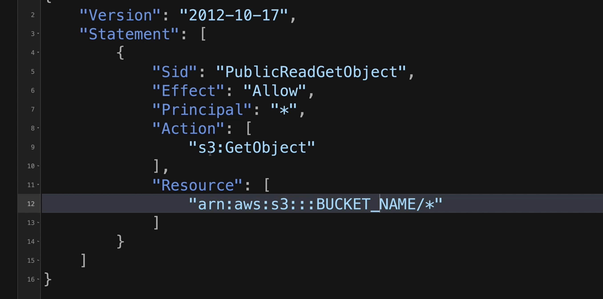
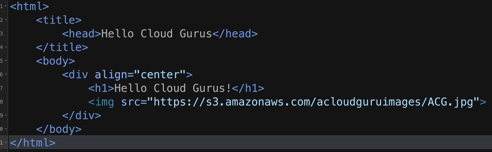
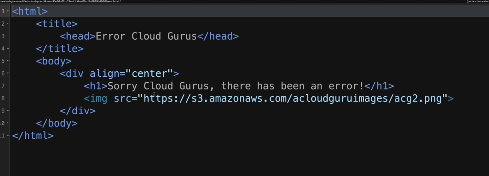

# 4.0 - Simple Block Storage

## 4.1 S3 Overview

- S3 = Simple Storage Service
  - Provides secure, highly durable and scalable object storage
  - Any amount of data can be stored and retrieved from anywhere via S3 at a low cost
  - The service is designed with simplicity in mind via an easy-to-use interface.

- S3 is an object-based storage rather than traditional filesystem or data blocks
- Any file type can be uploaded such as photos, videos, code, text files
- It cannot be used to run an operating system or database

- Offers a range of storage classes designed for different use cases
- Rules can be defined in S3 to automatically transition objects to a cheaper storage tier or delete objects that are no longer required after a set time period
- All versions of an object are stored in S3 and available to be retrieved / managed.

### S3 Basics

- Unlimited Storage
  - Total volume of data and "number of objects" that can be stored is unlimited
- Objects can be up to 5Tb in Size
- Objects stored in buckets (analagous to folders)

### Working with S3 Buckets

- All AWS Accounts share the S3 namespace, each S3 bucket name is globally unique
- S3 Urls follow the general format: `https://<bucket name>.s3.<region>.amazonaws.com/<file name>`
- When uploading, HTTP 200 code is returned upon success

### Key-Value Store

- S3 works like a key-value store, any object stored has the following associated with it:
  - **Key:** The name of the object
  - **Value:** The data itself, stored as a sequence of bytes
  - **Version ID:** Utilised when storing multiple versions of the same object
  - **Metadata:** Data about the data stored e.g. content, last-modified, etc.

- Data in S3 is spread across multiple devices and facilities to ensure availability and durability.
- Build for 99.95-99.99% service availability (tier-dependent)
- Designed fro 99.999999999% durability

### Standard S3

  - Default S3 Offering
  - Data stored redundantly across multiple devices in multiple facilities (>=3 AZs)
  - 99.99% availability and 99.99999999999% durability
  - Designed for frequent access
  - Suitable for most workloads:
    - Websites
    - Content distribution
    - Mobile and gaming applications
    - Big data analytics

### Security

- S3 Data can be secured by any of:
  - Server-side encryption: Encryption within the bucket upon upload and storage of object
  - Access Control List (ACL): Defines the AWS accounts or groups that can access the data, ACLs can be attached per object within a bucket.
  - Bucket policies: Define what actions are allowed or denied against IAM user groups and roles.

### Data Consistency

- After a successful write of a new object (PUT) or overwrite of an existing object, any subsequent read request immediately receives the latest version of the object
- Strong consistency offered for list operations:
  - After a write, you can immediately list the objects in a bucket with any changes reflected

## Summary

- S3 is object-based
- Files can be up to 5Tb in size
- S3 cannot be used as an OS or Database System (but still stores data)
- You can store as much as you like in an S3 bucket - there are no limitations.
- Files are stored in Buckets in S3
- S3 Bucket names have to be unique.
- S3 Bucket URLs follow a particular format: `https://<bucket name>.s3.<region>.amazonaws.com/<file name>`
- HTTP 200 codes always follow upon successful object load
- Objects in S3 buckets are comprised of:
  - Key
  - Value
  - Version ID
  - Metadata

## 4.2 - Securing Buckets with S3 Block Public Access

- Access to S3 buckets is primarily controlled via either Object ACLs or Bucket Policies:
  - ACLs: Permissions that can be applied at an object level
  - Bucket Policies: Permissions applied to an entire bucket only

- Console -> S3 -> Create Bucket
  - Note: S3 operates across a global space
  - Supply name (unique) and region
  - Select whether to enable or disable ACL usage
  - Select whether to block public access or not
  - Enable versioning if desired
  - Create bucket.

- When object is uploaded, if ACL and block public access wasn't configured, access will be denied upon attempted viewing.
- To enable:
  - From the bucket -> permissions -> uncheck "block public access"
  - Permissions -> Object Ownership -> Edit -> Select "ACLS enabled" (only if wanting to control public access at a per-object level)
  - Object -> Actions -> Make Public Using ACL -> Make Public
  - Object can then be viewed via the object URL provided

### Summary

- Buckets are private by default - upon creation, users must take action to allow public access on the bucket and its objects to make it public
- Access to buckets is controlled by ACLs and Bucket Policies:
  - ACLs apply at an object level
  - Bucket policies apply at a bucket level
- HTTP 200 Codes are returned upon successful uploads

## 4.3 - Hosting a Static Website using S3

- S3 can be used to host static websites. Dynamic sites provide database connections, which S3 does not provide.
- When used this way, S3 will scale automatically to meet demand.

- At minimum for a static website, one needs:
  - An AWS Policy to allow public access to the objects
  - An homepage `html` file e.g. `index.html`
  - An error page defined in `html`.

- For static hosting, the "Block Public Access" needs to be unchecked.
- Upon bucket creation, within properties - an option to enable static website hosting can be selected.
  - Provide details such as the index document and the error document, then save the changes.

- Under properties, a URL will be made available for the S3 bucket site.
  - Objects can then be uploaded.

- Objects could be made public on a per-object level, but this is not sustainable at a high number of projects. It's better to use a bucket policy:
- Bucket -> Permissions -> Bucket policy
  - Add the desired policy in and save changes, ensuring the arn of the S3 bucket is specified correctly.
  - All objects will then be made public upon upload.

### Summary

- Bucket policies used to make entire buckets public
- Static content hosting is achieved by using S3
- S3 Scales automatically with demand

## 4.4 - Versioning Objects in S3

## 4.5 - 

## 4.6

## 4.7

## 4.8

## 4.9

## 4.10