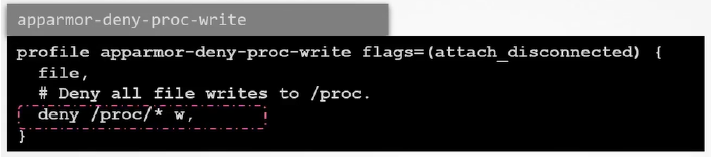

# 4.0 - System Hardening

## 4.1 - The Principle of Least Privilege

- **Airport Analogy**
  - Consider an airport passenger, what procedure must they go through?
    - Baggage drop-off and ticket validation
    - Travel document verification
    - Security / Carry on check
    - Move to a specific departure gate; users can access other areas during this time, but some restrictions still apply.
  - This suggests that in security management for a system, there are multiple entities involved; each with their own permissions and privileges
  - Considering the privileges of each of the entities:
    - Traveller - Unrestricted access to public spaces in the airport after check-in and the designated gate
    - Baggage - Has access to the travellers documents and the airlines information
    - Security officers - can inspect the belongings of travellers in the area
    - Store employees - public and restricted areas
    - Boarding gate - access to the documents
    - Cleaners and cargo workers - access to public and certain restricted areas
    - Pilots / Flight crew - complete aircraft access and certain areas of the airport
- They have access only to the plane(s) of their airlines
- In this case, each entity has the least / minimum amount of privileges required to perform their role.
- This principle is applicable to computer systems and K8s clusters.
- Kubernetes cluster security, via the least privilege principle, can be enforced via multiple options including:

## 4.2 - Minimize Host OS Footprint Intro

- Reducing the attack service
  - Achievable by keeping all systems in the cluster in a simple and consistent state
  - Any inconsistent or weak nodes could be attacked
    - Consistency can be enforced by Least Privilege Principle

## 4.3 - Limit Node Access

- As standard practice, exposure to the internet of the control plane and nodes
should be limited.
  - For self-hosted clusters or managed K8s clusters, this can be achieved via a
private network; access can then be achieved by a VPN
  - If running in the cloud, control plane access may be unlikely
- If implementing a VPN solution is impossible, one can enable authorized networks
via the infrastructure firewall
  - Allows/denies access from particular IP addresses
- Note: Attacks may not come from external sources, entities with network access
within the cluster may allow internal attacks.
  - One must therefore consider restricting access within the cluster.
  - Example - SSH Access:
    - Administrators require it
    - Developers do not require it usually and therefore they should be
restricted.
    - End users shouldn't have access too.
- Account Management - There are 4 types of accounts:
  - User accounts - Any individuals needing access to the system e.g. developers
system administrators
  - Superuser account - Root Account, has complete access and control over the
system
  - System Accounts - Created during the system development, used by software
such as SSH and Mail
  - Service Accounts - Similar to system accounts, created when services are
installed on Linux e.g. Nginx
- Viewing user details - Commands:
  - Id - provides details regarding user and group id
  - Who - lists who is currently logged in
  - Last - last time users logged into the system
- Access control files:
  - All stored under `/etc/` folder
    - `/passwd` - contains basic information about system users, including
user id and default directory
    - `/shadow` - contains the passwords for users, stored in hash format
    - `/group` - stores information about all user groups in the system
- The above commands and configuration files should be used to investigate user
permissions and access; limiting as appropriate based on least privilege principle.
  - Disable user account by setting default shell to a nologin shell:
`usermod -s /bin/nologin <username>`
  - Delete user - `userdel <username>`
  - Delete user and remove from group - `userdel <username> <groupname>`

## 4.4 - SSH Hardening

- SSH used for logging into and executing commands for remote servers
- General access via any of the following commands:
  - `ssh <hostname or IP address>`
  - `ssh <user>@<hostname or IP address>`
  - `ssh -l <user> <hostname or IP address>`
- Remote server must have an SSH service running and port 22 opened for communication
- Additionally, a valid username and password for the user should be created on the remote server; or an SSH key.
- To maximise security for access:
  - Generate key pair (public and private key) on the client system
  - Public key shared with remote server
  - Creation: `ssh-keygen -t rsa`
    - Enter passphrase = optional, but enhances security
    - Public key and private key stored at `/home/user/.ssh/id_rsa.pub` and `/home/user/.ssh/id_rsa respectively`
  - Copy public key to remote server: `ssh-copy-id <username>@<hostname>`
    - Password required for authentication on the server; shouldn't be required after key copying
  - On the remote server, the keys should be stored at `/home/user/.ssh/authorized_keys`
- Hardening the SSH service:
  - On the remote server; can configure the SSH service to enhance security.
  - Possible actions:
    - Disable SSH for root account - no one can log into the system via the root account, only their personal user or system accounts
- In line with the principle of least privilege
  - Requires updating of the ssh config file, located at `/etc/ssh/sshd_config` -> set PermitRootLogin to no
  - Could also disable password-based services if using SSH key based authentication -> set `PasswordAuthentication` to no
  - Once changes are applied, restart the service: systemctl restart sshd
- Additional information available via section 5.2 of the CIS Benchmarks
<https://www.cisecurity.org/cis-benchmarks/>

## 4.5 - Privilege Escalation in Linux

- Following disabling of root user access via ssh, need to consider when users may need root / administrative access credentials; this is provided by the `sudo` functionality (prefixed before any command)
- Default configuration for sudo is under `/etc/sudoers`; it can only be edited via `visudo`
- The sudoers file defines user privileges for `sudo`


- Administrators can give granular permissions
  - User mark has all permissions
  - User sarah has sudo permissions only for restarting the system
- Any sudo commands ran are executed in the users local shell rather than root shell -> can eliminate the need for ever logging in as a root user directly
- This can be done by editing the `/etc/passwd` for root user like below


- Sudoers syntax
  - Anything beginning with `# or $` is a comment
  - Content split into fields:
    - User or group the privilege(s) are to be granted to,
      - Groups are prefixed with `%`
    - Host the user can make use of the privileges on
      - By default, set to all, applies to localhost in most cases
    - Users and Groups the user in field 1 can run the command as
    - Command(s) runnable by the user(s) via `sudo`

## 4.6 - Remove Obsolete Packages and Services

- In general, systems should be kept as lean as possible, making sure that only the necessary software is installed and they are kept updated to address security fixes
- This can be applied for standalone systems, Kubernetes systems, etc.
- Any software that isn't used should be uninstalled for general reasons including:
  - Increased complexity of the system - one more package to maintain
  - It may remain unused and take up unwanted space
  - If not maintained, additional security vulnerabilities may arise that could be taken advantage of
- Removing services:
  - Services start applications upon Linux system booting
  - Managed by the Systemd tool and the systemctl utility
  - E.g. `systemctl status <service>`
    - Provides details regarding the service, including where its configuration file(s) are located
  - As with packages, only necessary services should be kept running or available on the system
    - To view the system services: systemctl list-units --type service
    - To remove a service: `systemctl stop <service>`
- Once services for unwanted packages are stopped, one can remove the associated package(s) via `apt remove <package name>`
- Additional information available in section 2 of the CIS Benchmarks.

## 4.7 - Restrict Kernel Modules

- Linux kernel modules has a modular design - its functionality can be extended via the addition of extra modules
- Example - Hardware support for video drivers via graphics cards
- Modules can be added manually - `modprobe <module name>`
- List modules in the Kernel - lsmod
- **Note:** When kubernetes workloads are running, non-root processes on pods may cause network-related modules to be installed on the Kernel - This can lead to vulnerabilities exploited by attackers.
- To mitigate, modules on cluster nodes can be blacklisted - achievable by creating a `.conf` file under `/etc/modprobe.d`
  - Any modules to be blacklisted should be included as an entry via: `blacklist <modulename>`
  - Upon entry addition, the system should be restarted and tests should be ran to see if the module is still running: <br>`shutdown -r now` <br> `lsmod | grep <modulename>`
- Example modules that should be blacklisted - `sctp` and `dccp`
- Additional information available in section 3.4 of the CIS Benchmarks

## 4.8 - Identify and Disable Open Ports

- Several processes and services bind themselves to a network port on the system - an addressable location in the OS to allow for segregation of network traffic.
- Example - TCP port 22 is only used for SSH processes
- To understand if a port is in used and listening for a connection request:
  - `natstat -an | grep -w LISTEN`
- To understand what each service or port is being used for, can check in the services file under `/etc`
  - Example: `cat /etc/services | grep -w 53`
- This begs the question, what ports should be open for nodes on the Kubenetes cluster? Answer: Review the documentation!
- <https://kubernetes/doc.setup/production-environment/tools/production-environment/tools/kubeadm/install-kubeadm/#check-required-ports>

## 4.9 - Minimize IAM Roles

- As discussed in the section **Limit Node Access**, it's never a good idea to use the Root account to perform daily tasks, SSH hardening can prevent root access and force users to using their own user accounts.
- Root accounts are equivalent to Admin accounts in Windows and Root Accounts in public cloud platforms e.g. AWS
- **Note:** AWS used as an example for this section but topics apply
  - 1st account (Root account) created - User can log into management credentials
    - Any and all functions can be carried out by this account on the management account
  - Root account, in line with the least privilege principle, should be used to create new users and assign them the appropriate permissions
  - The credentials for the root account should be saved and secured as appropriate
- When a new user is created, the least privilege is assigned depending on the associated IAM (Identity Access Management) policy.
  - E.g. developers have ability to create EC2 instances, but can only view the S3 Buckets
  - For further ease of assignment, users could be added to particular role groups or IAM groups - an IAM policy can then be attached to the group and assigned automatically.
- For resources and services, by default, no permissions are allowed. This cannot be achieved via IAM policies, roles must be developed.
  - Allows secure access to an AWS Resource(s)
  - **Example** - Allow EC2 Instance Access to an S3 Bucket.
- **Note:** Programmatic access can be configured, but this is typically less secure than via IAM methods.

## 4.10 - Minimize External Access to the Network

- To view the ports that are open and listening for requests on your system, utilize the
netstat command:
netstat -an | grep -w LISTEN
- By default, many of these ports can accept connections from any other device on
the network - undesirable via the principle of least privilege
- In production environments, with multiple clients and servers involved, it's beyond
important to implement network security to only allow or restrict access to various
services
- Security can be provided via network-wide or external firewalls e.g.
  - Cisco ASA
  - Juniper NGFW
  - Barracuda NGFW
  - Fortinet
- Alternatively, firewalls can be applied per server.

## 4.11 - UFW Firewall Basics

- UFW = Uncomplicated Firewall
- Considering an application setup where one needs to restrict access to an Ubuntu Server - call it app01
- The server should only accept SSH connections on Port 22 from a particular IP address
  - Additionally, the server runs a web server on http port 80
  - All other users in a particular IP range should be allowed
- Any other unused ports should be closed
- To help with this, can use the netfilter CLI tool and IPTables
  - IPTables - Most common for Linux, but requires a steep learning curve
  - UFW = Alternative that provides a frontend for IPTables
- On the machine: `netstat -an | grep -w LISTEN`
- The UFW tool can be installed via the following:
  - `apt-get update`
  - `apt-get install ufw`
  - `systemctl enable ufw`
  - `systemctl start ufw`
- UFW Rules:
  - Check the UFW Status: ufw status
  - In example, want to allow 80 and 22 from particular sources, but no outgoing
ports need closing:
    - Allow outgoing by default:
      - `ufw allow outgoing`
    - Deny ingress by default (before making exceptions)
      - `ufw default deny incoming`
    - Allow from particular IP address on particular port e.g. SSH 22
      - `ufw allow from 172.16.238.5 to any port 22 proto tcp`
        - Allows inbound connections from the IP address defined to port 22 on any reachable IP address on app01
      - `ufw allow from 172.16.238.5 to any port 80 proto tcp`
        - Allows connections on port 80 from IP address
      - `ufw allow from 172.16.100.0/28 to any port 80 proto tcp`
        - Allows access on port 80 from IPs in any range
      - `ufw deny 8080`
        - Denies all access on port 8080 (not needed if denying access by default)
    - To enable: `ufw enable`
    - `ufw status` to check implementation
  - To delete rule: `ufw delete <rule> or <rule number>`

## 4.12 - Linux Syscalls

- To understand how Syscalls are made, need to understand how a process runs:
  - Kernel - Major OS component that interfaces between hardware and processes
  - Kernel can be split into Kernel and User Spaces
    - Kernel Space - OS-related applications and software e.g. drivers
    - User Space - Where applications are ran
  - When a program runs in the user space, suppose one that wants to write data to a file:
    - Applications make system calls to the Kernel Space for tasks e.g.:
      - Open a file
      - Write to a file
      - Define a variable
      - open()
      - close()
    - Tracing Syscalls:
      - `which strace`:
        - Installed by default
        - Used to inspect / provide output of the syscalls made when running a command
      - Output presented in form of:
        - `syscall(<path to executable file>, [arg 1, arg 2, ...], ...)`
      - To trace the syscalls of a running process:
        - Get process ID (PID) - `pid <process>`
        - Get Syscalls: `strace -p PID`
    - Note: the `-c` flag can be used for more detailed outputs.

## 4.13 - AquaSec Tracee

- Open-source tool used for tracing container syscalls
- Makes use of EBPF to trace the system at runtime without interfering with the Kernel:
  - extended Berkeley Packet filter
- Tracee can be easily ran as a container:
- **Prerequisites:**
  - As ran as a container, it runs the EBFP program and stores it at /tmp/tracee
by default
  - To ensure built once and usable for successive runs, a set number of bind mounts are required:

    | Mount          | Purpose              |
    |----------------|----------------------|
    | `/tmp/tracee`  | Default Workspace    |
    | `/lib/modules` | Kernel Header Access |
    | `/usr/src`     | Kernel Header Access |

  - Addtionally, due to tracing syscalls, Tracee requires privileged capabilities:

- **Using Tracee:**
  - To observe syscalls generated by a single command: <br>

    ```shell
    docker run --name tracee --rm --privileged --pid=host \
    -v /lib/modules/:/lib/modules/:ro -v /usr/src:/usr/src:ro \
    -v /tmp/tracee:/tmp/tracee aqasec/tracee:0.4.0 --trace comm=ls
    ```

  - Returns syscalls made during the run of the ls command
  - To observe syscalls for all new processes on the host:

    ```shell
    docker run --name tracee --rm --privileged --pid=host \
    -v /lib/modules/:/lib/modules/:ro -v /usr/src:/usr/src:ro \
    -v /tmp/tracee:/tmp/tracee aqasec/tracee:0.4.0 --trace pid=new
    ```

  - For new containers:

    ```shell
    docker run --name tracee --rm --privileged --pid=host \
    -v /lib/modules/:/lib/modules/:ro -v /usr/src:/usr/src:ro \
    -v /tmp/tracee:/tmp/tracee aqasec/tracee:0.4.0 --trace container=new
    ```

## 4.14 - Restricting Syscalls Using Seccomp

- Previously seen how to view syscalls in an os.
- In practice, ~435 syscalls are available in Linux, all can be used by applications in the user space.
- In reality, applications wouldn't need to use anywhere near as many syscalls - application should only be able to use the required syscalls for their application
- By default, the Linux Kernel allows any syscall to be invoked by programs in the user space - increasing attack surface
- To resolve, can utilise seccomp
  - Secure Computing - A linux kernel-native feature designed to constrain applications to only make the required syscalls
  - To check if host supports it, look in the boot config file: `grep -i seccomp /boot/config-$(uname -r)`
  - If `CONFIG_SECCOMP = y` -> seccomp is supported
- To demonstrate how applications can be finetuned, consider running a container
e.g. docker/whalesay:
  - `docker run docker/whalesay cowsay hello!`
  - Knowing the app works - can run the container and exec into it: `docker run -it --rm docker/whalesay /bin/sh`
    - If users wanted to change the time for example, it would not be allowed
- Process running is `shell/bin/sh`
- Inspecting the process id -> PID = 1
- Inspecting the PID can check via seccomp:
  - Grep seccomp `/prc/1/status`
  - If value = 2 -> seccomp enabled:
  - Modes:
    - 0 = Disabled
    - 1 = Strict -> Blocks all syscalls except read, write, exit, rt_sigreturn
    - 2 => Selectively filters syscalls
    - How was the seccomp filter applied? What restrictions has it got applied?
- Docker has seccomp enabled by default and restricts ~60 of the 435 syscalls
- Defined by json file(s)
  - Defines architectures for files
  - Syscall arrays -> names and actions (allow or deny)
  - Default action -> what to do with syscalls not defined in the syscall array
- Json files can act as whitelists or blacklists
  - Whitelists can be very restrictive as any which you do
want to run have to be added
  - Blacklists -> allows all by default bar any in the array;
more open than whitelists but more susceptible to
attacks
    - Default docker seccomp profiles block calls such as reboot, mount
and unmount, clock time managements
    - Default seccomp profiles are good but custom files are better for
particular scenarios
  - To utilise a custom seccomp profile, can add associated flag to the `docker run` command i.e.: <br> `docker run -it --rm --security-opt seccomp=/path/to/file.json docker/whalesay /bin/sh`
  - Seccomp can be disabled for containers completely by setting the flag to `--security-opt seccomp=unconfined`
    - SHOULD NEVER BE USED

## 4.15 - Implementing Seccomp in Kubernetes

- By default, Docker supplies its own default seccomp profile in containers in mode 2
- When running in kubernetes, the number of blocked syscalls and seccomp
enablement may be different -> seccomp may not be enabled by default in Kubernetes (as of v1.20)
- To implement seccomp - use a pod definition file, to apply, need to add an appropriate field in the securityContext area:

  ```yaml
  securityContext:
    seccompProfile:
      type: RuntimeDefault
  ```

- **Note:** When adding the profile in this manner, it is advised to add to the container's securityContext field a disabling of privilege escalation i.e.:

    ```yaml
    containers:
    - securityContext:
        allowPrivilegeEscalation: false
    ```

- This helps the application run ONLY with the Syscalls it requires for the process
- **Note:** Type can be set to Unconfined, but this is not recommended and is the default profile
- For custom profiles in the pod security context:

  ```yaml
  securityContext:
    seccompprofile:
      type: Localhost
      localhostProfile: <path to file>
  ```

- Note: The profile path must be relative to the default seccomp file in `/var/lib/kubelet/seccomp`
- Example:
  - Creating an audit seccomp profile with `defaultAction SCMP_ACT_LOG`
  - Syscalls from the container will be stored in `/var/log/syscall`
    - Logs user id, process ID, etc about the processes used
  - To help map the syscall numbers to syscalls is to check the following: `grep -w 35 /usr/include/asm/unistd_64.sh`
  - Where 35 can be replaced with the PID
- Tracee can also be used for this as discussed previously
- Consider another seccomp profile that rejects by default (`defaultAction = SCMP_ACT_ERRNO`) => any pod created with this cannot run as all Syscalls are blocked by default
- Once the Syscalls are analysed and audited, users can identify the allowed syscalls and add them to a custom seccomp profile => recommended to block all by default and allow only ones needed.
- **Note:** A custom seccomp profile won't be required to be created from scratch, but a template one may need to be attached to a pod/deployment etc.

## 4.16 - AppArmor

- Although Seccomp works well to restrict the syscalls a container makes (or pods/objects in Kubernetes), it cannot be used to restrict a programs access to objects like files and directories.
- **Apparmor** = Linux Security module, used to confine a program to a limited set of resources
  - Installed by default for most distributions
  - Use systemctl status apparmor to check status
  - To use, the associated Kernel module must first be loaded on all nodes
where containers can run
    - Check enabled file under: `/sys/module/apparmor/parameters/enabled` <br> Shows Y or N depending on enablement
  - Similar to Seccomp, apparmor is applied via profiles, which must be loaded into the Kernel; checkable via `/sys/kernel/security/apparmor/profiles`
  - Profiles are simple text files that determines what capabilities are allowed or restricted

- **Example:**


- Above contains two rules:
  - File -> allow file system -> allows complete access to filesystem
  - Deny rule -> denies write access to all files under root system including subdirectories

- **Example 2: Deny Write Access to Only Files Under a Particular Subdirectory**



- Apparmor profiles can be created via various tools
- The status of the profiles loaded can be checked using aa-status
- Profiles can be loaded in 3 modes:
  - Enforce - Apparmor will enforce the rules on any application that fits the profile
  - Complain - Apparmor will allow the actions without restrictions but the actions are logged as events
  - Unconfined - Any tasks are allowed and no logging occurs

## 4.17 - Creating AppArmor Profiles

- Example Script used in lecture - creates a directory and writes a file to said directory, the event of creation is logged in "create.log"


- Tools provided by apparmor can be used to facilitate the creation of apparmor profiles
- To install the utilities for apparmor: `apt-get install -y apparmor-utils`
- Once done, can generate a profile via: `aa-genprof /path/to/script.sh`
  - This prepares apparmor to develop an accurate profile by scanning the system during the application's runnin
  - Once the application has run in a separate window, in the original window, enter "S" to scan the system for AppArmor events
    - This will generate a series of questions that the user must answer to help develop the profile
- E.g. for the example above, need to think about allowing the script access to the mkdir command or the tee command
  - Each event is reviewed on severity level of 1-10 (10 = most severe)
  - Resultant actions can be allowed/denied/inherited etc as required
  - The new profile can be viewed and validated by `aa-status`
  - The profiles are stored under `/etc/apparmor.d/`
- It's often advised to rerun the application with slightly different parameters to check the enforcement of the apparmor profile.
- To load a profile:
  - `apparmor_parser path/to/profile`
    - No output = success
- Disable profile:
  - `apparmor_parser -R path/to/profile`
    - No output = success
  - Need to create a symlink to the profile and the apparmor disable directory:
    - `ln -s /path/to/profile /etc/apparmor.d/disable/`

## 4.18 - AppArmor in Kubernetes

- AppArmor can also be used to restrict the functions of containers orchestrated by Kubernetes
- At the time of writing / when the recording was done, Kubernetes support for it was in beta
- **Prerquisites:**
  - The AppArmor Kernel module must be enabled on all nodes in the K8s
cluster where pods are expected to run
  - AppArmor profiles must be loaded in the Kernel
  - The container runtime should support AppArmor - Generally expected,
Docker know to support.
- **Example:**


- Ensure that the profile is loaded on all the nodes with aa-status if the profile is listed
in the required director
- As the support is only in beta, need to link it by annotations:

  ```yaml
  ...
  metadata:
    annotations: container.apparmor.security.beta.kubernetes.io/<container_name>:localhost/<profile name>
  ...
  ```

- When the pod is created, you can inspect and test the pods capabilities to test the profile enforcement.

## 4.19 - Linux Capabilities

- Previously seen that even when running a container with an unconfined seccomp profile, it couldn't be manipulated
- The same is applicable to Kubernetes even though it doesn't use seccomp by default
- To understand this, need to review how processes run in Linux:
  - Processes are separated into privileged and unprivileged (for kernel versions less than 2.2)
  - For 2.2 onwards, processes are split into capabilities:
    - Privileged processes possess a number of capabilities e.g.:
      - `CAP_CHOWN`
      - `CAP_NETMODE`
      - `CAP_SYS_BOOT` - Allows reboots
  - To check the required capabilities for a command:
    - getcap /usr/bin/ping for example
  - For a process:
    - Get the PID: `ps -ef | grep /usr/sbin/sshd | grep -v grep`
    - `getpcaps <PID>`
- Pivoting back to the pod in the example, the reason the certain commands like the
change time couldn't work, the operation wasn't permitted
  - Even if ran as a root user, the container is only started with limited
capabilities (14 if Docker = runtime)
- Capabilities for a container can be managed at the container's security context:

```yaml
apiVersion: v1
kind: Pod
metadata:
  name: ubuntu-sleeper
spec:
  containers:
  - name: ubuntu-sleeper
    image: ubuntu
    command: ["sleep", "1000"]
    securityContext:
      capabilities:
        add: ["SYS_TIME"]
```

- To drop a capability, add drop: `["Capability 1", "Capability 2", ...]`
