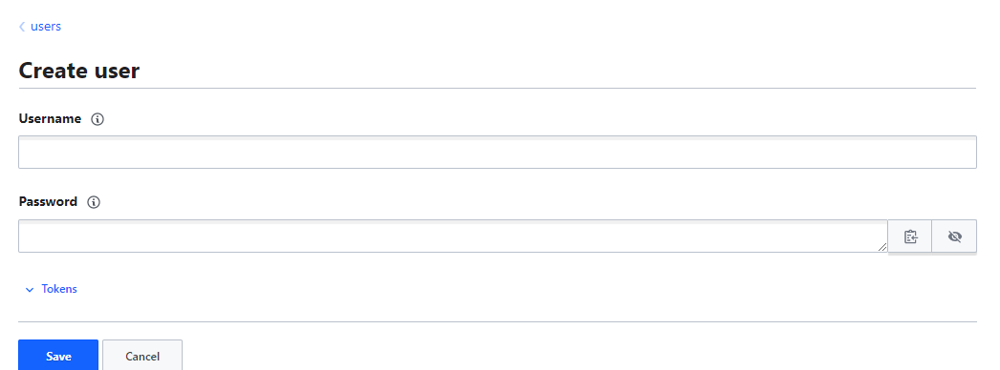

# 3.0 - Authentication and Authorization

## 3.01 - Authentication in Vault

### Notes

- Authentication is the process of recognizing a user's identity. It's typically based on various approaches e.g. username/passwords or tokens.
- In Vault it's no different - you have multiple ways to authenticate, including:
  - Token
  - Username
  - JWT
  - GitHub
- Any of these authentication methods must be matched when authenticating to Vault. You can however control what authentication methods are usable via the Access tab in the UI.


- Based on the above screenshot, one can see that only token-based authentication is allowed for this Vault instance.
- Selecting "Enable an Authentication method" - you are presented with a multitude of other options, including JWT and TLS Certificates as discussed, but as well as:
  - AWS
  - Azure
  - GitHub
  - Kubernetes
- Once enabled, each authentication method can be configured for various users e.g. in username and password, you can generate new credentials on the fly:



- To authenticate as the user in the CLI:

```powershell
vault login -method=userpass username=admin password=password
vault login -method=<method path> <parameters>
```

- Once authenticated, you will be presented with details regarding the user's access credentials e.g. token, token duration, policies assigned, etc.
- Note: any tokens displayed will be stored in the `token helper` - this will prevent the need to re-provide the token.

## 3.02 - Overview of Vault Policies

- [3.0 - Authentication and Authorization](#30---authentication-and-authorization)
  - [3.01 - Authentication in Vault](#301---authentication-in-vault)
    - [Notes](#notes)
  - [3.02 - Overview of Vault Policies](#302---overview-of-vault-policies)
    - [Vault Policies 01](#vault-policies-01)
      - [Introduction](#introduction)
      - [Predefined Policies](#predefined-policies)
      - [Basics of Policy Writing](#basics-of-policy-writing)
      - [Primary Capabilities](#primary-capabilities)
      - [Example](#example)
      - [Root-Protected API Endpoints](#root-protected-api-endpoints)
    - [Vault Policies 02](#vault-policies-02)
      - [ACL Rules Format - KV Secret Engine Version 2](#acl-rules-format---kv-secret-engine-version-2)
        - [Practical Example - ACL Policies](#practical-example---acl-policies)
      - [Listing Secrets](#listing-secrets)
        - [Practical Example - Listing Secrets](#practical-example---listing-secrets)
      - [Reading Secret Metadata](#reading-secret-metadata)
      - [Summary](#summary)
  - [3.03 - AppRole Authentication Method](#303---approle-authentication-method)
    - [Configuring AppRole Authentication Method](#configuring-approle-authentication-method)
  - [3.04 - HTTP APIs in Vault](#304---http-apis-in-vault)
  - [3.05 - Token Capabilities](#305---token-capabilities)
  - [3.06 - Entities and Aliases](#306---entities-and-aliases)
    - [Authentication for Multiple Users](#authentication-for-multiple-users)
    - [The Identity Secret Engine](#the-identity-secret-engine)
  - [3.07 - Identity Groups](#307---identity-groups)
    - [Identity Groups](#identity-groups)
      - [Demonstration](#demonstration)
      - [Internal and External Groups](#internal-and-external-groups)
  - [3.08 - Tools in Vault](#308---tools-in-vault)
    - [Vault Tools](#vault-tools)
  - [3.09 - Vault Auto-Complete](#309---vault-auto-complete)
    - [Auto-Completion Overview](#auto-completion-overview)
  - [3.10 - ACL Policy Path Templating](#310---acl-policy-path-templating)
    - [Contexts](#contexts)
    - [Path Templating Overview](#path-templating-overview)
    - [Practical Example](#practical-example)
    - [Supported Parameters](#supported-parameters)
  - [3.11 - Vault Policy - Transit Secret Engine](#311---vault-policy---transit-secret-engine)
    - [Vault Policy Rules - Transit Engine](#vault-policy-rules---transit-engine)
    - [Practical Demo](#practical-demo)

### Vault Policies 01

#### Introduction

- By default, any users created / assigned to authentication methods doesn't have any/many capabilities. Permissions come as a result of authorization in Vault, which is determined by Vault policies.
- Examples of policies include:
  - Read from secret/
  - Read and write from secret/
  - Read, write, update and delete from secret/, as well as work with auth methods

#### Predefined Policies

- When first initialized, Vault creates a root policy by default and assigns it to the root / superuser allowing them to do anything in Vault; including setup additional policies and authentication methods.
- Another policy titled **default** is also created upon initialization - this is attached to all tokens and provides minimum common permissions.


Policies can be easily viewed from the top toolbar (above).

#### Basics of Policy Writing

- Policies are written in HCL format, referred to as ACL policies.
- Typically, policies are written based on secret engine paths. Admins write policies to allow/deny certain paths and operations.
- Example:

```go
path "auth/*"
{
 capabilities = ["create", "read", "update", "delete", "list", "sudo"]
{
```

- If a policy capabiloities list is empty, the user cannot do anything

```go
path "<path>" {
 capabilities = [ "capability 1", "capability 2", ..... , "capability N"]
}
```

#### Primary Capabilities

- Create
- Read
- Update
- Delete
- List
- Sudo
- Deny

#### Example

- Ensuring a user has been created, authenticate to Vault via the userpass method

```go
vault login -method=userpass username=admin password=password
vault login -method=<method path> <parameters>
```

- When authenticated, this user should have "default" as the policy. To verify, run `vault secrets list` - this should provide an error as it goes against the default policy.
  - Typically the error will be of the form `URL <REQUEST TYPE> <vault address>/version/path`
- To fix this, one can create a new policy. Navigate to policies and select "Create ACL Policy" from the menu - you will be presented with an editor to write an ACL policy.

    

    "Create New ACL Policy" Menu

- Write the policy as desired, in this case, we just want to allow "read" operations on a particular path


- The policy must then be assigned the policy(ies). To do so, navigate to the user under "access" and select "edit user".
  - Under "Generated Token's Policies", add the name of the policy(ies) you which to attach, then click save.

- **Note:** Once the policy is assigned to the user, it will NOT automatically work. You must re-authenticate via the vault login command to generate a new token for the user.

- Re-authenticate the user and verify the user has the capability(ies) required.
- Repeat this process for any other issues / capability problems as required for the user.

- **Note:** Once a policy is assigned to a user, any changes made to it will automatically apply to that user.

- In some cases, there may be an unexpected change to the path e.g. `secret/data/secret1`  to fix this, the path in the policy could be changed to `secret/*` - using the * as a wildcard operator.
  - This poses a security risk - as multiple secrets may be under the path `secret/` that users shouldn't have access to.
  - To fix, either explicitly define the secret path provided i.e. `full path to secret`  OR add an additional policy to deny access to the other secret(s), an example follows:

```go
path "secret/*" {
  capabilities = ["read"]
}

path "secret/data/<secret not to be seen>" {
  capabilities = ["deny"]
}
```

- **Note:** If you did not wish to add the path information between the endpoints of the path, such as `data` in the above example, you can replace it with `+` , this will automatically apply to any secrets ending in the secret path prefix and suffix.

#### Root-Protected API Endpoints

- Some paths are more restrictive than others, requiring root token or sudo capabilities in the policy to allow the operations. Examples include:
  - auth/token/accessors
  - auth/token
  - sys/audit
  - sys/rotate
  - sys/seal

---

### Vault Policies 02

#### ACL Rules Format - KV Secret Engine Version 2

- The version 2 key-value store uses a prefixed API that differs from version 1
- Writing and reading versions are prefixed with the `data/` path.
- Example:

| Path | KV Version 1 | KV Version 2 |
| --- | --- | --- |
| /secret/first    |  `path "secret/first" { capabilities = ["create"] }`   | `path "secret/data/first" { capabilities = ["create"] }`    |

##### Practical Example - ACL Policies

- Create a policy for KV Version 1


- Additionally, create a test-user to test the policy out. Be sure to assign the policy to the user under `token-generated policy`


- Authenticate to the Vault via the CLI for the user

```go
vault login -method=userpass username="demo-user" password="demo-password"
```

- As expected, the authentication works, and the policy is shown to be attached to the user:


- Create a secret under the key-value secret engine for version 2 to test


- Test the policy: `vault kv get secret/demo01`


- As expected, the get request is denied in line with the policy. Note the path is `/secret/data/demo01` as the secret is under key vault version 2.
- Editing the policy to add the /data prefix will fix this.

#### Listing Secrets

- The `metadata/` endpoint returns a list of key names at the specified location.
- Any input for this must be a folder
- The values aren't accessible via this command.

| Path | KV Version 2 |
| --- | --- |
| `/secret/` | `path "secret/metadata/" { capabilities =["list"] }` |

##### Practical Example - Listing Secrets

- Add some more secrets to the key-value secrets engine


- If the user logs into the UI, they would not be able to see the contents of these secrets, but they CAN see the names of the secrets if they are allowed access to the metadata endpoint
- Add the required information to the policy


- This can then be tested in the UI by logging in as the user and verifying if you can `list` the secrets but not `read` them.

#### Reading Secret Metadata

- To retrieve the metadata and versions for the secret at the specified path:

| Path | KV Version 2 |
| --- | --- |
| `/secret/firstsecret` | `path "secret/metadata/firstsecret" { capabilities = ["read"] }` |

#### Summary

| Operation | Path [Capability(ies)] |
| --- | --- |
| Writing and Reading Versions | /data |
| Listing Keys | metadata/ [list] |
| Reading versions | metadata [read] |
| Destroy versions of secret | destroy/ [update] |
| Destroy all versions of metadata for key | metadata/ [delete] |

Examples for the latter two:


## 3.03 - AppRole Authentication Method

- Before a client can interact with Vault, it must authenticate against a particular auth method as outlined previously.
- Auth methods are generally targeted for one of two types of users:
  - Human users e.g. userpass
  - Machine/App users
- Once authenticated, a token is generated, which may have a policy associated.
- For machine/app users, the most common one is AppRole.
  - This allows multiple "roles" to be defined corresponding to different applications, each with different access levels e.g. one role for MySQL or a database application, another for a particular CI/CD application e.g. Jenkins.
- When authenticating via the AppRole method, applications will need to take note of:
  - Role ID
  - Secret ID

### Configuring AppRole Authentication Method

1. Create policy for role and apps
2. Get Role ID
3. Generate new Secret ID
4. Provide Role and Secret ID to application
5. Application authenticates with the provided role and secret IDs
6. Authentication token is returned.

**To enable:**

1. Enable AppRole authentication method under "access"
2. Under Policies, create a desired policy for the application e.g. allowing all non-destructive capabilities to the application
3. Create the role: `vault write /auth/approle/role/<name> token_policies="<role-name>"`
4. Test via `vault read auth/approle/role/<rolename>`
5. Read the role ID for provisioning`vault read auth/approle/role/<rolename>/role-id`
6. Generate the new secret ID: `vault write -f auth/approle/<role>/secret-id`
7. Using the IDs generated in steps 5 and 6, authenticate to vault: `vault write auth/approle/login role_id="" secret_id=""`
8. Verify the login operation is successful, a token is provisioned and the required policies are provided.

---

- The AppRole auth method is specifically designed for use by machines and applications.
- Role and Secret IDs can effectively be viewed as the application's username and passwords

## 3.04 - HTTP APIs in Vault

- All of Vault's capabilities are accessible via the HTTP API.
- Most CLI commands invoke the HTTP API, however, some Vault features can only be accessed via the HTTP API.
- Tools such as `cURL` can be used to make calls to the HTTP API. This requires the use of a client token, settable via the X-Vault-Token HTTP Header.
  - Example: `curl -h "X-Vault-Token: <token> -X GET http://127.0.0.1:8200/v1/secret/foo`
- All API Routes are prefixed with v1 bar a few documented exceptions.
- All response data from Vault is via JSON.

- The HTTP request types correspond to a particular Vault capability or operation

    | Capability | HTTP Request Type |
    | --- | --- |
    | create | POST/PUT |
    | list | GET |
    | update | POST/PUT |
    | delete | DELETE |
    | list | LIST |

---

- Sample requests are well-documented for multiple secret types at the following [link](https://vaultproject.io/api-docs/)

## 3.05 - Token Capabilities

- Users can check the capabilities of a token for a particular path using the `token capabilities` command
- Example:
  - `vault token capabilities sys`
  - `vault token capabilities <path>`
- When using this, if you you do not explicitly specify a token, Vault will assume the token of the user making the request is the token to be checked.
- If a token is provided as an argument, the "/sys/capabilities" endpoint and permission is used.
- If no token is provided, the "/sys/capabilities-self" endpoint and permission is used with the locally authenticated token
- To provide the token as an argument, simply add the token prior to the `<path>`

## 3.06 - Entities and Aliases

- [3.06 - Entities and Aliases](#306---entities-and-aliases)
  - [Authentication for Multiple Users](#authentication-for-multiple-users)
  - [The Identity Secret Engine](#the-identity-secret-engine)

### Authentication for Multiple Users

- Vault supports multiple authentication methods, as well as allowing the same type of authentication method for different mount paths.
- Each Vault client may have multiple accounts with various identity providers and are enabled on the Vault server.
  - For example, a user may have an account each in Active Directory and GitHub
  - Rather than have policies set up for each of these, they can be collated by usage of an entity and aliases.
- The aliases can be mapped to the particular entity as entity entries.
- Policies can now be set at entity level AND per account.
  - Policies can be set to be inherited from entity level - any account added to the entity as an entity member will automatically have the particular policy applied.
- To create an entity: Access → Entities
  - ENSURE A SUFFICIENT USER AUTH METHOD IS ENABLED
  - Entities → Create Entity
    - If there are any policies already existing, add them to the entity.
      - It may be advisable to have a policy per user account.
    - Select create
- Add Aliases:
  - entities → create alias
    - Provide alias name and auth backend per alias/entry
- To test:
  - `vault login -method=userpass username=bob password=password`
    - Entity policy, alias policy should be viewable under policies
    - Under identity_policies, the entity policy should be listed
  - `vault login -method=userpass username=bsmith password=password`
    - The entity policy should still be listed under identity_policies, however the policies list should be specific to the account/alias.

### The Identity Secret Engine

- This maintains the clients recognised by Vault
- Each client is internally termed as an entity, which can have multiple aliases
- This engine is mounted by default, and cannot be disabled or moved.

## 3.07 - Identity Groups

- [3.07 - Identity Groups](#307---identity-groups)
  - [Identity Groups](#identity-groups)
    - [Demonstration](#demonstration)
    - [Internal and External Groups](#internal-and-external-groups)

### Identity Groups

- Groups can contain multiple entities as members
- Policies set at group level will be applied to all members of the group i.e. all entities and the associated aliases
  - I.e. all users and all associated accounts as part of the group will have the policies be applied

#### Demonstration

- Assuming a entity has already been created (refer to section 3.06), create a new policy to be applied to the team e.g. allow read capabilities to all secrets under the secret/ path
- From Access → Groups, select "Create Group"
  - Provide the group name
  - Select type (internal or external)
  - Select any policy(ies) to be associated with the group
  - Add the member group IDs or the Entity IDs to be added to the group
  - Create
- To verify, login as a user as part of the group using `vault login`
  - The group policy should be included under the key `identity_policies` AND the `policies` key

#### Internal and External Groups

- By default, Vault creates an internal group
- Many organizations have groups predefined with their external identity providers, such as Active Directory
- External groups allows these providers to be linked to Vault via the `external identity` provider (auth provider) such that appropriate policies can be attached to the group

## 3.08 - Tools in Vault

- [3.08 - Tools in Vault](#308---tools-in-vault)
  - [Vault Tools](#vault-tools)

### Vault Tools

- Vault contains tools allowing specific functions
- They are available at the `/sys/tools` endpoint
- Examples of tools include:
  - Wrap
  - Lookup
  - Unwrap
  - Rewrap
  - Random - Used to generate a secret of random bytes of a particular size and format
  - Hash - Used to hash data using a particular format and output it as a particular format
    - Note, sometimes input data may need to be encoded as base64 before hashing
- Random can be called via a POST request to `/sys/tools/random/{bytes number}`
- Hash can be called via a POST request to `/sys/tools/hash/{algorithm}`
  - Algorithm may be any of `sha2-224`, `sha2-256`, and so on.
- Additional details are available in the documentation, along with sample curl requests.
  - [Documentation](https://www.vaultproject.io/api-docs/system/tools).
- Common exam questions are "what does X Call aim to achieve?"

## 3.09 - Vault Auto-Complete

- [3.09 - Vault Auto-Complete](#309---vault-auto-complete)
  - [Auto-Completion Overview](#auto-completion-overview)

### Auto-Completion Overview

- Vault auto-complete allows automatic completion for input flags, subcommands and arguments in the vault CLI
- This would be achieved by pressing `[TAB]` when writing any commands like `seal`
- Note, this is is very similar to the autocomplete feature in Linux.
- To enable autocomplete, simply run the following command: `vault -autocomplete-install`
- Note: When a command hasn't been written following `vault <x>`, the autocomplete would provide options for the command.

## 3.10 - ACL Policy Path Templating

- [3.10 - ACL Policy Path Templating](#310---acl-policy-path-templating)
  - [Contexts](#contexts)
  - [Path Templating Overview](#path-templating-overview)
  - [Practical Example](#practical-example)
  - [Supported Parameters](#supported-parameters)

### Contexts

- Consider `/secret` has two prefixes for two users:
  - `/alice`
  - `/bob`
- Each user should only be able to view what is available to them at their particular path i.e. a policy would be required for each:

```go
path "secret/data/alice/" {
 capabilities = ["create", "update", "delete"]
}

path "secret/data/bob/" {
 capabilities = ["create", "update", "delete"]
}
```

- For two users only, this is easy to manage, however if there are hundreds of users it will be pointless to write effectively the same policy over and over.
- Path Templating can be used to help here.

### Path Templating Overview

- Path templating allows variable replacement based on information provided by the entity associated.

```go
path "secret/data/{{identity.entity.name}}/*" {
 capabilities = ["create", "update", "delete"]
}
```

- So suppose this policy is assigned to an entity which the `alice` and `bob` users are part of, `{{identity.entity.name}}` would be replaced by `alice` or `bob`.

### Practical Example

1. Generate a sample policy to `"secret/data/{{identity.entity.name}}/*`
    1. Add `secret/metadata` as well if desired
2. Create a sample user set e.g. Alice and Bob via the desired authentication method (use userpass for ease)
3. Create an entity for each user and attach the template policy from step 1 to each, then attach the user alias
4. Verify the configuration via `vault login` for each of the users.
5. Test the capabilities for each user by creating a new secret at `/secret/....`
    1. Alice-user should only be able to review secrets under `/alice` and not `/bob` and vice versa
6. This will be applicable for any additional users created in this manner.

### Supported Parameters

| Name | Description |
| --- | --- |
| `identity.entity.id` | Entity ID |
| `identity.entity.name` | Entity Name |
| `identity.entity.metadata.<metadata-key>` | Metadata associated with an entity for a given key |
| `identity.entity.aliases.<mount-accessor>.id` | Entity alias ID for a particular mount |
| `identity.entity.aliases.<mount-accessor>.name` | Entity alias name for particular mount |
| `identity.entity.aliases.<mount-accessor>.metadata.<metadada-key>` | Metadata associated with an alias for a given mount and metadata key |
| `identity.groups.ids.<groupid>.name` | Group name for a particular group ID |
| `identity.groups.names.<group name>.id` | Group ID for a particular group name |
| `identity.groups.ids.<group id>.metadata.<metadata key>` | Metadata associated with a particular group id for a particular metadata key |
| `identity.groups.names.<group name>.metadata.<metadata key>` | Metadata associated with a particular group name for a particular metadata key |

## 3.11 - Vault Policy - Transit Secret Engine

- [3.11 - Vault Policy - Transit Secret Engine](#311---vault-policy---transit-secret-engine)
  - [Vault Policy Rules - Transit Engine](#vault-policy-rules---transit-engine)
  - [Practical Demo](#practical-demo)

### Vault Policy Rules - Transit Engine

- For Vault clients to be able to perform encryption and decryption operations, two policy rules are required:

```go
path "transit/encrypt/<key_name>" {
  capabilities = ["update"]
}

path "transit/decrypt/<key_name>" {
  capabilities = ["update"]
}
```

### Practical Demo

- Enable the transit secret engine
- Create an example encryption key
- Enable a suitable authentication method for a new user (create if required)
- Sign in to the Vault UI via the assigned method
  - Note that based on the default policy, the user can't do much
- Via admin,  create a policy with the rules above and associate it with the sample user.
- Upon signing out and signing in, the sample user should now see the transit/ secret path
  - The secrets won't be listable however, add a rule with the `list` capability to the path `transit/keys`
- Still not done..... add another rule with the `read` capability to the path `/transit/keys/<key-name>`
