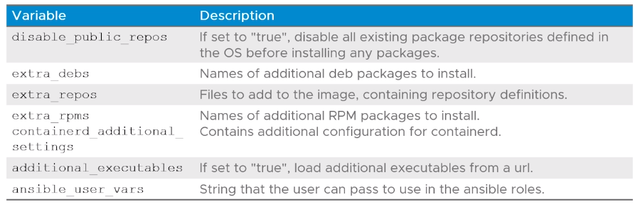

# 3.1 - Building Custom Cluster Machine Images

- [3.1 - Building Custom Cluster Machine Images](#31---building-custom-cluster-machine-images)
  - [Overview](#overview)
  - [Learner Objectives](#learner-objectives)
  - [Deploying Clusters Using Custom Machine Images](#deploying-clusters-using-custom-machine-images)
  - [Custom Machine Image Customizations](#custom-machine-image-customizations)
  - [Building Custom Images - Requirements](#building-custom-images---requirements)
  - [Steps to Create Custom Image](#steps-to-create-custom-image)
  - [Using Custom Images](#using-custom-images)

## Overview

- Tanzu Kubernetes clusters = Workload Clusters
- Applications are typically deployed to these clusters and managed by TKG Management clusters
- Provisioning and configuring Tanzu Kubernetes clusters is the key functionality that TKG provides

## Learner Objectives

- Describe the steps to build a custom image
- Describe the available customizations

## Deploying Clusters Using Custom Machine Images

- Custom machine images can be used as VM templates for Tanzu Kubernetes workload cluster nodes
- Each custom machine image packages a base OS version and a Kubernetes version, as well as any additional customizations into an image capable of running on:
  - vSphere
  - AWS
  - Azure
- Base OS can be any OS that VMware supports but does not distribute e.g. Red Hat Enterprise Linux (RHEL) v7

- **Note:** for TKG v1.3 - only workload clusters support custom images, both these and management clusters are supported in v1.4

## Custom Machine Image Customizations

- Variables including the above can be used to customize the image builds.

## Building Custom Images - Requirements

- The following requirements must be met for custom images:
  - Account on vSphere/AWS/Azure with sufficient permissions
  - Docker installed on Mac OS or Linux workstation
  - For AWS - aws CLI enabled
  - Azure - az CLI enabled
  - vSphere - OVFTool must be installed

## Steps to Create Custom Image

1. Determine and download image builder configuration version to be built from
Each version corresponds to the Kubernetes version that the Image Builder will use.
2. For vSPhere - load OVF tool in the image builder container image
3. Prepare the required configuration
4. Run image builder (recommended to do a dry run first)

## Using Custom Images

- After creating the custom images, you need to allow the Tanzu CLI to use the image - this requires creation of a custom Tanzu Kubernetes release based on the image

1. Open the BOM (Bill Of Materials) file corresponding to the Kubernetes version being used by the custom image
2. Edit the configuration as appropriate
3. Encode the BOM configuration in Base64
4. Create a ConfigMap YAML to the `tkr-system` namespace
5. Save the ConfigMap, set the context to the management cluster the Tanzu Kubernetes release is to be added to, and apply via `kubectl apply`
6. Verify the custom Tanzu Kubernetes release was added via `tanzu kubernetes-release get` or `kubectl get tkr`
