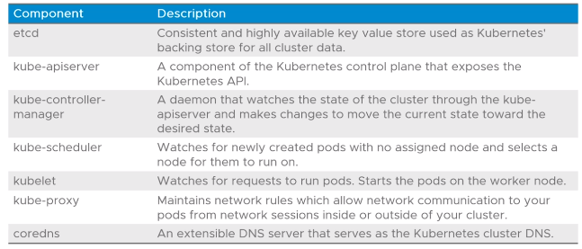
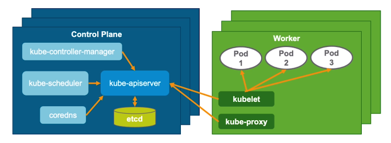
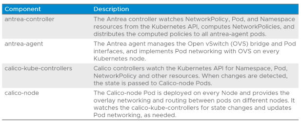
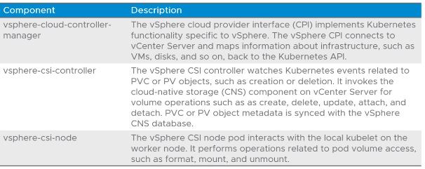

# 3.7 - Managing Cluster Lifecycles

- [3.7 - Managing Cluster Lifecycles](#37---managing-cluster-lifecycles)
  - [Learner Objectives](#learner-objectives)
  - [Tanzu Kubernetes Cluster VMs](#tanzu-kubernetes-cluster-vms)
  - [Upstream Kubernetes Components](#upstream-kubernetes-components)
  - [Kubernetes API High-Availability](#kubernetes-api-high-availability)
  - [Authentication Core Addons](#authentication-core-addons)
  - [Networking Core Addons](#networking-core-addons)
  - [vSphere Core Addons](#vsphere-core-addons)
  - [Metrics Core Addons](#metrics-core-addons)

## Learner Objectives

- Describe the VMs that make up a Tanzu Kubernetes cluster
- Describe the pods that run on a Tanzu Kubernetes Cluster
- Describe the Tanzu Kubernetes Grid core add-ons that are installed on a cluster

## Tanzu Kubernetes Cluster VMs

- Depending on the plan used, the following VMs will be created:
  - Control plan VMs: `<cluster name>-control-pane-......`
  - Worker node VMs: `<cluster name>-md-0-........`
- There will always be one or more of each.

## Upstream Kubernetes Components

- A number of standard Kubernetes components will be included upon deployment.

- Architecturally:

## Kubernetes API High-Availability

- The component `kube-vip` provides HA load-balancing for the Kubernetes control-plane
- By default, if included, it runs on every control plane.
- In classic HA fashion, one of the nodes will be elected the "leader" and advertises the virtual IP address using Address Resolution protocol
- If the node fails or becomes unhealthy, a leader election happens - a new leader will be elected from the available controlplane nodes and the winner will advertise the virtual IP address via ARP.

## Authentication Core Addons

- By default, TKG will implement Pinniped for cluster authentication, it comes with the following components:

## Networking Core Addons

- Tanzu Kubernetes Grid supports Antrea (default) or Calico as the container network interface (CNI) for in-cluster networking.
- Each come with their own components:

## vSphere Core Addons

- For each IaaS provider - additional components will also be deployed. For vSphere, the components are outlined as follows.

## Metrics Core Addons

- Tanzu Kubernetes Grid deploys a metrics server to management and workload clusters by default:
- metrics-server: Collects resource metrics from kubelets and exposes them in the Kubernetes API for use by Horizontal and Vertical Pod autoscalers
