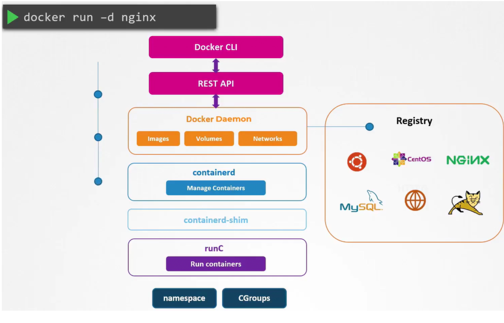

# 5.0 - Minimize Microservice Vulnerabilities

## 5.1 - Security Contexts

- When running docker containers, can specify security standards such as the ID of
the user to run the container
- The same security standards can be applied to pods and their associated containers
- Configurations applied a pod level will apply to all containers within
- Any container-level security will override pod-level security
- To add security contexts, add securityContext to either or both the POD and
Container specs; where user IDs and capabilities can be set
  - Note: Capabilities are only supported at container level

```yaml
apiVersion: v1
kind: Pod
metadata:
  name: web-pod
spec:
  containers:
  - name: ubuntu
    image: ubuntu
    command: ["sleep", "3600"]
    securityContext:
      runAsUser: 1000
      capabbilities:
        add: ["MAC_ADMIN"]
```

## 5.2 - Admission Controllers

- Commands are typically ran using the kubectl utility, these commands are sent to the kubeapi server and applied accordingly
  - To determine the validity of the command, it goes through an authentication process via certificates
  - Any kubectl commands come from users with a kubeconfig file containing
the certificates required
  - The determination of whether the process has permission to carry the task out is handled by RBAC authorization
    - Kubernetes Roles are used to support this.
- With RBAC, restrictions can be placed on resources for:
  - Operation-wide restrictions
  - Specific operation restrictions e.g. create pod of specific names
  - Namespace-scoped restrictions
- What happens if you want to go beyond this? For example:
  - Allow images from a specific registry
  - Only run as a particular user
  - Allow specific capabilities
  - Constrain the metadata to include specific information
- The above is handled by **Admission controllers**
  - Various pre-built admission controllers come with K8s:
    - AlwaysPullImages
    - DefaultStorageClass
    - EventRateLimit
    - NamespaceExists
- Example - NamespaceExists:
  - If creating a pod in a namespace that doesn't exist:
    - The request is authenticated and authorized
    - The request is then denied as the admission controller acknowledges that the namespace doesn't exist -> Request is denied
- To view admission controllers enabled by default: `kube-apiserver -h | grep enable-admission-plugins`
  - **Note:** For kubeadm setups, this must be run from the kube-apiserver control plane using kubectl

- Admission controllers can either be added to the .service file or the .yaml manifest depending on the setup:

```shell
ExecStart=/usr/local/bin/kube-apiserver \\
  --advertise-address=${INTERNAL_IP} \\
  --allow-privileged=true \\
  --apiserver-count=3 \\
  --authorization-mode=Node,RBAC \\
  --bind-address=0.0.0.0 \\
  --enable-swagger-ui=true \\
  --etcd-servers=https://127.0.0.1:2379 \\
  --event-ttl=1h \\
  --runtime-configmap=api/all \\
  --service-cluster-ip-range=10.32.0.0/24 \\
  --service-node-port-range=30000-32767 \\
  --v=2
  --enable-admission-plugins=NodeRestriction,NamespaceAutoProvision
```

```yaml
## /etc/kubernetes/manifests/kube-apiserver.yaml
apiVersion: v1
kind: Pod
metadata:
  creationTimestamp: null
  name: kube-apiserver
  namespace: kube-system
spec:
  containers:
  - command:
    - kube-apiserver
    - --authorization-mode=Node,RBAC
    - --advertise-address=172.17.0.107
    - --allow-privileged=true
    - --enabke-admission-plugins=NodeRestriction
    - --enable-bootstrap-token-auth=true
    image: k8s.gcr.io/kube-apiserver-amd64:v1.11.3
    name: kube-apiserver
```

- To disable a plugin use `--disable-admission-plugins=<plugin1>,<plugin2>, ....`
- **Note:** NamespaceAutoProvision is not enabled by default - it can be enabled by the
above menthods

## 5.3 - Validating and Mutating Admission Controllers

- **Validating Admission Controller** - Allows or Denies a request depending on the controllers functionality/conditions
  - Example: NamespaceExists
- Mutating Admission Controller: If an object is to be created and a required parameter isn't specified, the object is modified to use the default value prior to creation
  - Example: DefaultStorageClass
- **Note:** Certain admission controllers can do both mutation and validation operations
- Typically, mutation admission controllers are called first, followed by validation controllers.
- Many admission controllers come pre-packaged with Kubernetes, but could also
want custom controllers:
  - To support custom admission controllers, Kubernetes has 2 available for use:
    - MutatingAdmissionWebhook
    - ValidatingAdmissionWebhook
  - Webhooks can be configured to point to servers internal or external to the cluster
    - Servers will have their own admission controller webhook services running the custom logic
    - Once all the built-in controllers are managed, the webhook is hit to call to the webhook server by passing a JSON object regarding the request
    - The admission webhook server then responds with an admissionreview object detailing the response
- To set up, the admission webhook server must be setup, then the admission controller should be setup via a webhook configuration object
  - The server can be deployed as an api server in any programming language desired e.g. Go, Python, the only requirement is that it must be able to accept and handle the requests
    - Can have a validate and mutate call
  - **Note:** For exam purposes, need to only understand the functionality of the webhook server, not the actual code
- The webook server can be ran in whatever manner desired e.g. a server, or a deployment in kubernetes
  - Latter requires it to be exposed as a service for access
- The webhook configuration object then needs to be created (validating example
follows):
- Each configuration object contains the following:
  - **Name** - id for server
  - **Clientconfig** - determines how the webhook server should be contacted - via URL or service name
    - **Note:** for service-based configuration, communication needs to be authenticated via a CA, so a caBundle needs to be provided
  - **Rules:**
    - Determines when the webhook server needs to be called i.e. for what sort of requests should invoke the call to the webhook server
    - Attributes detailed include API Groups, namespaces, and resources.

```yaml
apiVersion: admissionregistration.k8s.io/v1
kind: ValidatingWebhookConfiguration
metadata:
  name: "pod-policy.example.com"
webhooks:
- name: "pod-policy.example.com"
  clientConfig:
    service:
      namespace: "webhook-namespace"
      name: "webhook-service"
    caBundle: "Ci0tLS0tQk.......tLS0K"
  rules:
  - apiGroups: [""]
    apiVersions: ["v1"]
    operations: ["CREATE"]
    resources: ["pods"]
    scope: "Namespaced"
```

## 5.4 - Pod Security Policies

- When developing pods, there may be configurations you wish to prevent users from using / applying on the cluster
  - Examples:
    - Prevent container from having root access to the underlying system
    - Prevent running as root user
    - Prevent certain capabilities
  - These restrictions can be enforced by Pod Security Policies
- There is a pod security policy Admission controller that comes as part of Kubernetes
by default, though it is not enabled by default.
  - Check if disabled by:: `kube-apiserver -h | grep enable-admission-plugins`
- It can be enabled by updating the `--enable-admission-plugins` flag with the `kube-apiserver.service` or `kube-apiserver.yaml` files:

```yaml
## /etc/kubernetes/manifests/kube-apiserver.yaml
apiVersion: v1
kind: Pod
metadata:
  creationTimestamp: null
  name: kube-apiserver
  namespace: kube-system
spec:
  containers:
  - command:
    - kube-apiserver
    - --authorization-mode=Node,RBAC
    - --advertise-address=172.17.0.107
    - --allow-privileged=true
    - --enabke-admission-plugins=NodeRestriction
    - --enable-bootstrap-token-auth=true
    - --enable-admission-plugins=PodSecurityPolicy
    image: k8s.gcr.io/kube-apiserver-amd64:v1.11.3
    name: kube-apiserver
```

- Once enabled, one can create a Pod Security Policy Object, outlining the requirements / restrictions. An example of restricting running as privileged user follows:

```yaml
apiVersion: policy/v1beta1
kind: PodSecurityPolicy
metadata:
  name: example-psp
spec:
  privileged: false
  seLinux:
    rule: RunAsAny
  supplementalGroups:
    rule: RunAsAny
  runAsUser:
    rule: RunAsAny
  fsGroup:
    rule: RunAsAny
```

- **Note:**
  - seLinux, supplementalGroups, runAsUser and fsGroup are all mandatory fields.
- Once deployed, any pod definition files will be checked against the pod security policy.
- **Note:** Need to ensure that the security policy api must be authenticated / authorized for the admission controller to work.
  - This can be achieved via RBAC
  - Every pod has a serviceAccount associated with it (default if not specified)
    - Can therefore create a role and bind the serviceAccount to allow
access to the pod security policy api

```yaml
## psp-example-role.yaml
apiVersion: rbac.authorization.k8s.io/v1
kind: Role
metadata:
  name: psp-example-role
rules:
- apiGroups: ["policy"]
  resources: ["podsecuritypolicies"]
  resourceNames: ["example-psp"]
  verbs: ["use"]
```

```yaml
apiVersion: rbac.authorization.k8s.io/v1
kind: Role
metadata:
  name: psp-example-rolebinding
subjects:
- kind: ServiceAccount
  name: default
  neamespace: default
roleRef:
  kind: Role
  name: psp-example-role
  apiGroup: rbac.authorization.k8s.io
```

- In Pod Security Policies, one can:
  - Force the user to run as "non-root"
  - Force capabilities to be added or removed
  - Restrict the types of volumes

## 5.5 - Open Policy Agent (OPA)

- Consider a user logging into a web server, there are typically multiple steps for
logging in:
  - Authentication - Checking identity
  - Authorization - Checking / restricting
- OPA exists to handle authorization requests / verification.
- Without OPA, any time a new service will be deployed, one will have to manually
configure all the routes and authorization mechanisms / policies between it and the
other services => VERY TEDIOUS!
- In practice, OPA is deployed within the environment and policies are configured
within it.
  - When a service wants to make a request to another service, the request first
goes to OPA, which either allows or denies it.
- **Step 1:**
  - Download from Github
  - Execute from within directory: `./opa run -s`
- **Step 2: Load Policies**
  - Policies defined in .rego language (Example follows):

    ```rego
    package httpai.authz

    # HTTP API Request
    import input

    default allow = false

    allow {
        input.path == "home"
        input.user == "john"
    }
    ```

    - {} determines acceptance conditions
  - Once ready, can load the policy via curl to use a PUT request e.g.: `curl -X PUT --data-binary @example.rego http://localhost:8181/v1/policies/example1`
  - To view the list of existing policies: `curl http://localhost:8181/v1/policies`
- Policies can then be called within programs by making a post request to the API and passing the required input parameters -> If allow conditions are met, OPA allows the request, if not, rejected.
- **Note:** A guide on utilising the rego language is available via the documentation and a "playground" for policy testing

## 5.6 - OPA in Kubernetes

- Kubernetes currently has RBAC for various functions except:
  - Only permit images from certain registries
  - Forbid "runAs Root User"
  - Only allow certain capabilities
  - Enforce pod labelling
- Admission Controllers go some way to covering these failures, with many
pre-packaged with Kubernetes and capable of mutation and validation operations
however even they have their limitations.
  - For custom admission controllers, would have to build a separate admission
controller webhook server
  - This need can be removed and centralized by using OPA in kubernetes.
- Assuming OPA is pre-installed in Kubernetes, one can create a
ValidatingWebhookConfiguration:
  - If OPA is not installed in the Cluster, set the ClientConfig URL to the server
  - If installed on the server, one needs to define:
    - The OPA caBundle
    - The OPA Kubernetes service details
- As discussed, the webhook configuration sends an admission review request to the
OPA endpoint - in this case, the request is checked against the .rego policy stored
within OPA.
  - This can be for operations such as checking image registries.
- For policies where information about other pods is required, need to utilise an
import statement:
Import data.kubernetes.pods
- To help OPA understand the state / definition of the Kubernetes cluster in OPA, one
can use the kube-mgmt service
  - Service deployed as a sidecar container alongside OPA
  - Used to:
    - Replicate Kubernetes resources to OPA
    - Load policies into OPA via Kubernetes
- If creating an OPA policy, can create a ConfigMap with the
following label: openpolicyagent.org/policy: rego
And define the policy logic under the configMap's data field.
- How is OPA deployed on Kubernetes?
  - Deployed with kube-mgmt as a deployment
  - Roles and rolebindings deployed
  - Service to expose OPA service to Kubernetes API Server
  - Deployed in an OPA namespace.
- Within the cluster, one can now create a validating/mutating admission webhook
and reference the OPA service

```yaml
apiVersion: admissionregistration.k8s.io/v1beta1
kind: ValidatingWebhookConfiguration
metadata:
  name: opa-validating-webhook
webhooks:
- name: validating-webhook.openpolicyagent.org
  rules:
  - operations: ["CREATE", "UPDATE"]
    apiGroups: ["*"]
    apiVersions: ["*"]
    resources: ["*"]
  clientConfig:
    caBundle: $(cat car.crt | base64 | tr -d '\n')
    service:
      namespace: opa
      name: opa
```

- **Note:** The above is the "old" way of implementing OPA to Kubernetes, nowadays a
gatekeeper service is used.

## 5.7 - Manage Kubernetes Secrets

- Used to store sensitive information e.g. passwords and keys
- Similar to configmaps but stored in hashed format
- Secrets must first be created before injection
- Creation via commands or a definition file:
  - Imperative: `kubectl create secret generic <secret name> --from-literal=<key>=<value>, ...`
    - Or use: `--from-file=/path/to/file`
  - Declarative:
    - Create a `secret.yaml` file
      - Under data - add secrets in key-value pairs
- To encode secrets: `echo -n 'secret' | base64`
- Secrets viewable and manageable via kubectl < task > secrets
- To view secrets values: `kubectl get secret <secret> -o yaml`
- To decode, use the `| base64` command with `--decode` flag
- Secrets can then be injected into pods as environment variables using the envFrom
field
  - One can also reference the secret directly using env // valueFrom
  - Alternatively, volumes can be used, but this isn't recommended.

## 5.8 - Container Sandboxing

- All containers running on a server share the same underlying kernel. From the host perspective, this is just another process isolated from the host and other containers running it.
- When running a container running a process, the process will have a different process ID within the container and on the host OS.
  - This is process ID namespacing
    - Allows containers to isolate processes from one another
    - **Note:** If process killed on the host, the container would also be stopped
- For containers to run in the user space, they need to make syscalls to the hardware -> this leads to issues
  - Unlike VMs, which have dedicated Kernels, share the same Kernel on the host OS
  - This can pose massive security risks as it means that containers could interact and affect one another.
  - Sandboxing can resolve this
    - Sandboxing techniques include:
      - **Seccomp** - Docker default profiles and custom profiles (K8s)
      - **Apparmor**
    - Both of the above work by whitelisting and blacklisting actions and calls:
      - **Whitelist** - Block by default and allow particular calls / actions
      - **Blacklist** - Allow by default and block particular calls/actions
    - Both have varying use cases, there is no set case for what works best.

## 5.9 - gVisor

- The Linux Kernel allows applications to perform an untold number of syscalls to
perform a variety of functions
- Whilst this can be great from a developer perspective, the same cannot be said for
security perspective. The more opportunities for Kernel interaction there are, the
more opportunities for attack.
- The core problem relates more to how each container in a multitenant environment
would be interacting with the same underlying OS and Kernel -> Need to improve
isolation from container-container AND from container-Kernel
- gVisor aims to implement the isolation between the container and Kernel.
  - When a program / container wants to make a syscall to the kernel, it first goes to gVisor
  - gVisor as a sandbox tool contains a variety of tools:
    - **Sentry** - An independent application-level Kernel dedicated for containers; intercepting and responding to syscalls
      - Sentry supports much less syscalls than the linux kernel as it's designed to support containers directly; limiting the opportunities for exploit.
    - **Gofer** - A file proxy that implements the logic for containers to access the filesystem
  - gVisor can also facilitate and monitor network-based operations.
  - Each container has its own gVisor Kernel acting between the container and the host kernel.
- The main con of gVisor is that its compatibility with applications can be limited, it can also result in slightly slower containers.

## 5.10 - Kata Containers

- Kata aims to set the isolation at its own VM / container
- Each container will have its own dedicated kernel running inside
- Removes the issue(s) when all container apps communicate with the same host
kernel -> if any issues occur, only the affected container will have issues
- The VMs created by Kata are lightweight and performance-focussed, therefore
would not take long to spin up.
  - The added isolation and VM would require additional resources
  - Additionally, there are compatibility issues for virtualization
- **Note:** Wouldn't want to run Kata on cloud instances / not be able to, this would be
nested virtualization and can lead to major performance issues.

## 5.11 - Runtime Classes

- When running a container, the following steps from Docker CLI are applied



1. Docker client converts command to a REST API
2. REST API request passed to Docker Daemon
3. If the image is not present in the local system, it is pulled from the Docker registry
4. The call is made to containerd to start the container -> containerd converts image to OCI-compliant bundle
5. The OCI-compliant bundle is passed to the containerd-shim, triggering the runtime runC to start the container
6. RunC interacts with the Kernel's namespaces and CGroups on the Kernel to create the container

- RunC is referred to the default container runtime and adheres to OCI standards for format and runtime
- With runc installed on a server, containers could be ran on their own via `runc run <image>`
  - Without docker's features e.g. image management, managing the container would be very tough
  - runC is the default container runtime for many container systems
- Kata and gVisor use their own runtimes that are OCI-compatible
  - The OCI-compatibility means that kata and runsc (gvisor) could be used with
Docker without issue by adding a `--runtime <runtime>` to the `docker run` command.

## 5.12 - Using Runtimes in Kubernetes

- Assuming gVisor is already installed on the nodes of a Kubernetes cluster, it can be used as the runtime for containers within easily.
- To do so, a runtimeclass Kubernetes object is required, which can be created using kubectl as usual. The handler should be a valid name associated with the given runtime / application.

```yaml
## gvisor.yaml

apiVersion: node.k8s.io/v1beta1
kind: RutnimeClass
metadata:
  name: gvisor
handler: runsc
```

- To specify the runtime to be used by the pod, add `runtimeClassName: <runtime class name>` to the pod spec
- To check if pods are running in this runtime, run `pgrep -a <container name>`
  - If no output is given, there is an isolation between the system and the container and it's running in the defined runtime as expected.
  - To check the runtime: `pgrep -a <runtime>`

## 5.13 - One-Way SSL vs Mutual TLS (mTLS)

- **One-Way SSL:**
  - Receivers can only verify identities based on the information sent by clients
e.g. emails, social media using usernames and passwords
- If there is no end-user to provide the information e.g. two services, what then?
  - **Mutual SSl is required:**
    - Client and Server verify their identities
    - When requesting data from the server, the client requests the servers public certificates
    - When the server sends it back, it requests the clients certificate and the client verifies the server certificate with the CA it uses
    - Once verified, the client sends its certificate with a symmetric key encrypted with the server's public key
    - The server then validates the client certificate via the CA.
- Once both certificates are verified, all communication can be encrypted using the symmetric key.

## 5.14 - Implement Pod-to-Pod Encryption via mTLS

- By default, data transfer between pods is unencrypted -> This is a MAJOR security risk
- Pods can be configured to use mTLS though.
  - Similar to the previous example, but replace client and server with pod a and pod b respectively.
  - This ensures that both pods verify each other's identities.
- How would this be managed across multiple pods and nodes?
  - This is achievable by getting applications to encrypt communications by default, however this could then cause issues if there are differing encryption methods.
  - Typically, third party applications are used to facilitate the mTLS e.g. Istio and Linkerd
    - These are Service Mesh tools and aren't confined to mTLS only, they are typically used to facilitate microservice architecture
  - Tools like this run alongside pods as sidecar containers
  - When a pod sends a message to another, istio intercepts, encrypts and sends the message, where it is encrypted by the istio container running alongside the receiving pod.
  - Istio supports varying types of encryption levels / modes:
    - **Permissive / Opportunistic** - Will accept unencrypted traffic where possible / deemed safe
    - **Enforced / Strict** - No unencrypted traffic allowed at all
