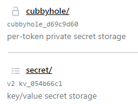
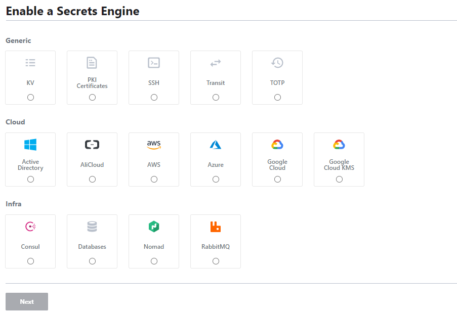
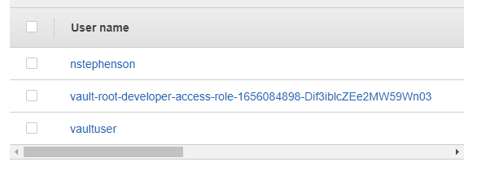
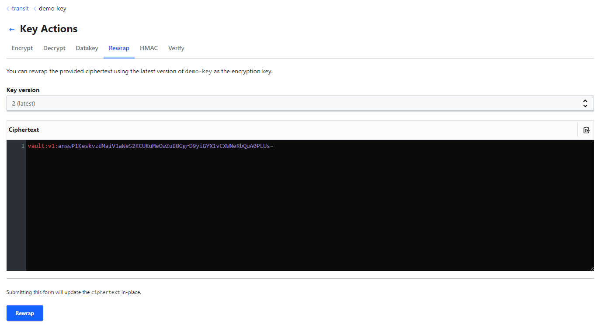
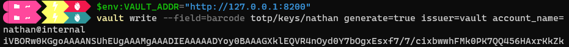
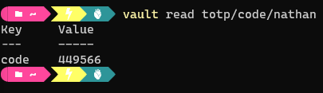

# 2.0 - Getting Started with Vault

## 2.01 - Overview of HashiCorp Vault

### Notes

#### Getting Started

- Vault allows enhanced management and storage of secrets such as tokens, passwords, tokens, certificates, etc.
- Secret management in general is one of the most common and high-priority challenges faced by organisations - this generally includes storage, access management, and rotation of secrets.
- Secrets include anything from database passwords, AWS access/keys, API tokens, encryption keys, etc.

---

#### Dynamic Secrets and Vault Console

- As discussed in the previous section, Vault aims to offer Dynamic Secrets i.e. users request the credentials from Vault, the credentials generated are then rotated based on the policies set.
- Vault was previously CLI-only, but is now packaged with a UI / Console to help with management.
- This console can be easily used to generate new credentials for many different secret types.
- This can be viewed via the Vault CLI, the following command provides credential details including password, username, and lease time:

```bash
vault read database/creds/readonly
```

- Other functionalities include encryption.
- In general, once installed, Vault can remove the manual aspect of many secret management tasks, allowing engineers and admins to spend more time on the work they're required for.

## 2.02 - Installation of HashiCorp Vault

- Vault is available on all major operating systems and can also be installed on platforms such as Kubernetes clusters.

### Windows

- Download and extract binary file from [https://www.vaultproject.io/downloads](https://www.vaultproject.io/downloads)
- Or use package managers such as Chocolatey:

```powershell
choco install vault
```

- Verify the installation:

```powershell
vault
```

- Ensure Vault's location is added to the PATH env variable.

---

#### Linux

- [https://learn.hashicorp.com/tutorials/vault/getting-started-install?in=vault/getting-started](https://learn.hashicorp.com/tutorials/vault/getting-started-install?in=vault/getting-started)

##### Ubuntu

- Add the HashiCorp [GPG key](https://apt.releases.hashicorp.com/gpg)

```bash
curl -fsSL https://apt.releases.hashicorp.com/gpg | sudo apt-key add -
```

- Add the official HashiCorp Linux repository - replace arch=<> as appropriate (confirm via `arch`

```bash
sudo apt-add-repository "deb [arch=amd64] https://apt.releases.hashicorp.com $(lsb_release -cs) main"
```

- Update and Install

```bash
sudo apt-get update && sudo apt-get install vault
```

- Again, ensure it is in $PATH if installing manually

```bash
echo $PATH
mv <vault binary> $PATH
```

---

#### MacOS

[https://learn.hashicorp.com/tutorials/vault/getting-started-install?in=vault/getting-started](https://learn.hashicorp.com/tutorials/vault/getting-started-install?in=vault/getting-started)

## 2.03 - Initializing Vault with Dev Server Mode

- Vault has two modes for operation:
  - Dev
    - Typically used for local development, testing, and practice
    - Very insecure
    - All data is stored in-memory ⇒ Any data stored will be lost upon restart
  - Prod
- Vault can be started as a server in "dev" mode via the following command:

```bash
vault server -dev
```

- Resultant output provides details regarding the vault server.

```bash
Vault server configuration:

             Api Address: http://127.0.0.1:8200
                     Cgo: disabled
         Cluster Address: https://127.0.0.1:8201
              Go Version: go1.17.5
              Listener 1: tcp (addr: "127.0.0.1:8200", cluster address: "127.0.0.1:8201", max_request_duration: "1m30s", max_request_size: "33554432", tls: "disabled")
               Log Level: info
                   Mlock: supported: false, enabled: false
```

- By default, the UI is available at the address listed against `Api Address`


- To obtain the token for login - refer to the end of the output of the command used to start Vault in dev server mode, extract the root token and login to the UI:

```bash
The unseal key and root token are displayed below in case you want to
seal/unseal the Vault or re-authenticate.

Unseal Key: <Key>
Root Token: <Token>

Development mode should NOT be used in production installations!
```

- Once in the UI, menu options available will include:
  - Secrets - Secrets stored via various storage methods (engines)
  - Access -
  - Policies
  - Tools
- To verify the status of the Vault Server, use the `vault status` command, appending the server address via the —address option.

```bash
vault status --address=$VAULT_ADDR
```

- Where $VAULT_ADDR is the address of the Vault server provided at Vault initialisation.
- To stop the server, simply use `CTRL+C` on the terminal where Vault is running. Note that upon restart, the root token will be different.

## 2.04 - Creating a Secret

- One of Vault's key features is to read and write arbitrary secrets securely.
- It does so utilising Secrets engines - these are components responsible for the storage, generation, or encryption of data.
- Secrets can be stored based on a specific secret engine - each engine offers particular features.

---

### Secret Example

- When starting Vault in dev server mode, two secret engines exist as part of the standard setup:
  - Cubbyhole
  - Key-Value



#### GUI Secret Generation - KeyValue

- To create a secret, navigate to the secret engine of choice and select `create secret`


- For keyvalue add the following:
  - path - secret name
  - secret metadata - maximum number of versions
  - version data - add password associated with secret in key-value form
- Once saved, the secret is logged and the password can be checked by selecting the eye icon
- This secret can be edited at any point - changes are logged as versions which can be switched between at any point
- Delete and destroy operations are available for each version, or all versions can be destroyed
  - In this case, destroy is permanent deletion, delete offers the chance to recover the secret.

##### CLI Creation

- Options for secret generation in the KV engine via the CLI can be viewed via, this includes CRUD operations, amongst others:

```bash
vault kv -h
```

- To create in the kv engine:

```bash
vault kv put /path/to/secret key=value
```

- Secret creation  can then be verified in the HC Vault UI
- New versions of secrets can be created via the CLI:

```bash
vault kv put secret/secret-name key=new-value
```

- To read a secret:

```bash
vault kv get secret/secret-name
```

- To read a particular version,  append `-version=<version number>`
- Example:

```bash
vault kv get -versions=<version number> secret/secret-name
```

- For deletion:

```bash
vault kv delete -versions=<number> path/to/secret
```

- For undeletion:

```bash
vault kv undelete -versions=<number> path/to/secret
```

- For full version destruction:

```bash
vault kv destroy -versions=<number> path/to/secret
```

- For full secret destruction - covering all versions and data relating to the secrets:

```bash
vault kv metadata delete path/to/secret
```

- Note: `-h` option provides MANY options for use case examples

## 2.05 - Overview of Secrets Engine

### Secret Engine Overview

- Secrets engines are components that **store**, **generate** or **encrypt** data.
- Secrets can be stored based on specific secret engines, each offer particular features.


#### Secret Engine Types

- Similar to Terraform Providers, multiple secret engine types are available, each providing particular features for specific use cases. Examples include:
  - AWS
  - Active Directory
  - Key/Value
  - SSH
  - Azure

#### Secret Engine Paths

- Secret engines are enabled at a given path. Once enabled, the secrets are stored at that particular path.
- You can control where a secret is installed via the following command:

```python
vault kv put <secret engine path>/<secret name> mykey=myvalue
```

#### Secret Engine Lifecycle

- In general, engines can be:
  - Enabled
  - Disabled
  - Tuned
  - Moved

    | Option | Description |
    | --- | --- |
    | Enable | Enables a secrets engine at a particular path. By default, they will be enabled at their "type" e.g. "aws" enables at "aws/" |
    | Disable | Disables an existing secrets engine - this by default will revoke all secrets associated with the engine |
    | Move | Moves the path for an existing secrets engine, |

#### Example - Key/Value Secret Engine

- The KV secrets engine stores arbitrary secrets within the configured physical storage for Vault
- Key names must always be strings
- Provides various functionalities e.g. versioning.
- Further information regarding secrets engines is available at [https://www.vaultproject.io/docs/secrets](https://www.vaultproject.io/docs/secrets)

    > Note: There are two versions of the kv secrets engine, version 2 is the latest.
    >
- Engines can be enabled via the CLI or the UI.

##### Enabling a Secrets Engine - UI

- From the home page, select `Enable new engine`
- Select the desired engine from the list provided, in this case, KV.

    

- Configure the `Path` AND the Maximum number of versions per key to keep, then enable the engine.
- The secret engine is now available for usage and can have secrets be created within.

##### Enabling a Secrets Engine - CLI

- To enable a secrets engine, run:

    ```powershell
    vault secrets enable -path=demopath -version=2 kv
    ```

    

#### Disabling a Secret Engine

- To disable a secret engine via the CLI, run:

    ```powershell
    vault secrets disable <pathname>/
    ```

    

## 2.06 - Overview of Dynamic Secrets

### Dynamic Secrets Overview

- In the KV secret engine, data had to be stored manually.
- By contrast, certain engines work based on dynamic secrets - these do not exist until a request comes in to generate them.
- A typical use case is when requesting access to a database. If integrated, users can send a request to HashiCorp Vault to generate a username and password dynamically to the user for testing purposes.
  - These secrets can be set to expire for enhanced security measures.
- Another use case is using the AWS secrets engine to generate temporary AWS credentials e.g. access and secret keys.

#### Example - AWS Secret Engine

- Assuming a user has created a role via the AWS secret engine - if a developer navigates to the role under the AWS secret engine and selects "generate" - a set of dynamic AWS credentials are created for the user and is added to "your" AWS account under IAM.


- As part of the generated credentials it is worth noting:
  - Authorisation keys (access and secret)
  - Lease ID - Unique Identifier for the Leased Credentials
  - Renewable - Can a user make multiple requests to this engine for credentials?
  - Lease Duration - How long do the credentials last?
- Vault will automatically revoke the dynamic credentials upon the completion of the lease duration - alternatively it can be revoked manually by the UI under Access → Leases.

## 2.07 - Generating AWS Credentials Dynamically

### Example - Generating AWS Credentials Dynamically from Scratch

- From the home screen in the UI, select "Create New Engine" and select "AWS" from it.
- Leave the path and other options as default for now and select "Enable Engine".
- Options will now be available for use - roles and configurations.
  - Roles - What access level does the credentials requested for generation allow?
- Select "Create Role" and assign a role name as required.
- In terms of policy, you can select any policy listed under IAM → Access Management → Policies in the AWS Console, or write your own.


- Opening the policy, copy the policy (JSON Format) into Vault and modify it accordingly.


- Once created, Vault users can use that role to generate a set of dynamic credentials, which will have the permissions assigned based on the policy defined, in this case, full access to all EC2 instances.
- To allow this, one needs to create a user to act as a service account for Vault.
  - Add user titled e.g. vaultuser
  - Set access type to "AWS Management Console Access" and create the user
  - Note the password and attach "AdministratorAccess" policy
  - Generate Access and Secret Access Keys for the vaultuser account
  - In Vault, under Configuration → Configure AWS, add the Access and Secret Keys associated with the Vault user.
    - Configure the region and IAM endpoint as required.
  - Now any developer wanting access credentials with the associated role simply has to select "Generate" on the role and will be provided with temporary dynamic Access and Secret keys for AWS.
  - Vault will use the user account to create the temporary user with the assigned policy.

    

## 2.08 - Managing Leases

### Overview of Lease

- With every dynamic secret and service type authentication token, Vault will create a lease.
- Leases are metadata containing information regarding how the credentials are used e.g. time to live (TTL), renewability, etc.
- Once the lease expires, Vault can automatically revoke the data such that the secret can no longer be used.
  - Dynamic credentials can be manually revoked regardless.
- To view leases, in Vault UI navigate to Access → Leases
  - From here, you can navigate to the lease associated with the role or secret engine that you wish to view or revoke.
  - The lease can easily be revoked by selecting "revoke lease"
- Lease TTL can be configured with two options:
  - Default TTL (seconds)
  - Maximum TTL (seconds)

> Note: When creating a role and noting a policy, you can also copy the policy ARN rather than the json policy.
>
- Prior to a Vault Lease Expiring you are able to request renewal of the lease either via the UI (selecting "renew lease" when viewing the lease") or running the following command:

```powershell
vault lease renew -increment=<time in seconds> path/to/lease
```

- This will extend the lease duration by the increment defined.

- **Note:** The default and maximum TTLs will vary depending on the organization, but they can be customised to suit and renewed via the methods above.

- If a user requests a renewal longer than the maximum TTL, the request will be denied.

## 2.09 - Path-Based Revocation

- When revoking leases in HashiCorp Vault, there are typically two main methods:

| Command | Description |
| --- | --- |
| `vault lease revoke <lease id>` | Revoke a lease of particular ID |
| `vault lease revoke -prefix aws/` | Revoke all AWS access keys - substitute AWS with the prefix associated with the desired secret engine |

- Lease IDs are structured in a way such that their prefix is always the path where the secret was requested from - this allows trees of secrets to be revoked by prefixes.

## 2.10 - Transit Secret Engine

### Overview

- Many applications require proper encryption/decryption functionalities
- Building the custom logic to handle this can add excessive workloads to application developers, particularly if they lack expertise in this area.
- Vault has a functionality to support this in its **transit secrets engine -** which handles cryptographic functions on data-in-transit.
- Vault doesn't store the data sent to the secrets engine, so it can also be viewed as encryption as a service.
- Therefore, instead of developing and managing cryptographic-related operations, application developers can get Vault to cover this.


- Based on the above, one can see:
  - Apps can send data to vault to be encrypted prior to storage in databases.
  - The app can then retrieve the encrypted data from the database and request decryption via Vault
- Once the transit secrets engine is enabled, you are required to create an encryption key to facilitate cryptographic operations.


- The primary use cases will be encrypt and decrypt.
- Selecting encrypt, you can easily enter any text to be encrypt and be provided ciphertext


- This data will not be stored by the Vault - to decrypt, provide the ciphertext provisioned during encryption.
- To do this via the CLI:
  - `vault write transit/encrypt/<key-name> plaintext=<base64 / encoded text>`
  - The ciphertext is then provided and must be stored safely outside the vault - otherwise the data cannot be decrypted
  - To decrypt: `vault write transit/decrypt/<key-name> ciphertext=<cipher key>`

---

### Dealing with larger Data Blobs

- When data is encrypted, the encryption key to encrypt plaintext is referred to as a data key.
- This data key needs to be protected so that the encrypted data cannot be decrypted easily by an unauthorized party.
- When the data is large, naturally we wouldn't want to send it over traditional network means for encryption/decryption operations as this would increase latency.
- The transit engine allows generation of a data key that ca be used locally for encryption and decryption operations.


- The data key can now be used for encryption operations, the ciphertext can then be used for decryption operations with vault, submitting the ciphertext to obtain the plaintext decryption key.
- Best practices:
  - Whenever generating a data key in plaintext - the response contains the plaintext of the data key as well as its ciphertext
  - Use the plaintext to encrypt the large data and store the ciphertext in the desired location e.g. key/value secrets engine.
  - When the blob requires decryption, request Vault to decrypt the ciphertext of the data key - allowing you to get the plaintext back for local decryption.

---

### Important Features

#### Key Rotation

- It's not recommended to encrypt all data with the same encryption keys for obvious reasons.
- Transit Engine allows a rotation of the encryption key.
- Vault maintains the versioned keyring and the vault operator can decide the minimum version allowed for decryption operations e.g. only the latest could be allowed.
- When creating an encryption key, the format will always be `vault:v<number>:<ciphertext>` - the number following the v denotes the version.
- To rotate the encryption key - simply select "rotate encryption key" - for future encryption options you will then be allowed to select which version you wish to encrypt the data with.

#### Minimum Decrypt Version

- As multiple versions of encryption keys appear, this leads to an increased likelihood of working keys being obtained for decryption in the event of an attack.
- Using the **min_decryption_version** setting we can plan on what data can get decrypted.
- As a result of this, found ciphertext to obsolete data cannot be decrypted, but in an emergency, the **min_decryption_version** can be moved back to allow for legitimate decryption.
- You can configure the minimum decryption and encryption versions by editing the encryption key.


#### Rewrapping Data

- When a key is rotated, Vault can allow encrypted data to be rewrapped.
- The Vault can send the data encrypted with an older version of the key to have it re-encrypted with the latest version




- This will produce a new ciphertext for the data in accordance with the required key version - allowing you to successfully decrypt the data.

## 2.11 - TOTP Secrets Engine

- TOTP = Time-Based One-Time-Passwords
- These are passwords that typically expire within 30, 60 seconds, etc.
- An example of this is Google Authenticator.
- Typically these TOTPs will regenerate with new values after the set timeframe.
- Vault offers both generation and provision services for TOTPs.
- To create, simply select TOTP from the list of secrets engines available. Note that you cannot now select it to open.


- For usage e.g. for a barcode:
  - Generate data for bar code:
    - `vault write --field=barcode totp/keys/<keyname> generate=true issuer=vault account_name=<user>`
    - The resultant output should follow - note that you must have the VAULT_ADDR environment variable for this to work

        

  - Write the data to a file, decode the data and store it in an image file:
    `cat <file containing code> | base64 -d > totp.jpg`
  - This will result in a barcode data that can be used by authentication apps like google authenticator.
  - The code can also be read from the Vault itself:

    

## 2.12 - PKI Secrets Engine

- Disclaimer - PKI is a huge topic in itself, however for the purposes of the certification, you can only consider it at a high level.
- Certificate Authority:
  - Any entity that issues digital certificates
  - Both the receiver and sender have a trusted relationship with the CA during the process.
  - The certificate authority validates the address/domain being accessed and the users accessing the domain.
- Typically, CAs work via the following process:
    1. Users/Entities generate a Certificate Signing Request (CSR)
        1. Generate public/private keys
        2. Generate CSR and have it signed with a private key
    2. Submit the CSR to the CA to get it signed
- The above steps are typically achieved via the openssl tool:

```powershell
## Create base directory for certificates and keys
mkdir /root/certificates
cd /root/certificates

## Create a private key for the CA
openssl genrsa -out ca.key 2048

## Create a CSR
openssl req -new -key ca.key -subj "/CN-KUBERNETES-CA" -out ca.csr

## Self-sign the CSR
openssl x509 -req -in ca.csr -signkey ca.key -CAcreateserial -out ca.crt -days 1000
```

- The PKI Secrets Engine Provided by HashiCorp Vault aims to simplify this process by generating dynamic X509 certificates.
  - This removes the need for manual generation of certificates as outlined in the steps above - Vault acts as the CA.
- PKI Secrets Engines can be implemented easily enough via the Vault UI. Once done, selecting "issue certificate" and the common name will allow generation of the certificate.

### Benefits of PKI In Vault

- Vault can act as an Intermediate CA i.e. a liaising certificate authority between the identity certificate authority and a third-party root CA.
- It reduces or eliminates certificate revocations
- Reduces time to get certificate by eliminating the need to generate a private key and a CSR.
