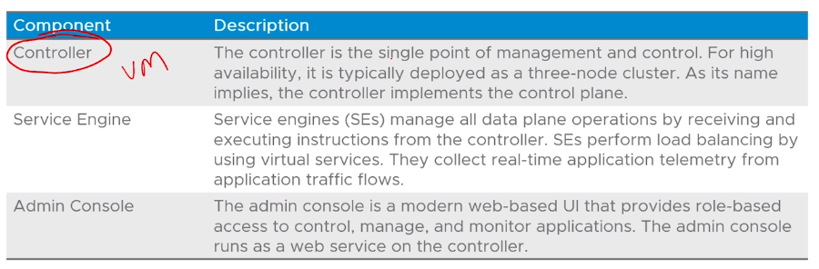
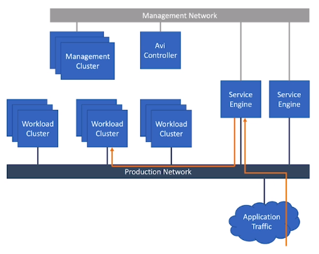
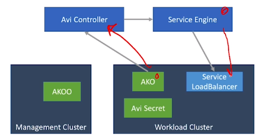

# 2.4 - NSX Advanced Load Balancer

## Objectives

- Describe the NSX Advanced Load balancer components
- Explain how Tanzu Kubernetes Grid integrates with NSX Load Balancer

## Load Balancing Kubernetes Services

- TKG supports optional integration with NSX advanced load balancer
- NSX Advanced Load Balancer doesn't require any licenses to be used with TKG
- The integration allows NSX Advanced Load Balancer to provide layer-4 load balancing services when a load balancer service type is created on a TK workload cluster.
- NSX Advanced Load Balancer does not perform load balancing for the Kubernetes API on control plane nodes - this is handled by kube-vip.

## NSX Advanced Load Balancer

### Components

### Architecture

- When applications running on a workload cluster are exposed using a load balancer service type, traffic inbound to the apps is routed to the Service Engines, from which they're routed to a NodePort IP address on the workload cluster.

- The AVI controller determines the configuration and operations of the Service engines

## AKO Operator Functionality

- The AKO Operator (AKOO) runs on management clusters and is reponsible for deploying the AKO on workload clusters.
- When any new workload cluster is deployed, the AKOO:
  - Creates a user dedicated to the workload cluster in the NSX Advanced LoadBalancer controller
  - Creates a Kubernetes secret in the workload cluster; containing the new user credentials
  - Deploys the AKO Controller to the workload cluster

## AVI Kubernetes Operator Functionality

- Avi Kubernetes Operator = AKO
- When a service of type load balancer is created on the workload cluster, the AKO Operator sends a request to the NSX Advanced Load Balancer controller to create a virtual service
- The NSX Advanced Load Balancer controller sends a request to the SE to configure a virtual service
- The SE load balances traffic to pods running in the cluster.

