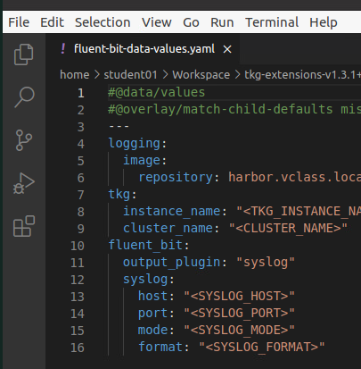
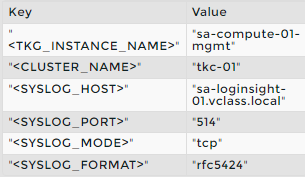

# 4.06 - Lab 10

## Objectives

- Configure FluentBit
- Deploy FluentBit
- Access vRealize log insight to view logs

## Configure Fluentbit

1. Using the terminal, navigate to the `fluent-bit` directory.

    `cd ~/Workspace/tkg-extensions-v1.3.1+vmware.1/extensions/logging/fluent-bit`

2. Make a copy of the example Syslog settings.

    `cp syslog/fluent-bit-data-values.yaml.example fluent-bit-data-values.yaml`

3. Open `fluent-bit-data-values.yaml` in Visual Studio Code.

    `code fluent-bit-data-values.yaml`

    

    1. Modify the following parameters within < >
        1. Instance = TKG Instance or Management Cluster
        2. Cluster = tkc-01 = workload cluster

        

    2. Save the file and close Visual Studio Code.
4. Verify that the configuration file matches the reference configuration file.

    `checkconfig fluent-bit-data-values.yaml`

    When a configuration mismatch exists, Visual Studio Code opens the configuration file in the left panel and the reference configuration file in the right panel.

    1. If a configuration mismatch exists, modify the configuration on the left to match the reference configuration on the right.

        Differences are highlighted in red.

    2. Save the file and close Visual Studio Code.

## Deploy FluentBit

1. Using the terminal, navigate to the `fluent-bit` directory.

    `cd ~/Workspace/tkg-extensions-v1.3.1+vmware.1/extensions/logging/fluent-bit`

2. Set the kubectl context to the tkc-01 cluster.

    `kubectl config use-context tkc-01-admin@tkc-01`

3. Create a namespace for Fluent Bit.

    `kubectl apply -f namespace-role.yaml`

4. Create a Kubernetes secret from the settings file.

    `kubectl create secret generic fluent-bit-data-values --from-file=values.yaml=fluent-bit-data-values.yaml -n tanzu-system-logging`

5. Deploy Fluent Bit.

    `kubectl apply -f fluent-bit-extension.yaml`

6. Verify the status of the deployment by using kubectl.

    `kubectl get app fluent-bit -n tanzu-system-logging`

    Re-run the command until the status displays as `Reconcile succeeded`.

7. Verify the status of the deployment by using kapp.

    `kapp list -n tanzu-system-logging`

    `kapp inspect --app fluent-bit-ctrl -n tanzu-system-logging`

## Access VRealize Log Insight to View Logs

1. In Firefox, open the vRealize Log Insight bookmark in a new tab.

    `https://sa-loginsight-01.vclass.local/`

2. Log in to vRealize Log Insight.
    - User name: admin
    - Password: VMware1!
3. Click **Interactive Analytics**.

    The logs for tkc-01 display.
