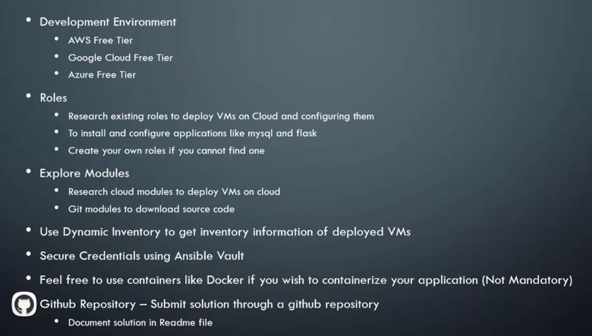

# 14.0 - Assignment

## 14.1 - Overview

- Deploy the simple-webapp to the cloud
- Deploy all required servers e.g. 1 db and 1 web servers
- Deploy the simple-webapp as required using the predone playbook
- Run each service as a service
- Configure load balancing for multiple servers
- Send out a notification email upon playbook completion, with login details for the server access

- Servers can be on any suitable cloud provider or vmware
- Adhere to distributed deployment model - we don't do monolithic
- Use any suitable load balancer e.g. AWS Elastic Load Balancing, Nginx, HAProxy

---

## AWS

- Deploy EC2 Instances
- Configure Networking for EC2 Instances
- Deploy Application and Database

## Areas to Check

- Mysql CNF Updates e.g. bind_address at `/etc/mysql/<cnf file>`
- Make sure web_server host is set accordingly

---

[Example for GCP](https://github.com/mmumshad/udemy-ansible-assignment)
[Ansible EC2 Docs](https://docs.ansible.com/ansible/latest/collections/amazon/aws/ec2_instance_module.html)
