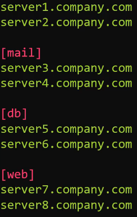

# 3.0 - Ansible Inventory

## 03.1 - Ansible Inventory

### Introduction

- Ansible can work with one or multiple systems in the system at the same time
  - This requires it to establish connection via SSH (Linux) or Powershell Remoting (Windows)
- This makes Ansible agentless - no additional packages are required for connection to be established to the target machines, unlike similar tools.
- Information regarding the target machines is noted in an Inventory file, stored by default in /etc/ansible/hosts , an example follows:
  - Servers can be listed one after another as standalone entries or as part of a group, denoted by [groupname]

    

- Aliases for hosts, for ease of reference, can be added in a manner similar to:

```bash
<alias> ansible_host=server.company.com
```

---

- Other parameters are available for use in inventory files, such as:
  - ansible_connection - ssh/winrm/localhost
    - Determines how ansible connects to the target server - Linux or Windows-based system, or applying changes to localhost
  - ansible_port - 22/5896
    - 22 for SSH by default
  - ansible_user - root/administrator
    - User logging in to make changes, set to root by default
  - ansible_ssh_pass - Password
    - ssh password for linux - NOT RECOMMENDED to do this in plaintext, ssh key-based passwordless authentication should be used, especially in production environments.

## 03.2 - Demo: Ansible Inventory

### Introduction

- Verify connection between ansible-controller and targets 1-2 via ssh
- Create an inventory.txt file and add details regarding  ansible-target1 in a format similar to:

```bash
<hostname> ansible_host=<IP> ansible_ssh_pass=<password>
```

---

Once complete, run the following command:

```bash
ansible target1 -m ping -i inventory.txt
```

- This calls ansible to use the ping module to test the connection to the host target1 based on the inventory file inventory.txt's information.
- A successful message will be similar to:

```bash
ansible-target1 | SUCCESS => {
    "ansible_facts": {
        "discovered_interpreter_python": "/usr/bin/python"
    },
    "changed": false,
    "ping": "pong"
}
```

- Repeat for the second target machine.
- Note, if SSH has not been successful for any of the target machines, this will fail.
  - Alternatively, changes can be made to the /etc/ansible/ansible.cfg by uncommenting the line that asks "host key check

    ---

    ---

### Exercises

1. We have a sample inventory file with 3 servers listed. Add a fourth server by the name `server4.company.com`.

```yaml
## Sample Inventory File

server1.company.com
server2.company.com
server3.company.com
server4.company.com
```

1. We have added aliases named `web1`
, `web2`
 and `web3`
 for the first three servers. Update server4 to have an alias `db1`

```yaml
## Sample Inventory File

web1 ansible_host=server1.company.com
web2 ansible_host=server2.company.com
web3 ansible_host=server3.company.com
db1 ansible_host=server4.company.com
```

1. The web servers are linux, but the db server is windows. Add additional parameters in each line to add `ansible_connection`, `ansible_user` and `password`. Use the below table for information about credentials.

| Alias | Host | Connection | User | Password |
| --- | --- | --- | --- | --- |
| web1 | server1.company.com | SSH | root | Password123! |
| web2 | server2.company.com | SSH | root | Password123! |
| web3 | server3.company.com | SSH | root | Password123! |
| db1 | server4.company.com | Windows | administrator | Password123! |

Note: For linux use `ansible_ssh_pass` and for windows use `ansible_password`. Connector for windows is `winrm`

```shell
web1 ansible_host=server1.company.com ansible_connection=ssh ansible_user=root ansible_ssh_pass=Password123!
web2 ansible_host=server2.company.com ansible_connection=ssh ansible_user=root ansible_ssh_pass=Password123!
web3 ansible_host=server3.company.com ansible_connection=ssh ansible_user=root ansible_ssh_pass=Password123!
db1 ansible_host=server4.company.com ansible_connection=winrm ansible_user=administrator ansible_password=Password123!
```

1. We have created a group for web servers. Similarly create a group for database servers named `db_servers` and add `db1` server to it.

```shell
## Web Servers
web1 ansible_host=server1.company.com ansible_connection=ssh ansible_user=root ansible_ssh_pass=Password123!
web2 ansible_host=server2.company.com ansible_connection=ssh ansible_user=root ansible_ssh_pass=Password123!
web3 ansible_host=server3.company.com ansible_connection=ssh ansible_user=root ansible_ssh_pass=Password123!

## Database Servers
db1 ansible_host=server4.company.com ansible_connection=winrm ansible_user=administrator ansible_password=Password123!

[web_servers]
web1
web2
web3

[db_servers]
db1
```

1.

Let us now create a group of groups. Create a new group called `all_servers` and add the previously created groups `web_servers` and `db_servers` to it.

Note: Syntax:

[parent_group:children]

child_group1

child_group2

```shell
## Web Servers
web1 ansible_host=server1.company.com ansible_connection=ssh ansible_user=root ansible_ssh_pass=Password123!
web2 ansible_host=server2.company.com ansible_connection=ssh ansible_user=root ansible_ssh_pass=Password123!
web3 ansible_host=server3.company.com ansible_connection=ssh ansible_user=root ansible_ssh_pass=Password123!

## Database Servers
db1 ansible_host=server4.company.com ansible_connection=winrm ansible_user=administrator ansible_password=Password123!

[web_servers]
web1
web2
web3

[db_servers]
db1

[all_servers:children]
web_servers
db_servers
```

1. Try and represent the data given in the below table in Ansible Inventory format

| Server Alias | Server Name | OS | User | Password |
| --- | --- | --- | --- | --- |
| sql_db1 | sql01.xyz.com | Linux | root | Lin$Pass |
| sql_db2 | sql02.xyz.com | Linux | root | Lin$Pass |
| web_node1 | web01.xyz.com | Win | administrator | Win$Pass |
| web_node2 | web02.xyz.com | Win | administrator | Win$Pass |
| web_node3 | web03.xyz.com | Win | administrator | Win$Pass |

Group the servers together based on this table

| Group | Members |
| --- | --- |
| db_nodes | sql_db1, sql_db2 |
| web_nodes | web_node1, web_node2, web_node3 |
| boston_nodes | sql_db1, web_node1 |
| dallas_nodes | sql_db2, web_node2, web_node3 |
| us_nodes | boston_nodes, dallas_nodes |

```shell
sql_db1 ansible_host=sql01.xyz.com ansible_connection=ssh ansible_user=root ansible_ssh_pass=Lin$Pass
sql_db2 ansible_host=sql02.xyz.com ansible_connection=ssh ansible_user=root ansible_ssh_pass=Lin$Pass
web_node1 ansible_host=web01.xyz.com ansible_connection=winrm ansible_user=administrator ansible_password=Win$Pass
web_node2 ansible_host=web02.xyz.com ansible_connection=winrm ansible_user=administrator ansible_password=Win$Pass
web_node3 ansible_host=web03.xyz.com ansible_connection=winrm ansible_user=administrator ansible_password=Win$Pass

[db_nodes]
sql_db1
sql_db2

[web_nodes]
web_node1
web_node2
web_node3

[boston_nodes]
sql_db1
web_node1

[dallas_nodes]
sql_db2
web_node2
web_node3

[us_nodes:children]
boston_nodes
dallas_nodes
```

## 3.3 - Inventory Format

### Introduction

- Ansible inventory formats offer differ from scenario to scenario.
- For small-scale projects, simpler formats are likely required as only a small number of servers are used.
- For large-scale projects, there are likely resources spread worldwide carrying out a multitude of functions.

- Small projects therefore could get away with simple `.ini` formats, whilst a `yaml`-based inventory would be suitable for large-scale projects.

### Ini Format

- The most simple and straightforward format.

```shell
[webservers]
web1.example.com
web2.example.com

[dbservers]
db1.example.com
db2.example.com
```

- Servers are grouped under `[]`

### YAML Format

- More structured than the `.ini` format. An example follows:

```yaml
all:
  children:
    webservers:
      hosts:
        web1.example.com
        web2.example.com
    dbservers:
      hosts:
        db1.example.com
        db2.example.com
```

- Inventory format should be chosen based on project needs.

## 3.4 - Grouping and Parent-Child Relationshops

### Introduction

- It's important to utilise grouping in inventory files for ease of life and reduction of human error.
- Typically, servers are grouped based on aspects such as location and functionality.
- In the event of sub-grouping, parent-child relationships can be utilised in Ansible.
- For example web servers could act as one group, which could be further split into subgroups based on locations.

### Ini Format

- Subgroups are defined by being listed under `[<group name>:children]`

```shell
[webservers:children]
webservers_us
webservers_eu

[webservers_us]
web1_us.example.com
web2_us.example.com

[webservers_eu]
web1_eu.example.com
web2_eu.example.com
```

### YAML Format

```yaml
all:
  children:
    webservers:
      children:
        webservers_us:
          hosts:
            web1_us.example.com:
              ansible_host: <ip address>
            web2_us.example.com:
              ansible_host: <ip address>
        webservers_eu:
          hosts:
            web1_eu.example.com:
              ansible_host: <ip address>
            web2_eu.example.com:
              ansible_host: <ip address>
```

