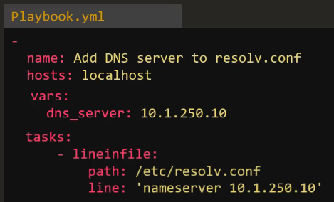
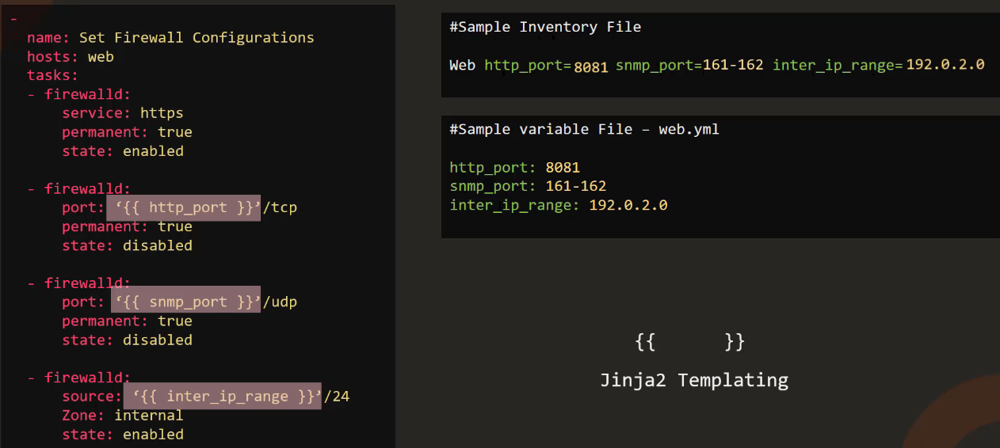

# 4.0 - Ansible Variables

## 7.1 - Ansible Variables

### Introduction

- Variables are used in a very similar manner to other programming / scripting languages.
- Could be used to allow changeability of username / host details.
- Ansible inventory files can be the prime point for variables
- Variables can be added in playbooks in a similar manner to:



- Alternatively, they can be included in a separate variables file and referenced by "incudes" functions, more on that in a later section:


#### Using Variables

- To use variables, enter the variable name in ‘{{}}' i.e.


- Example two - using inventory file playbooks. variable yaml files etc:



- Note - This is Jinja Templating!

## 07.2 - Coding Exercise: Ansible Variables

### Q1

The playbook is used to update name server entry into resolv.conf file on localhost. The name server information is also updated in the inventory file as a variable `nameserver_ip`. Refer to the inventory file.

`Replace the ip of the name server in this playbook to use the value from the inventory file`, so that in the future if you had to make any changes you simply have to update the inventory file.

```yaml
 -
    name: 'Update nameserver entry into resolv.conf file on localhost'
    hosts: localhost
    tasks:
        -
            name: 'Update nameserver entry into resolv.conf file'
            lineinfile:
                path: /etc/resolv.conf
                line: 'nameserver {{ nameserver_ip }}'
```

### Q2

We have added a new task to disable SNMP port in the playbook. However the port is hardcoded in the playbook. Update the inventory file to add a new variable `snmp_port` and assign the value used here. Then update the playbook to use value from the variable.

Remember to use curly braces around the variable name.

```yaml
-
    name: 'Update nameserver entry into resolv.conf file on localhost'
    hosts: localhost
    tasks:
        -
            name: 'Update nameserver entry into resolv.conf file'
            lineinfile:
                path: /etc/resolv.conf
                line: 'nameserver {{ nameserver_ip }}'
        -
            name: 'Disable SNMP Port'
            firewalld:
                port: '{{ snmp_port }}'
                permanent: true
                state: disabled
```

### Q3

We are printing some personal information to the screen. We would like to move the `car_model`, `country_name` and `title` to a variable defined at the play level.

Create three new variables (`car_model`, `country_name` and `title`) under the play and move the values over. Use the variables in the task.

```yaml
-
    name: 'Update nameserver entry into resolv.conf file on localhost'
    hosts: localhost
    vars:
      car_model: BMW M3
      country_name: USA
      title: Systems Engineer
    tasks:
        -
            name: 'Print my car model'
            command: 'echo "My car''s model is {{ car_model }}"'
        -
            name: 'Print my country'
            command: 'echo "I live in the {{country_name}}"'
        -
            name: 'Print my title'
            command: 'echo "I work as a {{title}}"'
```

## 4.3 - Variable Types

### String

- Sequences of characters that can be defined in a playbook, inventory, or as CLI arguments.
- **Example:** `username: "admin"`

### Number

- Integer or floating-point values. May be set as standalone values or used in mathematical operations.
- **Example:** `max_connections: 100`

### Boolean

- True or False, typically used in conditionals.
- **Example:** `debug_mode: true`
- True/False are not the only accepted values for `True` or `False` to be registered:
  - `Truthy` Values: True, 'true', 't', 'yes', 'y', 'on', '1', 1, 1.0
  - `Falsy` Values: False, 'false', 'f', 'no', 'n', 'off', '0', 0, 0.0

### List

- Used to hold an ordered collection of values, the values must all be of the same type, but any value type is supported by lists themselves
- Example:

```shell
packages:
- nginx
- git
- terraform
...
```

- Specific list values can be referred to via `{{ <list name>[item index] }}`
  - **Note:** The first element is always index `0`.
- Lists themselves can then be referred to via loops - refer to section 5.7 for further details.

### Dictionary

- Holds a collection of key-value pairs.
- Keys and values can be any values.

```yaml
user:
  name: "admin"
  password: "secret"
```

- Dictionary values can be referred to via `{{ <dictionary name>.<key name> }}`

## 4.4 - Registering Variables and Varoiable Precedence

### Variable Precedence

- If variables are defined in multiple places, the order of priority they are registered is variable precedence.
- In practice, Ansible will first assign variables defined at the group level, any vars defined at host level will then be applied or overwrite values as appropriate.
  - Host variables therefore take precedence over group variables.
- Any variables defined at playbook level and then at CLI level take precedence.
- So, in order of precedence, Ansible applies variables in the following order:
  - Group Vars
  - Host Vars
  - Playbook Vars
  - CLI vars (via `--extra-vars` flag)
- Additional options are available, however the above are the 4 more common methods.

### Registering Vars

- You may wish to capture the output of a particular task and pass it in as a variable to a follow-on task. This can be achieved via the `register` parameter.

```yaml
- name: Check /etc/hosts file
  hosts: all
  tasks:
  - shell: cat/etc/hosts
    register: result # output of shell command stored as variable "result"
  - debug:
      var: result
```

- The output can be further queried for specific values as it is in `json` output.
- Example: `var: result.stdout`

- Any variable created via `register` is available for the rest of the playbook for that given host; it has the host scope.
- Note: To avoid using the debug module, append the `-v` flag to the desired `ansible-playbook` command.

## 4.5 - Variable Scoping

### Introduction

- Scope = How accessible a variable's value is.
- For example, if one host in a particular inventory file has an extra parameter set, that value is not available to the other hosts.
- Multiple scopes are available in ansible to deal with varying scenarios.

- **Host:**
  - A variable defined as a host variable, and is only accessible in a play(s) on that specific host.

- **Play:**
  - Variables defined at play-level and cannot be referenced by any other plays.

- **Global:**
  - Variables available across all plays, these are typically variables defined at CLI levels via `--extra-vars "<var name>=<var value>`

## 4.6 - Magic Variables

### Hostvars

- As discussed in previous sections, variables are scoped depending on where they are defined. If defined at a host level, host 2 traditionally has no access to variables defined for host 1, etc.
- If this did become a requirement, Magic Variables can be utilised.
- Used in the form `'{{ hostvars['<hostname>'].<var name> }}'`
- If additional facts are gathered by the hosts, vars such as the following can be used:
  - Host IP Address: `ansible_host`
  - Host system architecture: `ansible_facts.architecture`
  - Host mounts: `ansible_facts.mounts`

- **Note:** Magic variables may also be referred to via: `'{{ hostvars['<hostname>'][<var/var group name>][<sub-variable name>] }}'`

### Groups

- Group magic variables can be utilised in a few ways: `'{{ groups['<group_name>'] }}'` returns all the hosts under the particular group.
- `'{{ group_names }}'` will return the names of any group the particular host finds itself in.

### Inventory

- `'{{ inventory_hostname }}'` gives the inventory-level name for the host the play is running on.

---

- Other examples are available via the Ansible documentation.

## 4.7 - Ansible Facts

### Introduction

- Ansible gathers basic facts about the target machine upon initial connection, such as:
  - basic system information
  - system architecture
  - architecture
  - network connectivity
  - ip addresses
  - storage information
- Ansible gathers all these `facts` via the `setup` module, which is ran automatically at the start of each playbook, unless `gather_facts` is disabled.
- All facts gathered by ansible are stored in the `ansible_facts` variable. This can be viewed via the `debug` module, passing `ansible_facts` as the var.
- Gathering facts can be disabled at playbook level by setting `gather_facts: no`, or at config level by setting `gathering = implicit/explicit`
  - At config level, implicit will gather facts by default, unless specified not to at playbook level.
  - Explicit will not gather facts by default, unless specified otherwise at playbook level.
  - Playbook-level configuration always takes precedence.
- Fact-gathering only applies to hosts defined in inventory files.

