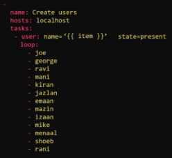
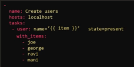

# 5.0 - Ansible Playbooks

## 05.1 - Ansible Playbooks

### Notes

- Playbooks are configuration files used to help Ansible understand what it needs to do when running.
- Example - Running commands on particular servers in a particular order, then restarting said servers in a particular order.
- Or more complex operations e.g.:
  - Deploy x VMs to environment 1
  - Deploy y VMS to environment 2
  - Provision storage to all VMs
  - Setup Network Configuration for all VMs in environment 2
- All Playbooks are written in YAML
  - They contain "plays" - a set of activities (tasks) to be run on hosts
  - Task - any action to be executed on the host e.g. run a script, install a package.
- Example Playbook:

```yaml
- name: Play 1
  hosts: localhost
  tasks:
  - name: Execute command "date"
    command: date

  - name: Execute script on server
    script: test_script.sh

  - name: Install httpd service
    yum:
      name: httpd
      status: present

  - name: start web server
    service:
      name: httpd
      state: started
```

- Each activity will occur in the order that they are defined on the host defined
  - The host must be included in the associated ansible inventory file e.g. localhost, server1.company.com
  - All connection information must be specified in the inventory files
  - Additionally, if a group is defined as the host, then all hosts in that group will be applied by default
- Playbooks = list of dictionary in YAML
  - Each play is a dictionary
  - Tasks are lists / arrays → ordered collection, meaning the order MATTERS
- The actions ran by tasks are modules e.g. command, script, yum, service
  - Further information provided in the ansible docs OR

    ```yaml
    ansible-doc -l
    ```

---

- To execute an ansible playbook:

```yaml
ansible-playbook <playbook>.yaml
```

## 05.2 - Demo: Run Ansible Playbooks

### Notes

---

- When running ansible playbooks, generally have two options:
  - using the ansible command
  - using the ansible-playbook command
- The former is typically used in an imperative manner for one-off commands not requiring a playbook e.g.:

    ```yaml
    ansible <hosts> -a <command>

    ansible all -a "/sbin/reboot"

    ansible <hosts> -m <module>

    ansible target1 -m ping
    ```

- The latter should be used when wanting to run a particular playbook. This is in a declarative manner.

```yaml
ansible-playbook <playbook name>
```

---

### Demo

- In the demo project folder created previously, run the following:

```yaml
ansible all -m ping -i inventory.txt
```

- This will tell ansible to call the ping module to test connection
- Note: The all group is not specified in the inventory file, however it is created by default via ansible when specifying a particular inventory file.
- The same result could be achieved by a yaml file

```yaml
- name: Test Connectivity to Target Servers # name of playbook
  hosts: all # what hosts should this playbook apply to?
  tasks:
  - name: Ping Test
    ping: # note the ping module doesn't require any parameters
```

- This can then be ran by the following:

```bash
ansible-playbook playbook-pingtest.yaml -i inventory.txt
```

---

### Labs

#### Q1

Update name of the play to `Execute a date command on localhost`

```yaml
-
    name: 'Execute a date command on localhost'
    hosts: localhost
    tasks:
        -
            name: 'Execute a date command'
            command: date
```

#### Q2

Update the task to execute the command `cat /etc/hosts`
 and change task name to `Execute a command to display hosts file`

```yaml
-
    name: 'Execute a command to display hosts file on localhost'
    hosts: localhost
    tasks:
        -
            name: 'Execute a command to display hosts file'
            command: cat /etc/hosts
```

#### Q3

Update the playbook to add a second task. The new task must execute the command `cat /etc/hosts`
 and change new task name to `Execute a command to display hosts file`

```yaml
-
    name: 'Execute two commands on localhost'
    hosts: localhost
    tasks:
        -
            name: 'Execute a date command'
            command: date
        - name: 'Execute a command to display hosts file'
          command: cat /etc/hosts
```

#### Q4

We have been running all tasks on localhost. We would now like to run these tasks on the web_node1. Update the play to run the tasks on `web_node1`

```yaml
-
    name: 'Execute two commands on localhost'
    hosts: web_node1
    tasks:
        -
            name: 'Execute a date command'
            command: date
        -
            name: 'Execute a command to display hosts file'
            command: 'cat /etc/hosts'
```

#### Q5

Refer to the attached inventory file. We would like to run the tasks defined in the play on all servers in `boston`

Inventory:

```shell
## Sample Inventory File

## Web Servers
sql_db1 ansible_host=sql01.xyz.com ansible_connection=ssh ansible_user=root ansible_ssh_pass=Lin$Pass
sql_db2 ansible_host=sql02.xyz.com ansible_connection=ssh ansible_user=root ansible_ssh_pass=Lin$Pass
web_node1 ansible_host=web01.xyz.com ansible_connection=ssh ansible_user=administrator ansible_ssh_pass=Win$Pass
web_node2 ansible_host=web02.xyz.com ansible_connection=ssh ansible_user=administrator ansible_ssh_pass=Win$Pass
web_node3 ansible_host=web03.xyz.com ansible_connection=ssh ansible_user=administrator ansible_ssh_pass=Win$Pass

[db_nodes]
sql_db1
sql_db2

[web_nodes]
web_node1
web_node2
web_node3

[boston_nodes]
sql_db1
web_node1

[dallas_nodes]
sql_db2
web_node2
web_node3

[us_nodes:children]
boston_nodes
dallas_nodes
```

Answer:

```yaml
-
    name: 'Execute two commands on web_node1'
    hosts: boston_nodes
    tasks:
        -
            name: 'Execute a date command'
            command: date
        -
            name: 'Execute a command to display hosts file'
            command: 'cat /etc/hosts'
```

#### Q6

Create a new play named `Execute a command to display hosts file contents on web_node2` to execute `cat /etc/hosts` command on second node `web_node2` and name the task `Execute a command to display hosts file`.

Refer to the attached inventory file (see Q5)

```yaml
-
    name: 'Execute command to display date on web_node1'
    hosts: web_node1
    tasks:
        -
            name: 'Execute a date command'
            command: date
-
    name: 'Execute a command to display hosts file contents on web_node2'
    hosts: web_node2
    tasks:
        -
            name: 'Execute a command to display hosts file'
            command: cat /etc/hosts
```

#### Q7

You are assigned a task to restart a number of servers in a particular sequence. The sequence and the commands to be used are given below. Note that the commands should be run on respective servers only. Refer to the inventory file and update the playbook to create the below sequence.

> Note: Use the description below to name the plays and tasks.
>
1. `Stop` the `web` services on web server nodes - `service httpd stop`
2. `Shutdown` the `database` services on db server nodes - `service mysql stop`
3. `Restart` `all` servers (web and db) at once - `/sbin/shutdown -r`
4. `Start` the `database` services on db server nodes - `service mysql start`
5. `Start` the `web` services on web server nodes - `service httpd start`

> Warning: Do not use this playbook in a real setup. There are better ways to do these actions. This is only for simple practise.
>

Inventory:

```yaml
## Sample Inventory File

## Web Servers
sql_db1 ansible_host=sql01.xyz.com ansible_connection=ssh ansible_user=root ansible_ssh_pass=Lin$Pass
sql_db2 ansible_host=sql02.xyz.com ansible_connection=ssh ansible_user=root ansible_ssh_pass=Lin$Pass
web_node1 ansible_host=web01.xyz.com ansible_connection=ssh ansible_user=administrator ansible_ssh_pass=Win$Pass
web_node2 ansible_host=web02.xyz.com ansible_connection=ssh ansible_user=administrator ansible_ssh_pass=Win$Pass
web_node3 ansible_host=web03.xyz.com ansible_connection=ssh ansible_user=administrator ansible_ssh_pass=Win$Pass

[db_nodes]
sql_db1
sql_db2

[web_nodes]
web_node1
web_node2
web_node3

[all_nodes:children]
db_nodes
web_nodes
```

Answer:

```yaml
-
    name: 'Stop the web services on web server nodes'
    hosts: web_nodes
    tasks:
        -
            name: 'Stop the web services on web server nodes'
            command: 'service httpd stop'
-
    name: 'Shutdown the database services on db server nodes'
    hosts: db_nodes
    tasks:
        -
            name: 'Shutdown the database services on db server nodes'
            command: 'service mysql stop'
-
    name: 'Restart all servers (web and db) at once'
    hosts: all_nodes
    tasks:
        -
            name: 'Restart all servers (web and db) at once'
            command: '/sbin/shutdown -r'
-
    name: 'Start the database services on db server nodes'
    hosts: db_nodes
    tasks:
        -
            name: 'Start the database services on db server nodes'
            command: 'service mysql start'
-
    name: 'Start the web services on web server nodes'
    hosts: web_nodes
    tasks:
        -
            name: 'Start the web services on web server nodes'
            command: 'service httpd start'
```

## 5.3 - Verifying Playbooks

### Check Mode

- This is ansible's dry-run mechanism, that attempts to run the playbook without making any actual changes on the hosts.
- Achievable via appending the `--check` flag when executing an `ansible-playbook` command.
- *Not all modules support this option*

### Diff Mode

- When used in combination with check mode, provides a before-and after comparison of playbook tasks.
- This helps to understand and verify the impact of tasks pre-application.
- Add the `--diff` flag to the `ansible-playbook` command to use.

### Syntax Check

- Ansible has built-in syntax check mode, simply add the folliwing flag: `--syntax-check`

## 5.4 - Ansible-Lint

### Overview

- Playbooks can become increasingly complex over time, leading to increased likelihood of deviation from best practice.
- Ansible-lint aims to mitigate these issues, this is a CLI tool that performs linting on ansible playbooks, roles, and collections.
  - The tool checks code for potential errors, bugs, stylistic errors and deviations from best practice.
- To use: `ansible-lint <yaml file>`
- Output provides guidance on any errors it finds and the locations of the incidents.

## 08.1 - Conditionals

### Introduction

- Consider two Playbooks that look to install NGINX, but one on Red Hat, another on Debian. This requires the use of the yum and apt packages respectively.


- Rather than have two separate playbooks for this same task, it's more advisable to bring the task into one playbook and use a conditional to perform the appropriate module.
- Conditionals are typically used via "when" statements e.g.:


- And and Or separators can be used for multiple conditions


- Conditionals may also be used in loops, an example follows, where the packages will only be installed if required is set to true:


- Conditionals can also be used in conjunction with the outputs of prior tasks, this would require the use of the register module.
  - The example causes a mail message to be sent to the email address provided only if the httpd service is shown to be down


### Conditionals based on Facts, Variables, Re-Use

- If tasks need to be ran depending on specific conditionsm such as OS architecture, `ansible_facts` can be utilised in combination with the `when:` for conditionals.
- Example, only run a task on hosts running Ubuntu 18: `when: ansible_facts['os_family'] == 'Debian' and ansible_facts['distribution_major_version'] == '18'`
- If wanting to run particular tasks using variables, use `vars:` in a similar manner to below for the given task:

```yaml
- name: deploy configuration files
    template:
      src: "{{ app_env }}_config.j2"
      dest: "/etc/myapp/config.conf"
    vars:
      app_env: production
```

- For follow-on tasks for a play, you can then add `when: <var name> == '<var value>'` after the variable was defined previously e.g. at CLI-level.

## 08.2 - Coding Exercise: Conditionals

### Q1

The given playbook attempts to start mysql service on `all_servers`. Use the `when` condition to run this task if the host (`ansible_host`) is the database server.

Refer to the inventory file to identify the name of the database server.

```yaml
-
    name: 'Execute a script on all web server nodes'
    hosts: all_servers
    tasks:
        -
            service: 'name=mysql state=started'
            when: ansible_host == 'server4.company.com'
```

### Q2

The playbook has a variable defined - `age`
. The two tasks attempt to print if I am a child or an Adult. Use the when conditional to print if I am a child or an Adult based on weather my age is `< 18 (child)`
 or `>= 18 (Adult)`

```yaml
-
    name: 'Am I an Adult or a Child?'
    hosts: localhost
    vars:
        age: 25
    tasks:
        -
            command: 'echo "I am a Child"'
            when: 'age < 18'
        -
            command: 'echo "I am an Adult"'
            when: 'age >= 18'
```

### Q3

The given playbook attempts to add an entry into the `/etc/resolv.conf` file for `nameserver`.

First, we run a command using the `shell` module to get the contents of `/etc/resolv.conf` file and then we add a new line containing the name server data into the file. However, when this playbook is run multiple times, it keeps adding new entries of same line into the resolv.conf file.

1. Add a `register` directive to store the output of the first command to variable `command_output`
2. Then add a `conditional` to the second command to check if the output contains the name server (`10.0.250.10`) already. Use `command_output.stdout.find(<IP>) == -1`

> Note: A better way to do this would be to use the lineinfile module. This is just for practice.
>
>
> Note: `shell` and `command` modules are similar in that they are used to execute a command on the system. However `shell` executes the command inside a shell giving us access to environment variables and redirection using `>>`
>

```yaml
-
    name: 'Add name server entry if not already entered'
    hosts: localhost
    tasks:
        -
            shell: 'cat /etc/resolv.conf'
            register: command_output
        -
            shell: 'echo "nameserver 10.0.250.10" >> /etc/resolv.conf'
            when: 'command_output.stdout.find("10.0.250.10") == -1'
```

## 09.1 - Loops

### Notes

- Loops allow the same command(s) to be ran iteratively to accommodate an ever-changing value(s)
- A common example is creating users



- Note: **'{{ item }}'** is used to call the loop iteration variable
- What happens if you have multiple sets of variables e.g. user name and user id
  - Use a list of dictionaries in the loop


- Note: Would now refer to items in the list of dictionaries / arrays to call separate variables e.g.:
  - item.name
  - item.uid
- Note: The loop module is new to ansible, it was previously covered by the with_ module; an example follows:



---

- With_ allows more flexibilty compared to loops e.g.:
  - `with_items`
  - `with_files`
  - `with_url`
  - `with_env`
- These are all custom plugins primarily focused on lookup tasks.

## 09.2 - Coding Exercise: Ansible Loops

### Q1

The playbook currently runs an echo command to print a fruit name. Apply a loop directive (with_items) to the task to print all fruits defined in the `fruits`
 variable.

```yaml
-
    name: 'Print list of fruits'
    hosts: localhost
    vars:
        fruits:
            - Apple
            - Banana
            - Grapes
            - Orange
    tasks:
        -
            command: 'echo "{{item}}"'
            with_items: '{{fruits}}'
```

### Q2

To a more realistic use case. We are attempting to install multiple packages using yum module.The current playbook installs only a single package.

```yaml
-
    name: 'Install required packages'
    hosts: localhost
    vars:
        packages:
            - httpd
            - binutils
            - glibc
            - ksh
            - libaio
            - libXext
            - gcc
            - make
            - sysstat
            - unixODBC
            - mongodb
            - nodejs
            - grunt
    tasks:
        -
            yum: 'name={{item}} state=present'
            with_items: '{{packages}}'
```

