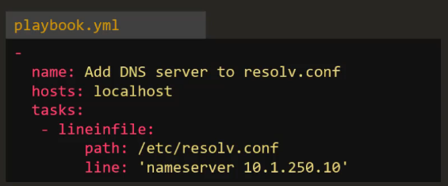

# 6.0 - Ansible Modules

## 06.1 - Ansible Modules

### Notes

- Modules are categorised based on functionalities e.g
  - System - Commands based on the host system e.g. start/stop service
  - Commands - Used to execute commands or scripts on hosts
  - Files - Used to execute file-specific commands e.g. find, copy, replace
  - Database - Used to interact with databases such as MongoDB, MSSQL, MySQL
  - Cloud - Used to interact with cloud providers like AWS, Azure, GCP, Linode, Digital Ocean.
  - Windows - Commands to help use Ansible in a windows environment, be it working with files, user management, executing commands.
- This is a non-exhaustive list - many more modules can be viewed in the Ansible documentation, with details on how to use each provided.

---

#### Command

- Used to execute a command on a remote node
- Parameters include:


- Example Playbook:


Example playbook to execute the date command and run the cat command on a desired file.


- Creates parameter is used to perform a check if the folder or file exists before running the command
- chdir requests that ansible changes directory before the command is ran
- free_form - the command module takes a free form command to run; no parameters are required
  - Not all commands support free-form parameters, example, copy requires a source and target dir to be specified.

---

#### Script

- Used to run a local script on a remote node after transferring it.
- Example playbook:


---

#### Service

- Used to manage services on the system e.g. stop, start, restart
- Example playbooks for this can be done in one of two manners:


- **Question:** Why write the state as "started" and not "start"?
  - Not instructing ansible to start the service, we are asking ansible to ensure that it is started i.e. if it's not started - start it
  - This leads to the idempotency of ansible modules:
    - Idempotency - An operation is idempotent if the result of performing it once is exactly the same as the result of performing it repeatedly without any intervening actions
  - In general, Ansible's idea is to be able to run a playbook, when running it again, everything should return "as expected", if not, Ansible will make it so.

---

#### Lineinfile

- Searches for a line in a file and replaces it or adds it if it doesn't exist
- Example playbook:



- Note that this action IN THEORY could be achieved by running a script like this:


- However, this would repeatedly add the same entry to /etc/resolv.conf rather than replace it or not add it if found. By contrast the idempotency of Ansible means that if this task is ran as part of a playbook, the entry is added once and only once if it's not found.

## 6.2 - Introduction to Plugins

### Overview

- Ansible plugins aim to provide additional functionality and customisation options beyond the core features.
- Plugins extend or modify the core functionality of ansible, such as inventory, modules, and callbacks.
- Plugins can be found as any of:
  - Inventory Plugins (e.g. Dynamic Inventory)
  - Module Plugins (e.g. provision custom cloud configuration)
  - Action Plugins (e.g. define a series of high-level tasks to help enhance consistency in the configuration)
  - Callback Plugins - provide hooks into ansible's execution lifecycle, facilitating custom actions during playbook execution.
  - Lookup Plugins (typically used with Databases)
  - Filter Plugins
  - Connection Plugins
- Each plugin comes with their own parameters and configuration.

## 6.3 - Modules and Plugins Index

### Overview

- The module and plugin index aims to act as a hub for searching plugins and modules to be added to playbooks.
- Each comes with documentation for usage, examples, and additional supporting documentation.
- [Index link](https://docs.ansible.com/ansible/latest/collections/all_plugins.html)
- The index offers:
  - Search and filtering
  - Detailed documentation per plugin
  - Version compatability guidance and considerations
  - Community contributions for support and contribution guidance.

## 06.2 - Ansible Modules Coding Exercises

### Notes

#### Q1

Update the playbook with a play to `Execute a script on all web server nodes`. The script is located at `/tmp/install_script.sh`

Use the [Script module](https://docs.ansible.com/ansible/latest/collections/ansible/builtin/script_module.html)

```yaml
- name: 'Execute a script on all web server nodes'
  hosts: web_nodes
  tasks:
  - name: 'Execute a script on all web server nodes'
    script: /tmp/install_script.sh
```

#### Q2

Update the playbook to add a new task to `start httpd services` on all web nodes

Use the [Service module](https://docs.ansible.com/ansible/latest/collections/ansible/builtin/service_module.html)

```yaml
-
    name: 'Execute a script on all web server nodes'
    hosts: web_nodes
    tasks:
        -
            name: 'Execute a script on all web server nodes'
            script: /tmp/install_script.sh
        - name: 'start http services on all web server nodes'
          service:
            name: httpd
            state: started
```

### Q3

Update the playbook to add a new task in the beginning to add an entry into `/etc/resolv.conf` file for hosts. The line to be added is `nameserver 10.1.250.10`

> Note: The new task must be executed first, so place it accordingly.
>

Use the [Lineinfile module](https://docs.ansible.com/ansible/latest/collections/ansible/builtin/lineinfile_module.html)

```yaml
-
    name: 'Execute a script on all web server nodes'
    hosts: web_nodes
    tasks:
        - name: 'Add enntry to /etc/resolv.conf file'
          lineinfile:
            path: /etc/resolv.conf
            line: 'nameserver 10.1.250.10'
        -
            name: 'Execute a script'
            script: /tmp/install_script.sh
        -
            name: 'Start httpd service'
            service:
                name: httpd
                state: present
```

### Q4

Update the playbook to add a new task at second position (right after adding entry to resolv.conf) to create a new web user.

Use the [user module](https://docs.ansible.com/ansible/latest/collections/ansible/builtin/user_module.html) for this. User details to be used are given below:**Username**: web_user**uid**: 1040**group**: developers

```yaml
-
    name: 'Execute a script on all web server nodes and start httpd service'
    hosts: web_nodes
    tasks:
        -
            name: 'Update entry into /etc/resolv.conf'
            lineinfile:
                path: /etc/resolv.conf
                line: 'nameserver 10.1.250.10'
        - name: 'add user web_user'
          user:
            name: web_user
            uid: 1040
            group: developers

        -   name: 'Execute a script'
            script: /tmp/install_script.sh
        -
            name: 'Start httpd service'
            service:
                name: httpd
                state: present
```

