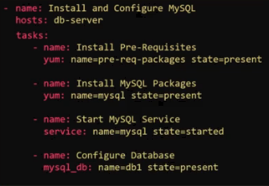
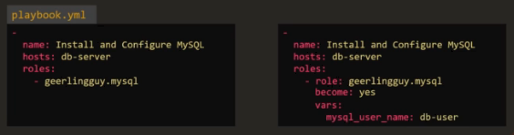

## 7.1 - Introduction to Handlers

### Introduction

- In some cases, configuration applied by Ansible may not take effect until the target server or service is restarted.
- Typically, one would then have to manually restart the server or service, Ansible Handlers aim to support this.
- Handlers allow definition of an action to restart the service and associate it with the task that modifies the configuration file.
  - Creates a dependency between the task and handler, and eliminates the need for manual intervention.
- One can therefore view handlers as tasks triggered by events / notifications.
  - They are defined in playbooks and executed when notified by a task.
  - They manage actions based on system state or configuration changes.

- An example playbook follows, the copy task notifies the defined handler to restart the service.:

```yaml
- name: Deploy application
  hosts: application_servers
  tasks:
  - name: copy application code
    copy:
      src: app/code
      dest: /opt/application/
    notify: Restart Application Service

  handlers:
  - name: Restart Application Service
    service:
      name: application_service
      state: restarted
```

- This is beneficial as the copy module has no way of restarting the service, another task would have to be defined.

## 10.1 - Ansible Roles

### Notes

- Roles can be assigned to each server involved in an Ansible playbook to allow them to perform particular tasks.
- Assigning a role in Ansible requires the performance of tasks such that the server can perform the required task. Example:
  - mysql
    - Prerequisite and mysql packages should be installed
    - mysql service configuration
    - database and user configuration
  - nginx
    - Prerequisite and nginxpackages should be installed
    - Service configuration
- Example playbook:



- If the tasks can be done on a Playbook, why are roles required?
- Whilst it's true that you could use a playbook that you can share with others, there may be changes required for each user.
- Instead, one can package this playbook as a role, which can then be called in a playbook for easier reusability


- Roles therefore allow the best-practices of Ansible to be adhered to.
- Typical directory structure:
  - Role
    - tasks carried out by role(s)
    - variables used by tasks
    - defaults values for tasks
    - handlers
    - templates used by playbooks
- Roles also allow easier sharing of code and roles within the community - Ansible Galaxy being a primary example

---

#### Getting Started with a Role

- Create the directory structure
- Run the ansible-galaxy command:

```bash
ansible-galaxy init <role-name>
```

- This will create the skeleton structure required for the role, and the code can then be moved into it as required.
- When referencing a role in a playbook, one must specify its location.
  - One option would be to create a designated directory for the roles
  - Ansible by default will look in /etc/ansible/roles
- Roles can then be shared via GitHub in Ansible Galaxy
- Ansible-galaxy's UI or CLI have search functionality to help look for "suitable" roles for users.
- To install a role:

```bash
ansible-galaxy install <role name>
```

- This will extract the role to the default directory defined by the ansible config file
- Roles can then be referenced in the Playbook(s) where required, either on its own or as a list of dictionaries; the latter offering the option to add more variable inputs.



## 7.3 - Ansible Collectionss

### Overview

- In the scenario that a large amount of multiple types of network devices are being managed, whilst Ansible provides some built-in modules, specialised modules and plugins can be accessed via collections.
- Collections are typically defined by `<collection name>.<sub collection>`
- Installation of collections is via `ansible-galaxy` i.e.: `ansible-galaxy collection install <collection name>`

- Collections are packages of modules, roles, plugins, etc in a self-contained manner, designed for specific purposes.
- Community and vendor-created collections are available.

- Collections offer:
  - Expanded functionality
  - Modularity and Reusability in playbooks, pone can define the collections used in a playbook as a list under `collections`
  - Similified distribution and management of playbooks, defining the required collections in a `requirements.yaml`, which can then be referenced when installing the required collections: `ansible-galaxy collection install -r requirements.yaml`

