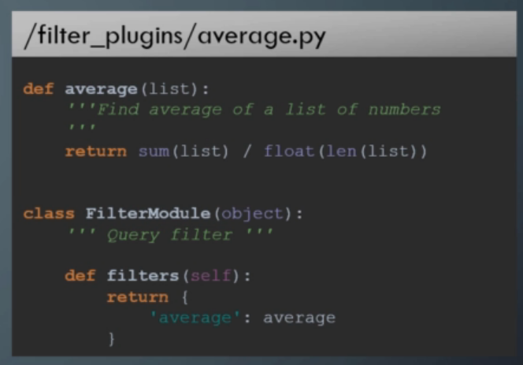

# 13.0 - Plugins

## 13.1 - Overview

- Ansible utilises plugins for various functionalities e.g.:
  - Action
  - Connections
  - Filter
  - Lookup
  - Strategy
- This makes Ansible highly extensible.

---

## 13.2 - Custom Filters

- Example: Develop an average filter to obtain the average of a numerical list

- To ensure usage, export the location of the filter plugins prior to playbook execution i.e. `export ANSIBLE_FILTER_PLUGINS=/path/to/plugins/folder`

---

## 13.3 - Callback Plugins

- To change the callback standard ouput format, e.g. to json, set `export ANSIBLE_STDOUT_CALLBACK=json`
- Callback plugins are used to, in addition to printing information:
  - Mail - error or notification emails
  - Integration with applications such as Logstash and Slack
  - Timer - Display the playbook execution time
- An extensive list is included in the plugins folder in th
- Example custom callback follows.

