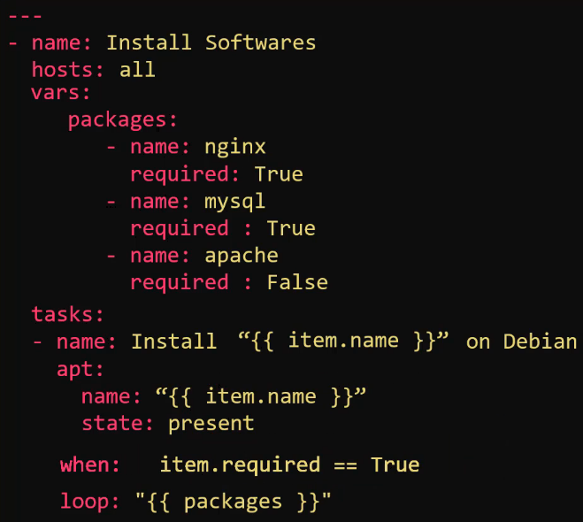

# 08.1 - Conditionals

## Introduction

- Consider two Playbooks that look to install NGINX, but one on Red Hat, another on Debian. This requires the use of the yum and apt packages respectively.


- Rather than have two separate playbooks for this same task, it's more advisable to bring the task into one playbook and use a conditional to perform the appropriate module.
- Conditionals are typically used via "when" statements e.g.:


- And and Or separators can be used for multiple conditions


- Conditionals may also be used in loops, an example follows, where the packages will only be installed if required is set to true:



- Conditionals can also be used in conjunction with the outputs of prior tasks, this would require the use of the register module.
  - The example causes a mail message to be sent to the email address provided only if the httpd service is shown to be down


## Conditionals based on Facts, Variables, Re-Use

- If tasks need to be ran depending on specific conditionsm such as OS architecture, `ansible_facts` can be utilised in combination with the `when:` for conditionals.
- Example, only run a task on hosts running Ubuntu 18: `when: ansible_facts['os_family'] == 'Debian' and ansible_facts['distribution_major_version'] == '18'`
- If wanting to run particular tasks using variables, use `vars:` in a similar manner to below for the given task:

```yaml
- name: deploy configuration files
    template:
      src: "{{ app_env }}_config.j2"
      dest: "/etc/myapp/config.conf"
    vars:
      app_env: production
```

- For follow-on tasks for a play, you can then add `when: <var name> == '<var value>'` after the variable was defined previously e.g. at CLI-level.
