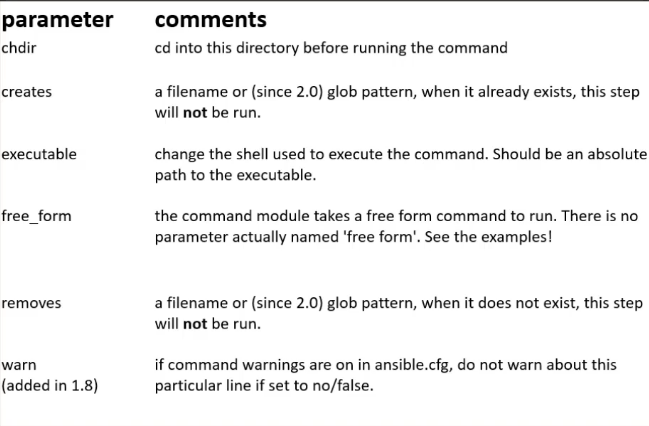

# 06.1 - Ansible Modules

- [06.1 - Ansible Modules](#061---ansible-modules)
  - [Notes](#notes)
    - [Command](#command)
    - [Script](#script)
    - [Service](#service)
    - [Lineinfile](#lineinfile)

## Notes

- Modules are categorised based on functionalities e.g
  - System - Commands based on the host system e.g. start/stop service
  - Commands - Used to execute commands or scripts on hosts
  - Files - Used to execute file-specific commands e.g. find, copy, replace
  - Database - Used to interact with databases such as MongoDB, MSSQL, MySQL
  - Cloud - Used to interact with cloud providers like AWS, Azure, GCP, Linode, Digital Ocean.
  - Windows - Commands to help use Ansible in a windows environment, be it working with files, user management, executing commands.
- This is a non-exhaustive list - many more modules can be viewed in the Ansible documentation, with details on how to use each provided.

---

### Command

- Used to execute a command on a remote node
- Parameters include:

- Example Playbook:

Example playbook to execute the date command and run the cat command on a desired file.

- Creates parameter is used to perform a check if the folder or file exists before running the command
- chdir requests that ansible changes directory before the command is ran
- free_form - the command module takes a free form command to run; no parameters are required
  - Not all commands support free-form parameters, example, copy requires a source and target dir to be specified.

---

### Script

- Used to run a local script on a remote node after transferring it.
- Example playbook:

---

### Service

- Used to manage services on the system e.g. stop, start, restart
- Example playbooks for this can be done in one of two manners:

- **Question:** Why write the state as "started" and not "start"?
  - Not instructing ansible to start the service, we are asking ansible to ensure that it is started i.e. if it's not started - start it
  - This leads to the idempotency of ansible modules:
    - Idempotency - An operation is idempotent if the result of performing it once is exactly the same as the result of performing it repeatedly without any intervening actions
  - In general, Ansible's idea is to be able to run a playbook, when running it again, everything should return "as expected", if not, Ansible will make it so.

---

### Lineinfile

- Searches for a line in a file and replaces it or adds it if it doesn't exist
- Example playbook:

- Note that this action IN THEORY could be achieved by running a script like this:

- However, this would repeatedly add the same entry to /etc/resolv.conf rather than replace it or not add it if found. By contrast the idempotency of Ansible means that if this task is ran as part of a playbook, the entry is added once and only once if it's not found.
