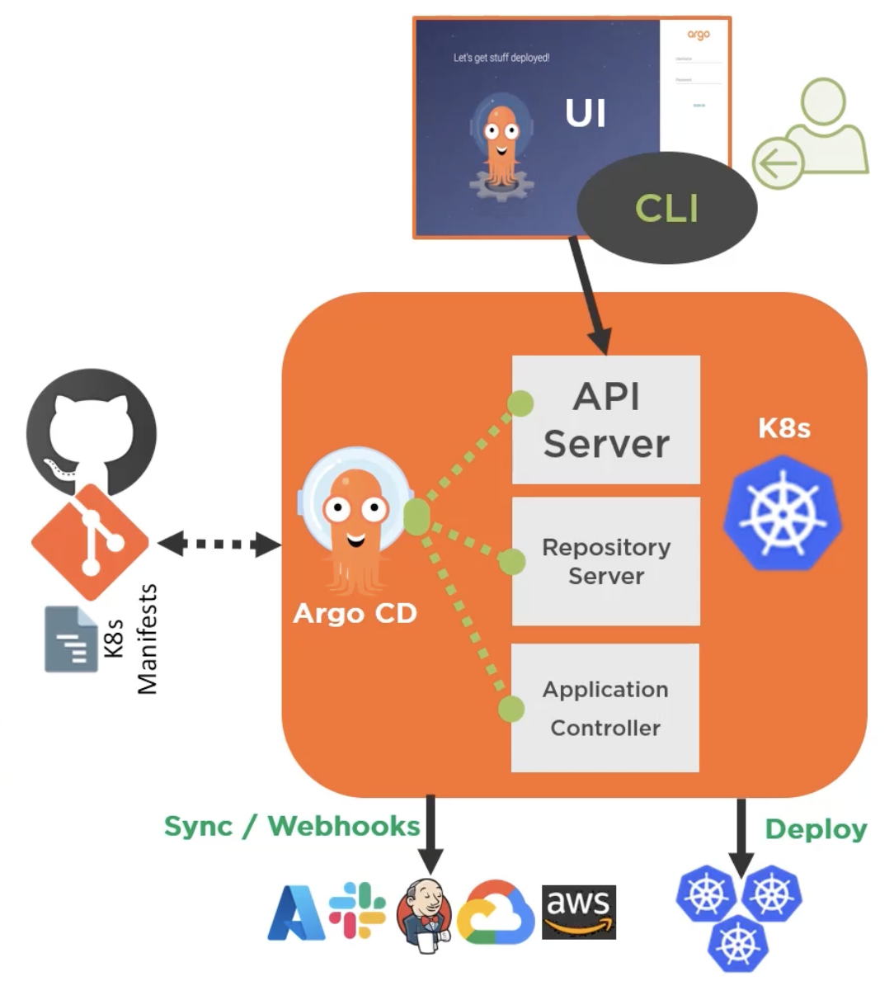

# 1.0 - Introduction

## 1.1 - Containers and Kubernetes Overview

### Containers

- An abstraction of the application layer in an isolated user-space instance
- Share the OS Kernel Storage and Networking from the host they run on
- Can be thought of like the core components needed for an application running as a process.
- Allow the packaging of an application and its dependencies in one instance.
- Allows engineers to develop applications into a repeatable and lightweight manner.
- Allows applications to integrate more easily with CI/CD pipelines, providing greater flexibility and agility.

- Because the containers share the OS Kernel storage, etc. and do not require a hypervisor or leverage a guest operating system, they are more lightweight and easier to deploy than virtual machines.


- If using Docker as the container runtime, common commands include:
  - Login to Dockerhub: `docker login localhost`
  - Run a hello world container: `docker run hello world`

### Kubernetes

- Open-source container orchestration platform.
- Used to automate, deploy, manage and scale workloads
- Abstracts the complexity of a multi-container environment
- Combines compute, networking and storage components that hundreds (or more) containers rely on.
- Works on a declarative management model - users describe the desired configuration for deployment.
  - It's this which ArgoCD aims to enforce.


## 1.2 - Helm and Kustomize Overview

### Helm

- Package manager for Kubernetes - apps are packaged into charts for deployments
- A deployment tool for automating creation, pacakging, configuration and deployment of apps and configurations to Kubernetes clusters.

### Kustomize

- A standalone tool to customize the creation of Kubernetes objects through a file called `kustomization.yaml`
- A template-free way to customize application configuration that is built into kubectl.
- Traverses a Kubernetes manifest to add, remove or update configuration options without forking or actual YAML files.

**Kustomize Structure:**

- *kustomization.yaml*

```yaml
bases:
  - ldap
patches:
  - patch.yaml
...
```

- *base - ldap*

```yaml
apiVersion: v1beta2
kind: Deployment
metadata:
  name: ldap
  labels:
    app: ldap
spec:
  replicas: 1
  selector:
    matchLabels:
      app: ldap
  template:
    metadata:
      lables:
        app: ldap
  spec:
    containers:
    ...
    volumes:
    ...
```

- *patch.yaml - staging*

```yaml
apiVersion: apps/v1beta2
kind: Deployment
metadata:
  name: ldap
spec:
  replicas: 2
```

- *patch.yaml - prod*

```yaml
apiVersion: apps/v1beta2
kind: Deployment
metadata:
  name: ldap
spec:
  replicas: 6
  template:
    spec:
      volumes:
        - name: ldap-data
          emptyDir: null
```

- Sample folder structure:


## 1.3 - GitOps Core Concepts

- **GitOps:**
  - An operating model pattern for cloud native and Kubernetes-based applications
  - Declarative infrastructure code in Git is used as the single source of truth for automated continuous delivery.

- **GitOps Principles**
  - Git acts as the source of truth for the entire system
  - The desired system state is versioned in Git
  - System state is described declaratively
  - Git is the single place for operations, such as create, change and delete
  - Autonomous Agents enforce the desired state, and alert on drift - ArgoCD is an example of this
  - Delivery of approved system state changes is done so in an automated manner

- **GitOps Architecture Components:**
  - Source control system (GitHub, GitLab, etc.)
  - Git repository
  - Container / Helm registry
  - Operator e.g. Flux, ArgoCD
  - Runtime Environment e.g. Kubernetes Cluster(s)
  - Namespaces - could be per environment, per app, service, build, etc.

- **Use Cases:**
  - Cloud Native App Management i.e. CD
  - Service Rollouts
  - Infrastructure management e.g. clusters and microservices

- **GitOps Operators Examples:**
  - Flux
  - ArgoCD
  - Kubestack

## 1.4 - ArgoCD Overview

- Argo Project supports 4 main solutions:
  - **Argo Workflows** - A workflow engine for orchestrating parallel jobs in Kubernetes
  - **ArgoCD** - A declarative, continuous delivery GitOps operator for Kuberentes
  - **Argo Rollouts** - Supports advanced deployments e.g. blue-green, canary
  - **Argo Events** - Event-driven workflow automation framework for Kubernetes

- **ArgoCD:**
  - A GitOps operator that provides continuous delivery for Kubernetes
  - Has application controller to continuously monitor apps running on Kubernetes, comparing the live state to what was defined in the Git repository.

- **Key Features:**
  - Web UI
  - Automated Application Deployment
  - Health Status Monitoring for Apps and associated resources

- **Typical CD Workflow with ArgoCD:**
  - ArgoCD Operator pulls app configurations from Git repo & deploys the app in a Kubernetes cluster
  - New app feature code committed and a pull request is submitted to the git repo to modify app development
  - Pull request is merged with new code into the main repo
  - ArgoCD Operator does a pull to the Git Repo, acknowledges the changes, and updates the app(s) in the Kubernetes cluster.

## 1.5 - ArgoCD Core Concepts and Architectures

### Architecture

- **API Server**
  - A gRPC/REST server that exposes the API consumed by the Web UI, CLI, and CI/CD systems.
- **Repository Server:**
  - Any internal service that maintains a local cache of the git repo holding the app manifests
- **Application Controller:**
  - A kubernetes controller that continuousl monitoers running apps, and compares their current state to that of the desired state.



### Components

- **argocd-dex-server:**
  - ArgoCD Embeds and bundles Dex as part of its installation - this delegates authentication to an external identity provider and handling SSO.
- **argocd-metrics / argocd-server-metrics:**
  - Exposes Application metrics and API Server metrics to be scraped by Prometheus
- **argocd-redis:**
  - Used to support caching for working with the ArgoCD repository server
- **argocd-repo-server:**
  - Clones the git repository, keeping it up to date and generating manifests using the appropirate tool
- **argocd-server:**
  - Runs the ArgoCD API Server

## 1.6 - Supported Tooling with ArgoCD

- ArgoCD supports sever different ways in which Kubernetes manifests can be defined, including:
  - Kustomize
  - Helm
  - Jenkins
  - Jsonnet

- **ArgoCD Tool Detection**
  - When a new app is created in ArgoCD can detect the tooling used to create the app.
  - **Example:** Helm by checking for a Chart.yaml
  - **Example:** Kustomization by checking for a `kustomization.yaml` file.
