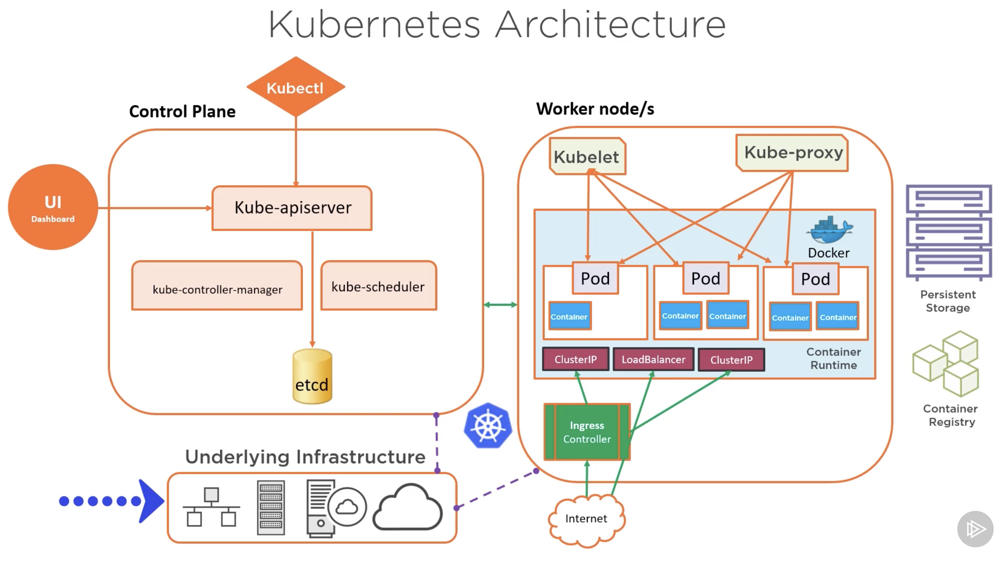
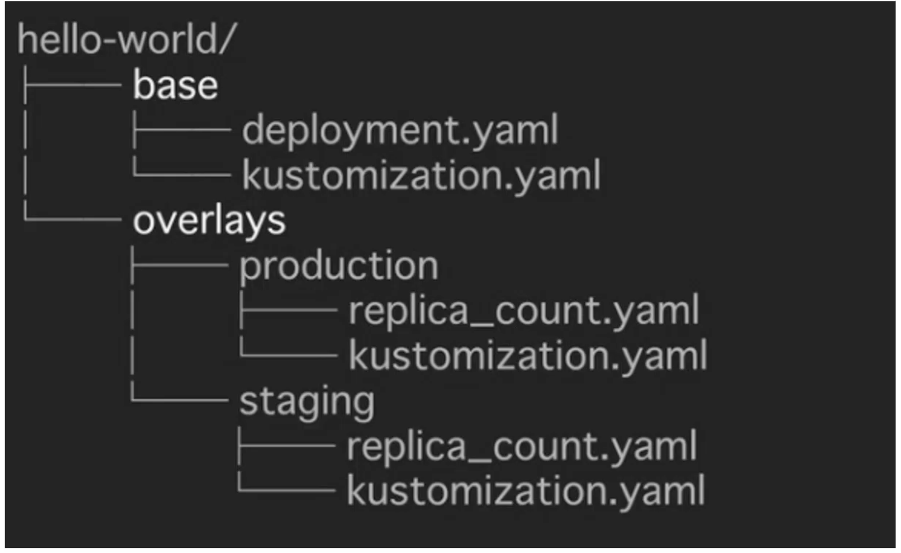

---
tags:
  - Tooling
  - ArgoCD
---

# Getting Started with Argo CD

## 1.0 - Introduction

### 1.1 - Containers and Kubernetes Overview

#### Containers

- An abstraction of the application layer in an isolated user-space instance
- Share the OS Kernel Storage and Networking from the host they run on
- Can be thought of like the core components needed for an application running as a process.
- Allow the packaging of an application and its dependencies in one instance.
- Allows engineers to develop applications into a repeatable and lightweight manner.
- Allows applications to integrate more easily with CI/CD pipelines, providing greater flexibility and agility.

- Because the containers share the OS Kernel storage, etc. and do not require a hypervisor or leverage a guest operating system, they are more lightweight and easier to deploy than virtual machines.


- If using Docker as the container runtime, common commands include:
  - Login to Dockerhub: `docker login localhost`
  - Run a hello world container: `docker run hello world`

#### Kubernetes

- Open-source container orchestration platform.
- Used to automate, deploy, manage and scale workloads
- Abstracts the complexity of a multi-container environment
- Combines compute, networking and storage components that hundreds (or more) containers rely on.
- Works on a declarative management model - users describe the desired configuration for deployment.
  - It's this which ArgoCD aims to enforce.



### 1.2 - Helm and Kustomize Overview

#### Helm

- Package manager for Kubernetes - apps are packaged into charts for deployments
- A deployment tool for automating creation, pacakging, configuration and deployment of apps and configurations to Kubernetes clusters.

#### Kustomize

- A standalone tool to customize the creation of Kubernetes objects through a file called `kustomization.yaml`
- A template-free way to customize application configuration that is built into kubectl.
- Traverses a Kubernetes manifest to add, remove or update configuration options without forking or actual YAML files.

**Kustomize Structure:**

- *kustomization.yaml*

```yaml
bases:
  - ldap
patches:
  - patch.yaml
...
```

- *base - ldap*

```yaml
apiVersion: v1beta2
kind: Deployment
metadata:
  name: ldap
  labels:
    app: ldap
spec:
  replicas: 1
  selector:
    matchLabels:
      app: ldap
  template:
    metadata:
      lables:
        app: ldap
  spec:
    containers:
    ...
    volumes:
    ...
```

- *patch.yaml - staging*

```yaml
apiVersion: apps/v1beta2
kind: Deployment
metadata:
  name: ldap
spec:
  replicas: 2
```

- *patch.yaml - prod*

```yaml
apiVersion: apps/v1beta2
kind: Deployment
metadata:
  name: ldap
spec:
  replicas: 6
  template:
    spec:
      volumes:
        - name: ldap-data
          emptyDir: null
```

- Sample folder structure:



### 1.3 - GitOps Core Concepts

- **GitOps:**
  - An operating model pattern for cloud native and Kubernetes-based applications
  - Declarative infrastructure code in Git is used as the single source of truth for automated continuous delivery.

- **GitOps Principles**
  - Git acts as the source of truth for the entire system
  - The desired system state is versioned in Git
  - System state is described declaratively
  - Git is the single place for operations, such as create, change and delete
  - Autonomous Agents enforce the desired state, and alert on drift - ArgoCD is an example of this
  - Delivery of approved system state changes is done so in an automated manner

- **GitOps Architecture Components:**
  - Source control system (GitHub, GitLab, etc.)
  - Git repository
  - Container / Helm registry
  - Operator e.g. Flux, ArgoCD
  - Runtime Environment e.g. Kubernetes Cluster(s)
  - Namespaces - could be per environment, per app, service, build, etc.

- **Use Cases:**
  - Cloud Native App Management i.e. CD
  - Service Rollouts
  - Infrastructure management e.g. clusters and microservices

- **GitOps Operators Examples:**
  - Flux
  - ArgoCD
  - Kubestack

### 1.4 - ArgoCD Overview

- Argo Project supports 4 main solutions:
  - **Argo Workflows** - A workflow engine for orchestrating parallel jobs in Kubernetes
  - **ArgoCD** - A declarative, continuous delivery GitOps operator for Kuberentes
  - **Argo Rollouts** - Supports advanced deployments e.g. blue-green, canary
  - **Argo Events** - Event-driven workflow automation framework for Kubernetes

- **ArgoCD:**
  - A GitOps operator that provides continuous delivery for Kubernetes
  - Has application controller to continuously monitor apps running on Kubernetes, comparing the live state to what was defined in the Git repository.

- **Key Features:**
  - Web UI
  - Automated Application Deployment
  - Health Status Monitoring for Apps and associated resources

- **Typical CD Workflow with ArgoCD:**
  - ArgoCD Operator pulls app configurations from Git repo & deploys the app in a Kubernetes cluster
  - New app feature code committed and a pull request is submitted to the git repo to modify app development
  - Pull request is merged with new code into the main repo
  - ArgoCD Operator does a pull to the Git Repo, acknowledges the changes, and updates the app(s) in the Kubernetes cluster.

### 1.5 - ArgoCD Core Concepts and Architectures

#### Architecture

- **API Server**
  - A gRPC/REST server that exposes the API consumed by the Web UI, CLI, and CI/CD systems.
- **Repository Server:**
  - Any internal service that maintains a local cache of the git repo holding the app manifests
- **Application Controller:**
  - A kubernetes controller that continuousl monitoers running apps, and compares their current state to that of the desired state.


#### Components

- **argocd-dex-server:**
  - ArgoCD Embeds and bundles Dex as part of its installation - this delegates authentication to an external identity provider and handling SSO.
- **argocd-metrics / argocd-server-metrics:**
  - Exposes Application metrics and API Server metrics to be scraped by Prometheus
- **argocd-redis:**
  - Used to support caching for working with the ArgoCD repository server
- **argocd-repo-server:**
  - Clones the git repository, keeping it up to date and generating manifests using the appropirate tool
- **argocd-server:**
  - Runs the ArgoCD API Server

### 1.6 - Supported Tooling with ArgoCD

- ArgoCD supports sever different ways in which Kubernetes manifests can be defined, including:
  - Kustomize
  - Helm
  - Jenkins
  - Jsonnet

- **ArgoCD Tool Detection**
  - When a new app is created in ArgoCD can detect the tooling used to create the app.
  - **Example:** Helm by checking for a Chart.yaml
  - **Example:** Kustomization by checking for a `kustomization.yaml` file.

## 2.0 - Installation and Operation of ArgoCD

### 2.1 - Requirements

- Kubectl needs to be installed
- A kubernetes cluster with:
  - Cluster admin level access
  - Kubeconfig configured to connect to the cluster
- Access to GitHub (or other source control)

### 2.2 - Deploying ArgoCD

- **Types of installs:**
  - **Non-High-Availability:**
    - Recommended for dev / testing
    - Deploys single pods and replicas for ArgoCD components
  - **High-Availability:**
    - Manifest = `namespace-install.yaml`
    - Recommended for prod
    - Optimized for high availabiltiy and resiliency
    - Multiple replicas for supported components.
  - **Core Install:**
    - Used typically when multi-tenancy features like web UI and API aren't required
    - Installs the non-HA version of each component
  - **Cluster Level:**
    - Use when you have cluster level access and will deploy apps in the saem K8s cluster that ArgoCD will run on
  - **Namespace-Level:**
    - Use when you have namespace-level access and will deploy apps to external K8s cluster from where ArgoCD is running.

#### Installation

- Create a namespace for ArgoCD: `kubectl create namespace argocd`
- `kubectl apply -n argocd -f <link to install.yaml>`

- **Note:** Other methods of installation are available e.g. Helm.

### 2.3 - Accessing ArgoCD API Server

- 2 Ways:
  - Access the WebUI
  - Utilise the ArgoCD CLI.

### 2.4 - Using the ArgoCD CLI

- Certain activities can only be performed via the ArgoCD CLI in comparison to the UI, such as:
  - Adding clusters
  - Managing user accounts
- The CLI supports scripting and AUTOMATION

#### ArgoCD Installation

- Windows: `choco install argocd-cli`
- Linux and Mac: `brew install argocd`\

#### Common Commands

| argocd command | Description                                                           |
| -------------- | --------------------------------------------------------------------- |
| login          | Login to API Server                                                   |
| account        | Manage API Server Account                                             |
| proj           | Manage projects                                                       |
| app            | Manage applications                                                   |
| repo           | Manage repos used by ArgoCD                                           |
| version        | Check the argocd CLI version                                          |
| argocd-util    | Provides access to utilities to manage argocd e.g. import/export data |
| cluster        | Manage cluster operations                                             |

### 2.5 - Upgrading ArgoCD

- ArgoCD follows the standard semantic versioning `<MAJOR>.<MINOR>.<PATCH>`

### 2.6 - Setting Up RBAC for ArgoCD

- ArgoCD doesn't have RBAC enabled by default. When enabled, it facilitates restriction of access to ArgoCD Resources
- As ArgoCD doesn't have its own user management system, it requires SSO configuration for local setup:
  - Solutions such as Azure AD or Okta recommended for larger teams
- More RBAC roles beyond the defaults can be defined upon setup, which can then be assigned per user / group.

#### **Default Roles:**

- `readonly`: Provide read-only access to all resources
- `admin`: unrestricted access to all resources

#### **ArgoCD RBAC - Resources & Actions:**

- **Resources:** Clusters, projects, applications, repositories, certificates, accounts, gpgkeys
- **Actions:** get, create, update, delete, sync, override, action

#### ArgoCD RBAC - Permissions

- Split into two caregories:
  - All resources except applications: `p, <role/user/group>, <resource>, <action>, <object>`
  - Applications (tied to an AppProject): `p, <role/user/group>, <resource>, <action>, <appproject>/<object>`

- These permissions and roles are typically defined in configmaps, where user groups are chosen by `g, <group name>`

### 2.7 - Configuring User Management

- By default ArgoCD has only one user created (admin)
- For new users there are 2 options:
  - **Local users** - Recommended for small teams 5 or less, as well as usage of API Accounts for automation.
  - **SSO Integration** - Recommended for larger teams & integrating with external identity providers.

#### Local Users

- Stored in a ConfigMap that is applied to ArgoCD
- Lack access to advanced features e.g. groups, login history, etc.
- Each new user requires assignment to `readonly` or `admin` role, the two built-in roles.
- Each new user will also need policy rules defined, or they will default to `policy.default`
- New users are created in a ConfigMap named `argodc-cm`
- Users can have capabilities assigned:
  - `apiKey` - allows generation of api keys
  - `login` - allows login via the UI
- User management is only achievable via the CLI:
  - Get users: `argocd account list`
  - Get user details: `argocd account get --account <USERNAME>`
  - Set user password: `argocd account update-password`

#### SSO Integration

- Also handled in the `argocd-cm` ConfigMap
- ArgoCD handles SSO via one of 2 options:
  - Dex OIDC Provider - Used when your standard identity provider doesn't support OIDC e.g. SAML or LDAP
  - Existing OIDC providers such as:
    - AuthO
    - Microsoft
    - Okta
    - OneLogin
    - KeyCloak

### 2.8 - Setting Up Secrets Management

- ArgoCD never returns sensitive data from its API, and redacts all sensitive data in API payloads and logs, including:
  - Cluster credentials
  - Git credentials
  - OAuth2 client secrets
  - Kubernetes Secret values
- ArgoCD stores the credentials of the external cluster as a Kubernetes Secret in the argocd namespace
  - The secret contains the K8s API bearer token associated with the `argocd-manager` service account created during the argocd setup.
- Secret management functionality isn't built-into ArgoCD by default, a third-party solution is required e.g.:
  - HashiCorp Vault
  - Helm Secrets
  - aws-secret-operator
  - argocd-vault-plugin

### 2.9 - HA, Backup and Disaster Recovery

- ArgoCD is made up of mostly stateless components
- For any data in ArgoCD that needs to persist, it is written to the etcd kubernetes database
- Redis in ArgoCD is designed as throwaway cache that will be thrown rebuilt when lost.
- Alternatively, ArgoCD can be deployed in a high-availability mode.

#### High-Availability

- Requires at least 3 different nodes for pod anti-affinity roles
- Specific High-Availability Manifests required for deployment
  - Deploys more replicas of standard ArgoCD components and Redis in HA mode.
  - Comprised of two main YAML manifests:
    - `ha/install.yaml` - Deploys multiple replicas for supported ArgoCD components. Typically used when you have cluster-level access and will deploy apps in the same cluster that ArgoCD runs on.
    - `ha/namespace-install.yaml` - Deploys multiple replicas for supported ArgoCD components. Typically used when you have naespace-level access and will deploy apps to external clusters from where ArgoCD is running.

#### Backup and Disaster Recovery

- Facilitated by `argocd admin` command, which supports data import and export operations:
  - `argocd admin export > backup.yaml`
  - `argocd admin import -< backup.yaml`

### 2.10 - Monitoring and Notifications

- API server supports webhooks and can be configured to receive webhook events instead of polling a given Git repository
- ArgoCD supports Git webhook notification from standard Git source control tools like GithUB and GitLab.

### 2.11 - ArgoCD Monitoring

- Two sets of Prometheus metrics are exposed: API Server Metrics, and Application Metrics
- ArgoCD has a built-in health assessment that is surfaced up to the overal Application health status.
  - Status determined by health checks on standard K8s  types e.g.:
    - Deployments
    - Service
    - Ingress
    - PersistentVolumeClaim

#### API Server Monitoring

- Looking for API Server metrics, scraped to: `argocd-server-metrics:8083/metrics`
- Metrics are mostly associated with requests made to the API Servers, including:
  - Request Totals
  - Response codes

#### App Monitoring

- Metrics scraped to `argocd-metrics:8082/metrics` including:
  - Gauge for application health status
  - Gauge for application sync status
  - Counter for application sync history

#### ArgoCD Notifications

- Notification functionality is not built in natively to ArgoCD, alternatives are advised e.g.:
  - **ArgoCD Notifications:** An open-source notification system that monitors ArgoCD applications, it integrates with Slack, Discord, etc.
  - **Argo Kube Notifier**
  - **Kube Watch**

## 3.0 - Deployment and Management of Applications

### 3.1 - Register a Kubernetes Cluster with ArgoCD

- By default with an ArgoCD deployment, the cluster it is running on is set as "in-cluster" -> `https://kubernetes.default.svc`
- When apps are deployed, you deploy them to the "in-cluster" Kubernetes cluster, or to external clusters.
- External clusters must first be registered with ArgoCD, this is achieved via the CLI ONLY, but it can then be modified via the UI.
  - Common commands include:
    - `argocd cluster add` - Add a given cluster configuration to ArgoCD, it must exist in the `kubectl` config prior to execution
    - `argocd cluster get` - Get specific information about a cluster
    - `argocd cluster list` - List known clusters in a JSON format
    - `argocd cluster rm` - Remove a given cluster from ArgoCD management
    - `argocd cluster rotate-auth` - Rotate auth token for a cluster

- Once the cluster is added to the kubeconfig as a context:
  - Verify with `kubectl config get-contexts -o name`
  - Add the context to ArgoCD, installing a service account `argocd-manager` to that context's `kube-system` namespace via `argocd cluster add <context name>`

### 3.2 - Setting Up Projects in ArgoCD

- Projects: A logical grouping of apps in ArgoCD
- Projects serve multiple purposes including:
  - Restrict what Git repos can be deployed from
  - Restrict what clusters and namespaces can be deployed to
  - Restrict the kinds of objects that can be deployed
  - Define project roles, providing app RBAC
- Typically used when ArgoCD is required by multiple teams
- All applications must belong to a project.
  - During initial setup, a "Default Project" is created automatically. Any apps created will be assigned to this if no other projects exist.
  - The default project allows deployments from any source Git repo to any cluster for all resource types.
- Projects can be created and managed by the web UI or the CLI.
- For the CLI: `argocd proj create <project name> ... <parameters>`
- Common commandsL
  - `argocd proj list`
  - `argocd proj get`
  - `argocd proj delete`
  - `argocd proj add-destination`
  - `argocd proj add-source`
  - `argocd proj allow-cluster-resource`
  - `argocd proj allow-namespace`

### 3.3 - Using Repositories with ArgoCD

- ArgoCD can connect to public or private Git repository.
  - For private, connection options include HTTP, HTTPS, SSH and the Github App.

### 3.4 - Deploy an App Using ArgoCD

- Deployment is achievable by either the web UI or CLI
- For deployment, ArgoCD needs to be pointed to the desired specific Git repository, containing any of Kubernetes manifests, Helm chart(s) or Kustomize.
- Typical CLI command: `argocd app create <app name> --repo <github link> --path <path to resources in repo> --dest-server <kubernetes http address> --dest-namespace <namespace name>`

#### App of Apps

- Apps can be created that creates other apps, this is the "App of Apps" pattern - a declaritive deployment of an app that consists of other apps deploying them at the same time.
- Sample App of Apps Architecture (as seen in `argoproj/argocd-example-apps` on GitHub):

```shell
|- chart.yaml
|- templates
|  |- guestbook.yaml
|  |- helm-dependency.yaml
|  |- helm-guestbook.yaml
|  |- kustomize-guestbook.yaml
|- values.yaml
```

### 3.5 - Application Sync and Rollback

- Most common sync used = Auto-Sync / Automatic Sync
  - ArgoCD applies every object in the application
  - It will sync when it detects differences between the Git repo and teh live state in the cluster.
- Alternative Sync Options:
  - **Selective Sync**
    - Syncs out-of-sync-resources ONLY
  - **Sync Windows**
    - Configurable windows of time when syncs happen
    - They can be set to allow or deny
    - They can apply to manual and automated syncs
    - Schedules are defined in cron format and can be targeted to applications, namespaces, and clusters
  - **Sync Phases and Waves**
    - ArgoCD executes a sync operation in 3 phases - pre-sync, sync, and post-sync
    - Each phase can have ne or more waves, ensuring certain resources are healthy before subsequent resources are synced.

#### Rollback

- Rollbacks are typically used when apps aren't healthy, ArgoCD can support this by tracking an application's history and leveraging data cached in Redis.
- For rollbacks to work: Auto-Sync needs to be disabled
- Via the CLI: `argocd app rollback <app name> <history id> [flags]`

### 3.6 - Deleting Applications

- Apps can be deleted from the UI or CLI. 2 Delete options available:
  - **Non-Cascade Delete** - Deletes only the app
  - **Cascade Delete** - Deletes the app and associated resources
- Deletion via CLI:
  - `argocd app delete <app name> --cascade=false`
  - `argocd app delete <app name> --cascade`

### 3.7 - Application Health and Status Reporting

- The Web UI provides the most comprehensive way of monitoring the health status of ArgoCD applications
- Breakdowns are avaailable for health status, sync status, etc.
- Application-level breakdowns are also available.

## 4.0 - Next Steps for Using ArgoCD

### Overview

- GitOps is growing at a fast rate and quickly being adopted into DevOps, especially Kubernetes.
  - ArgoCD is one of the top operators
- ArgoCD maintains K8s resources within Git - making it the single source of truth for devs, instead of kubectl.
- ArgoCD is a declarative and continuous delivery tool for Kubernetes
- ArgoCD automates deployment and lifecycle management of apps
- ArgoCD supports complex application rollouts such as Blue-Green and Canary

### Resources

- ArgoCD Bloc
- The GitOps Book: GitOps and Kubernetes: Continuous Deployment with ArgoCD, Jenkins X, and Flux.
- OpenShift GitOps Blog
- GitOps Conference - The Linux Foundation
- GitOps eBook: GitOps Cloud-Native Continuous Deployment

- OpenShift Labs: GitOps Introduction with Argocd
- OpenShift Labs: Multi Cluster Application Deployment
- Deploy ArgoCD In Your Own K8s Environment.

