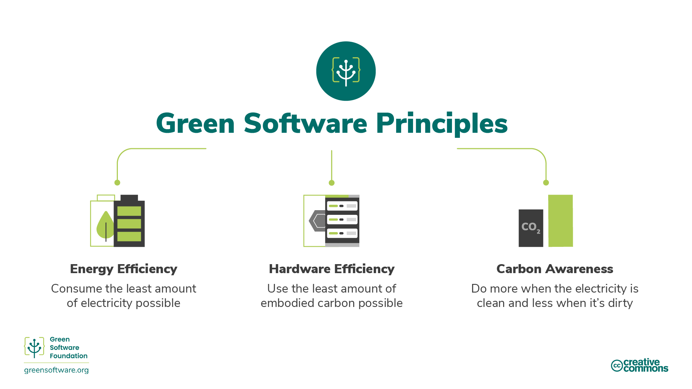

# 1.0 - Introduction

- [1.0 - Introduction](#10---introduction)
  - [1.1 - Course Introduction](#11---course-introduction)
    - [1.1.1 - What is Green Software?](#111---what-is-green-software)
    - [1.1.2 - Who Should Read This?](#112---who-should-read-this)
    - [1.1.3 - History](#113---history)
    - [1.1.4 - How to be a Green Software Practitioner](#114---how-to-be-a-green-software-practitioner)
    - [1.1.5 - Principles, Patterns, and Practices](#115---principles-patterns-and-practices)
  - [1.2 - Glossary](#12---glossary)
    - [Acronyms](#acronyms)
    - [Useful Terms](#useful-terms)
  - [1.4 - Additional Information](#14---additional-information)
    - [1.4.1 - The Green Software Foundation](#141---the-green-software-foundation)

## 1.1 - Course Introduction

### 1.1.1 - What is Green Software?

- An emerging discipline linking climate science, electricity markets, as well as the design of software, hardware, and data centers.
- This course aims to provide guidance on building and running green software apps.
- This is achieved by providing guidelines for "what it means" to be a green software practictioner.

- Green software is carbon-efficient software.
- Only 3 activities reduce the carbon emissions of software:
  - Energy efficiency
  - Carbon awareness
  - Hardware efficiency.

### 1.1.2 - Who Should Read This?

- Anyone building, deploying or managing software should have awareness of the green software principles.
- By doing so, one can make decisons that have a meaningful impact on their applications' carbon pollution levels.

### 1.1.3 - History

- The original eight principles were defined in 2019, with some merged together, and an addition focusing on climate commitments

### 1.1.4 - How to be a Green Software Practitioner

- Any green software practitioner should have awareness of:

1. **Carbon Efficiency** - Emit the least amount of carbon possible
1. **Energy Efficiency** - Use the least amount of energy possible
1. **Carbon Awareness** - Do more when electricity is cleaner, and less when it is dirtier.
1. **Hardware Efficiency** - Use the least amount of embodied carbon possible
1. **Measurement** - What cannot be measured, cannot be improved
1. **Climate Commitments** - Understand the exact mechanism of carbon reduction

### 1.1.5 - Principles, Patterns, and Practices

- A green software patterm is a specific example of how to apply one or more of the green software principles in the real world.
- Whilst principles describe the theory, patterns are the practical advice used for implementation; they are vendor-neutral.
- Practices are patterns applied to a specific vendor's product, and inform practitioners how to use the product in a more sustainable manner.

## 1.2 - Glossary

### Acronyms

| Acronym               | Term               | Definition   |
|-----------------------|--------------------|--------------|
| CFE                   | Carbon-free energy | This term is usually used to talk about the percentage of renewable energy used as a proportion of the total energy used. |
| CH4                   | Methane            | A common gaseous hydrocarbon that has a warming effect 25 times that of CO2.   |
| CO2                   | Carbon dioxide     |      One of the most common greenhouse gases.   |
| CO2eq / CO2-eq / CO2e |  Carbon dioxide equivalent  |   Carbon is used as a common form of measurement for all greenhouse gases. This unit of measurement indicates the potential impact of non-CO2 gases on global warming in carbon terms.  |
| COP                   |  Conference of the Parties   |   An annual event involving all parties in the United Nations Framework Convention on Climate Change.  |
| gCO2eq/kWh            |   grams of carbon per kilowatt hour                 |    The standard unit of carbon intensity is gCO2eq/kWh, or grams of carbon per kilowatt hour.  |
|  GHGs                     |   Greenhouse gases                 |  Greenhouse gases are a group of gases that trap heat from solar radiation in the Earth's atmosphere. These gases act as a blanket, increasing the temperature on the surface of the Earth.   |
|  GWP                     |  Global warming potential                  |    The potential impact of greenhouse gases on global warming. Measured in terms of CO2e.  |
|  IPCC                     |  Intergovernmental Panel on Climate Change                  |   The objective of the IPCC is to provide governments at all levels with scientific information that they can use to develop climate policies.   |
|  J                     |   joules                 |    Energy is measured in joules (J). |
|   kWh                    |   kilowatt hours                 |   Energy consumption is measured in kilowatt hours (kWh).    |
|  MMTCDE                     |    Million metric tonnes of carbon dioxide equivalent                |   Measurement term for CO2eq.                                                                                                                       |
|  NDC                     |   Nationally Determined Contribution                 |     The means by which members of the Paris Climate Agreement are expected to update their progress.    |
| PCA                      |  Paris Climate Agreement                  |    An international treaty agreed in 2015 by 196 parties and the UN to reduce the Earth's temperature increase.    |
| PPA                      |  Power Purchase Agreement                  |   A contract you sign with a power plant to purchase RECs.|
|  PUE                     |   Power usage effectiveness                 |     The metric used to measure data center energy efficiency.   |
| REC                      |   Renewable Energy Credit                 |       Renewable energy credits (also known as renewable energy certificates) represent the energy generated by renewable energy sources. |
|   SBTi                    |   Science Based Targets initiative                 |  A body that defines and promotes best practice in science-based target setting. For example, creating the standards for net zero.  |
|  SCI                     |  Software Carbon Intensity                  |   A standard which gives an actionable approach to software designers, developers and operations to measure the carbon impacts of their systems.    |
|   SF6                    |   Sulfur hexafluoride                 |   A man-made gas used as an electrical insulator that has a warming effect 23,500 times that of CO2.   |
|  UNFCCC                     |  United Nations Framework Convention on Climate                  |  A group created to achieve the stabilization of greenhouse gas concentrations in the atmosphere at a level that would prevent dangerous interference with the climate system.  |
|  VCM                     |    Voluntary Carbon Market                |     A decentralized market where private actors voluntarily buy and sell carbon credits that represent certified removals or reductions of greenhouse gases (GHGs) in the atmosphere.    |
|   VCS                    |   Verified Carbon Standard                 |  A standard for certifying carbon emissions reductions.   |
|   WMO                    |   World Meteorological Organization                 |  A specialized agency of the United Nations whose mandate covers weather, climate and water resources.   |

### Useful Terms

- **Carbon Intensity** - Measures the amount of greenhouse gases emitted per unit of electricity produced.

- **Demand Shaping** - The strategy of moving workloads to regions or times when the carbon intensity is less

- **Greenhouse Gas protocol** - The most widely used and internationally recognized greenhouse gas accounting standard.

- **Value chain emissions** - These are scope 3 emissions according to the GHG protocol, and the most significant source of emissions. They encompass the full range of activities needed to create a product or service, from conception to distribution.

- **Energy proportionality** - Measures the relationship between power consumed by a computer and the rate at which useful work is done (its utilization).

- **Static power draw** - This refers to how much electricity is drawn when a device is in an idle state.

- **Embodied carbon (also known as "embedded carbon")** - The amount of carbon pollution emitted during the creation and disposal of a device.

## 1.4 - Additional Information

### 1.4.1 - The Green Software Foundation

- The Linux Foundation provides a neutral, trusted hub for developers to code, manage, and scale open technology projects.
- Founded in 2000, The Linux Foundation is supported by more than 1,000 members and is the world's leading home for collaboration on open source software, open standards, open data and open hardware.
- The Linux Foundation's methodology focuses on leveraging best practices and addressing the needs of contributors, users and solution providers to create sustainable models for open collaboration.

- The Linux Foundation hosts Linux, the world's largest and most pervasive open source software project in history.
- It is also home to Linux creator Linus Torvalds and lead maintainer Greg Kroah-Hartman.
- The success of Linux has catalyzed growth in the open source community, demonstrating the commercial efficacy of open source and inspiring countless new projects across all industries and levels of the technology stack.

- As a result, the Linux Foundation today hosts far more than Linux; it is the umbrella for many critical open source projects that power corporations today, spanning virtually all industry sectors.
- Some of the technologies we focus on include big data and analytics, networking, embedded systems and IoT, web tools, cloud computing, edge computing, automotive, security, blockchain, and many more.
