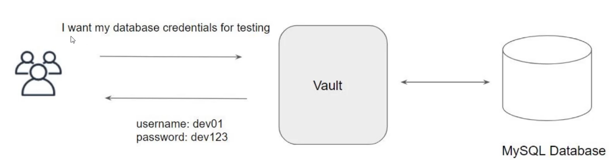

# 1.0 - Introduction

## 1.1 - Introduction to the Course and Certification

- [1.0 - Introduction](#10---introduction)
  - [1.1 - Introduction to the Course and Certification](#11---introduction-to-the-course-and-certification)
    - [Notes](#notes)
      - [Introduction](#introduction)
      - [Dynamic Secrets - High-Level View](#dynamic-secrets---high-level-view)
      - [Course Disclaimers](#course-disclaimers)

### Notes

#### Introduction

- Organisations can have security breaches due to any of, amongst other use cases:
  - Database credentials or access/secret keys being stored in notepad
  - Secrets handwritten on sticky notes
- This is obviously a huge potential security risk, as if secrets like this are compromised, servers, applications, and private data could all be exposed to attack.
- HashiCorp Vault aims to mitigate these risks by:
  - Manage secrets and protect sensitive data
  - Provide identity-based access management
  - Generate dynamic secrets e.g. database credentials, AWS secrets, etc.
- All the while remaining an open-source tool.

---

#### Dynamic Secrets - High-Level View

- Consider a developer wanting to authenticate to a database for testing in a system where Vault has been implemented.

- Credential request is sent to Vault
- Vault immediately generates the credentials for the user
- This is hugely beneficial as it doesn't depend on database admins generating the credentials.
- Additionally, Vault will monitor the timeframe of these credentials - if the Time-To-Live (TTL) for the credentials passes, Vault will automatically revoke these credentials - the user will then need to generate new credentials.

---

#### Course Disclaimers

- Course structure &ne; HashiCorp Exam structure - all relevant content is included.
- Exam:
  - 1-hour multiple choice assessment that is online proctored
  - Cost $70.50
  - Expires after 2 years
- Course is aimed to start from scratch with Vault - the notes should work towards exam readiness.
- Course Notes and Code can be found here:
<https://github.com/zealvora/hashicorp-certified-vault-associate>
