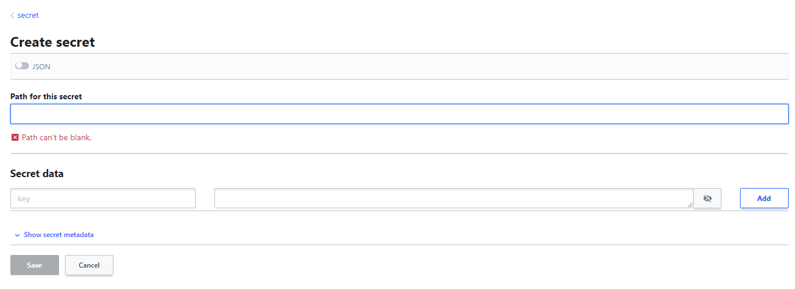

# 2.04 - Creating a Secret

## Notes

- One of Vault's key features is to read and write arbitrary secrets securely.
- It does so utilising Secrets engines - these are components responsible for the storage, generation, or encryption of data.
- Secrets can be stored based on a specific secret engine - each engine offers particular features.

---

### Example

- When starting Vault in dev server mode, two secret engines exist as part of the standard setup:
  - Cubbyhole
  - Key-Value


#### GUI Secret Generation - KeyValue

- To create a secret, navigate to the secret engine of choice and select `create secret`



- For keyvalue add the following:
  - path - secret name
  - secret metadata - maximum number of versions
  - version data - add password associated with secret in key-value form
- Once saved, the secret is logged and the password can be checked by selecting the eye icon
- This secret can be edited at any point - changes are logged as versions which can be switched between at any point
- Delete and destroy operations are available for each version, or all versions can be destroyed
  - In this case, destroy is permanent deletion, delete offers the chance to recover the secret.

#### CLI Creation

- Options for secret generation in the KV engine via the CLI can be viewed via, this includes CRUD operations, amongst others:

```bash
vault kv -h
```

- To create in the kv engine:

```bash
vault kv put /path/to/secret key=value
```

- Secret creation  can then be verified in the HC Vault UI
- New versions of secrets can be created via the CLI:

```bash
vault kv put secret/secret-name key=new-value
```

- To read a secret:

```bash
vault kv get secret/secret-name
```

- To read a particular version,  append `-version=<version number>`
- Example:

```bash
vault kv get -versions=<version number> secret/secret-name
```

- For deletion:

```bash
vault kv delete -versions=<number> path/to/secret
```

- For undeletion:

```bash
vault kv undelete -versions=<number> path/to/secret
```

- For full version destruction:

```bash
vault kv destroy -versions=<number> path/to/secret
```

- For full secret destruction - covering all versions and data relating to the secrets:

```bash
vault kv metadata delete path/to/secret
```

- Note: `-h` option provides MANY options for use case examples
