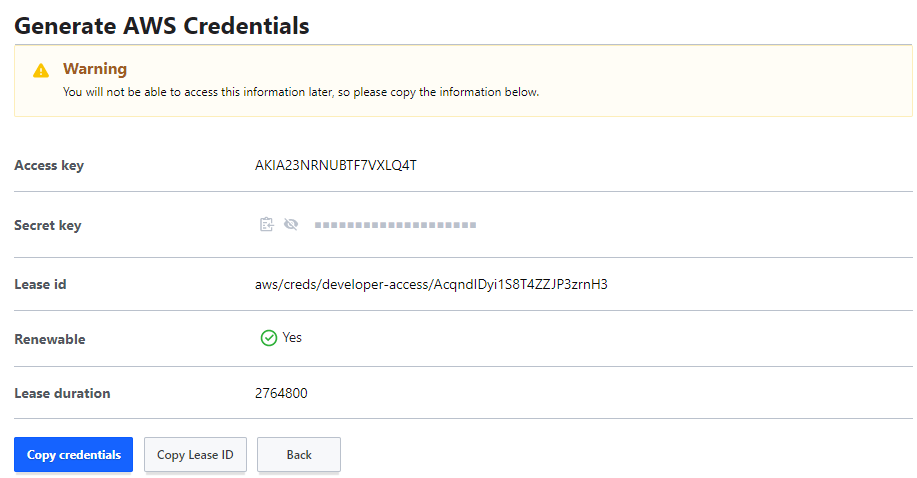
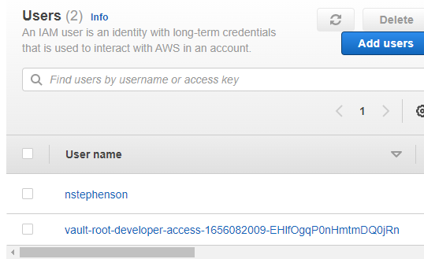

# 2.06 - Overview of Dynamic Secrets

## Dynamic Secrets Overview

- In the KV secret engine, data had to be stored manually.
- By contrast, certain engines work based on dynamic secrets - these do not exist until a request comes in to generate them.
- A typical use case is when requesting access to a database. If integrated, users can send a request to HashiCorp Vault to generate a username and password dynamically to the user for testing purposes.
  - These secrets can be set to expire for enhanced security measures.
- Another use case is using the AWS secrets engine to generate temporary AWS credentials e.g. access and secret keys.

### Example - AWS Secret Engine

- Assuming a user has created a role via the AWS secret engine - if a developer navigates to the role under the AWS secret engine and selects "generate" - a set of dynamic AWS credentials are created for the user and is added to "your" AWS account under IAM.

- As part of the generated credentials it is worth noting:
  - Authorisation keys (access and secret)
  - Lease ID - Unique Identifier for the Leased Credentials
  - Renewable - Can a user make multiple requests to this engine for credentials?
  - Lease Duration - How long do the credentials last?
- Vault will automatically revoke the dynamic credentials upon the completion of the lease duration - alternatively it can be revoked manually by the UI under Access → Leases.
