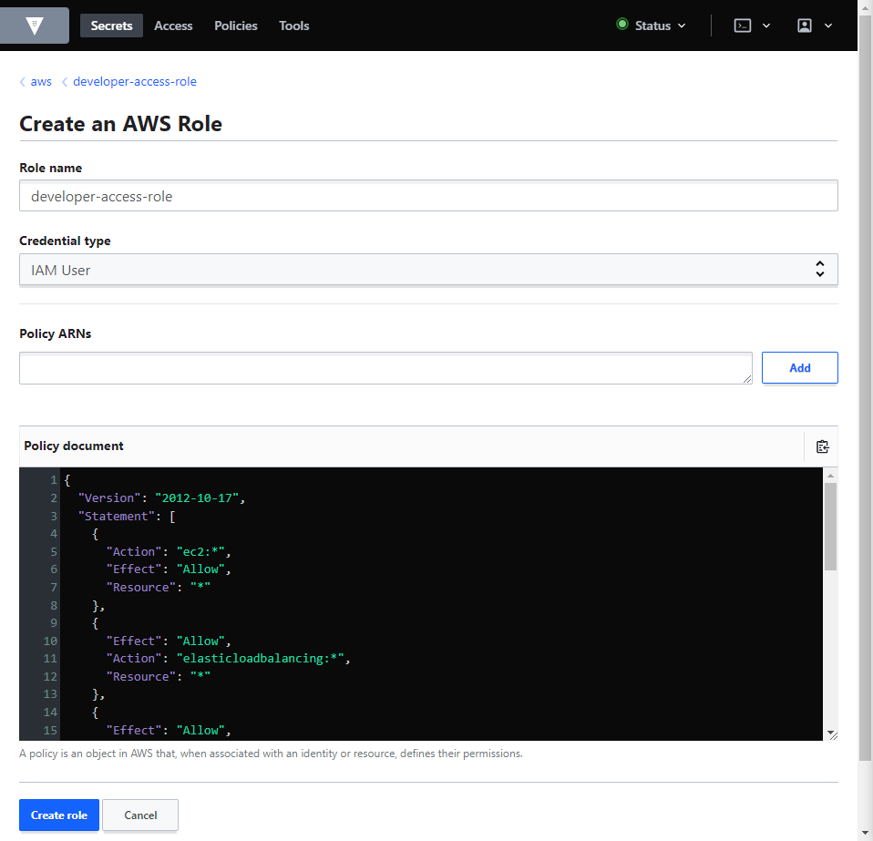
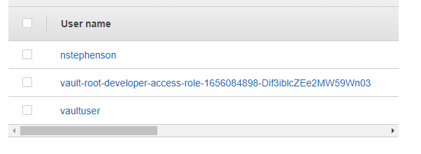

# 2.07 - Generating AWS Credentials Dynamically

- [2.07 - Generating AWS Credentials Dynamically](#207---generating-aws-credentials-dynamically)
  - [Example - Generating AWS Credentials Dynamically from Scratch](#example---generating-aws-credentials-dynamically-from-scratch)

## Example - Generating AWS Credentials Dynamically from Scratch

- From the home screen in the UI, select "Create New Engine" and select "AWS" from it.
- Leave the path and other options as default for now and select "Enable Engine".
- Options will now be available for use - roles and configurations.
  - Roles - What access level does the credentials requested for generation allow?
- Select "Create Role" and assign a role name as required.
- In terms of policy, you can select any policy listed under IAM → Access Management → Policies in the AWS Console, or write your own.

- Opening the policy, copy the policy (JSON Format) into Vault and modify it accordingly.

- Once created, Vault users can use that role to generate a set of dynamic credentials, which will have the permissions assigned based on the policy defined, in this case, full access to all EC2 instances.
- To allow this, one needs to create a user to act as a service account for Vault.
  - Add user titled e.g. vaultuser
  - Set access type to "AWS Management Console Access" and create the user
  - Note the password and attach "AdministratorAccess" policy
  - Generate Access and Secret Access Keys for the vaultuser account
  - In Vault, under Configuration → Configure AWS, add the Access and Secret Keys associated with the Vault user.
    - Configure the region and IAM endpoint as required.
  - Now any developer wanting access credentials with the associated role simply has to select "Generate" on the role and will be provided with temporary dynamic Access and Secret keys for AWS.
  - Vault will use the user account to create the temporary user with the assigned policy.

    
