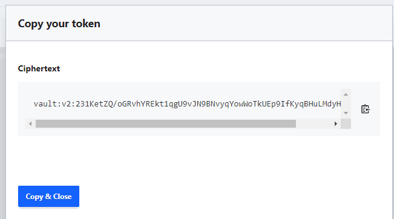

# 2.10 - Transit Secret Engine

## Overview

- Many applications require proper encryption/decryption functionalities
- Building the custom logic to handle this can add excessive workloads to application developers, particularly if they lack expertise in this area.
- Vault has a functionality to support this in its **transit secrets engine -** which handles cryptographic functions on data-in-transit.
- Vault doesn't store the data sent to the secrets engine, so it can also be viewed as encryption as a service.
- Therefore, instead of developing and managing cryptographic-related operations, application developers can get Vault to cover this.

- Based on the above, one can see:
  - Apps can send data to vault to be encrypted prior to storage in databases.
  - The app can then retrieve the encrypted data from the database and request decryption via Vault
- Once the transit secrets engine is enabled, you are required to create an encryption key to facilitate cryptographic operations.

- The primary use cases will be encrypt and decrypt.
- Selecting encrypt, you can easily enter any text to be encrypt and be provided ciphertext

- This data will not be stored by the Vault - to decrypt, provide the ciphertext provisioned during encryption.
- To do this via the CLI:
  - `vault write transit/encrypt/<key-name> plaintext=<base64 / encoded text>`
  - The ciphertext is then provided and must be stored safely outside the vault - otherwise the data cannot be decrypted
  - To decrypt: `vault write transit/decrypt/<key-name> ciphertext=<cipher key>`

---

## Dealing with larger Data Blobs

- When data is encrypted, the encryption key to encrypt plaintext is referred to as a data key.
- This data key needs to be protected so that the encrypted data cannot be decrypted easily by an unauthorized party.
- When the data is large, naturally we wouldn't want to send it over traditional network means for encryption/decryption operations as this would increase latency.
- The transit engine allows generation of a data key that ca be used locally for encryption and decryption operations.

- The data key can now be used for encryption operations, the ciphertext can then be used for decryption operations with vault, submitting the ciphertext to obtain the plaintext decryption key.
- Best practices:
  - Whenever generating a data key in plaintext - the response contains the plaintext of the data key as well as its ciphertext
  - Use the plaintext to encrypt the large data and store the ciphertext in the desired location e.g. key/value secrets engine.
  - When the blob requires decryption, request Vault to decrypt the ciphertext of the data key - allowing you to get the plaintext back for local decryption.

---

## Important Features

### Key Rotation

- It's not recommended to encrypt all data with the same encryption keys for obvious reasons.
- Transit Engine allows a rotation of the encryption key.
- Vault maintains the versioned keyring and the vault operator can decide the minimum version allowed for decryption operations e.g. only the latest could be allowed.
- When creating an encryption key, the format will always be `vault:v<number>:<ciphertext>` - the number following the v denotes the version.
- To rotate the encryption key - simply select "rotate encryption key" - for future encryption options you will then be allowed to select which version you wish to encrypt the data with.

### Minimum Decrypt Version

- As multiple versions of encryption keys appear, this leads to an increased likelihood of working keys being obtained for decryption in the event of an attack.
- Using the **min_decryption_version** setting we can plan on what data can get decrypted.
- As a result of this, found ciphertext to obsolete data cannot be decrypted, but in an emergency, the **min_decryption_version** can be moved back to allow for legitimate decryption.
- You can configure the minimum decryption and encryption versions by editing the encryption key.

### Rewrapping Data

- When a key is rotated, Vault can allow encrypted data to be rewrapped.
- The Vault can send the data encrypted with an older version of the key to have it re-encrypted with the latest version

- This will produce a new ciphertext for the data in accordance with the required key version - allowing you to successfully decrypt the data.
