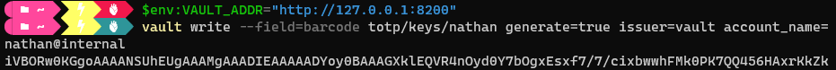
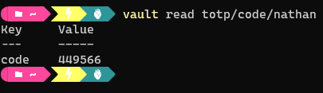

# 2.11 - TOTP Secrets Engine

## Notes

- TOTP = Time-Based One-Time-Passwords
- These are passwords that typically expire within 30, 60 seconds, etc.
- An example of this is Google Authenticator.
- Typically these TOTPs will regenerate with new values after the set timeframe.
- Vault offers both generation and provision services for TOTPs.
- To create, simply select TOTP from the list of secrets engines available. Note that you cannot now select it to open.

- For usage e.g. for a barcode:
  - Generate data for bar code:
    - `vault write --field=barcode totp/keys/<keyname> generate=true issuer=vault account_name=<user>`
    - The resultant output should follow - note that you must have the VAULT_ADDR environment variable for this to work

        

  - Write the data to a file, decode the data and store it in an image file:
    `cat <file containing code> | base64 -d > totp.jpg`
  - This will result in a barcode data that can be used by authentication apps like google authenticator.
  - The code can also be read from the Vault itself:

    
