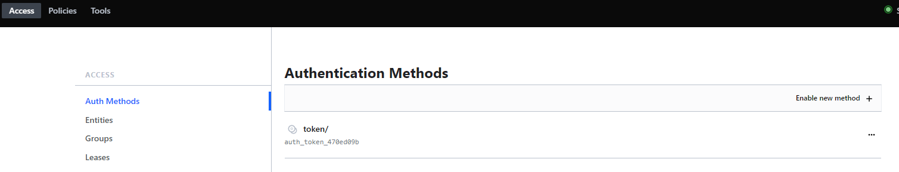
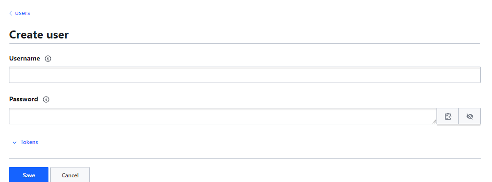

# 3.01 - Authentication in Vault

## Notes

- Authentication is the process of recognizing a user's identity. It's typically based on various approaches e.g. username/passwords or tokens.
- In Vault it's no different - you have multiple ways to authenticate, including:
  - Token
  - Username
  - JWT
  - GitHub
- Any of these authentication methods must be matched when authenticating to Vault. You can however control what authentication methods are usable via the Access tab in the UI.



- Based on the above screenshot, one can see that only token-based authentication is allowed for this Vault instance.
- Selecting "Enable an Authentication method" - you are presented with a multitude of other options, including JWT and TLS Certificates as discussed, but as well as:
  - AWS
  - Azure
  - GitHub
  - Kubernetes
- Once enabled, each authentication method can be configured for various users e.g. in username and password, you can generate new credentials on the fly:



- To authenticate as the user in the CLI:

```powershell
vault login -method=userpass username=admin password=password
vault login -method=<method path> <parameters>
```

- Once authenticated, you will be presented with details regarding the user's access credentials e.g. token, token duration, policies assigned, etc.
- Note: any tokens displayed will be stored in the `token helper` - this will prevent the need to re-provide the token.
