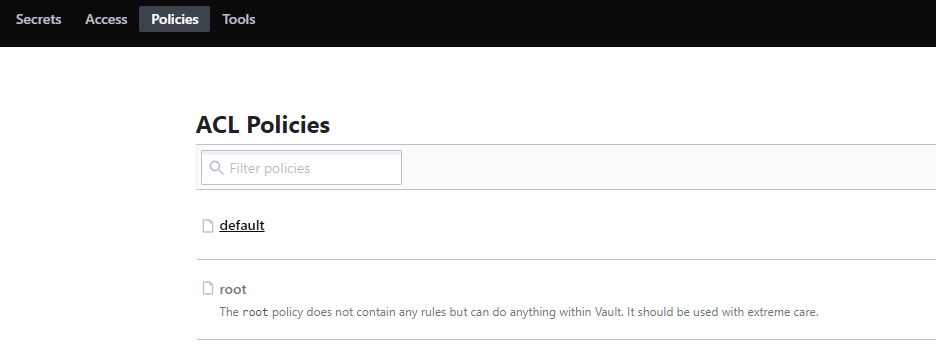
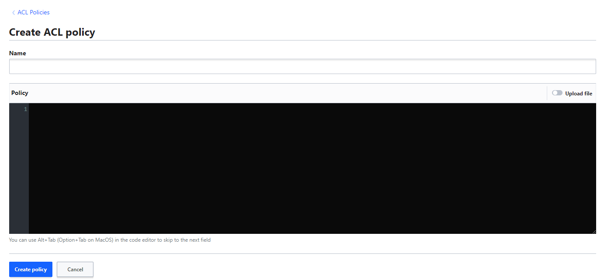
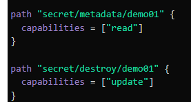

# 3.02 - Overview of Vault Policies

- [3.02 - Overview of Vault Policies](#302---overview-of-vault-policies)
  - [Vault Policies 01](#vault-policies-01)
    - [Introduction](#introduction)
    - [Predefined Policies](#predefined-policies)
    - [Basics of Policy Writing](#basics-of-policy-writing)
    - [Primary Capabilities](#primary-capabilities)
    - [Example](#example)
    - [Root-Protected API Endpoints](#root-protected-api-endpoints)
  - [Vault Policies 02](#vault-policies-02)
    - [ACL Rules Format - KV Secret Engine Version 2](#acl-rules-format---kv-secret-engine-version-2)
      - [Practical Example - ACL Policies](#practical-example---acl-policies)
    - [Listing Secrets](#listing-secrets)
      - [Practical Example - Listing Secrets](#practical-example---listing-secrets)
    - [Reading Secret Metadata](#reading-secret-metadata)
    - [Summary](#summary)

## Vault Policies 01

### Introduction

- By default, any users created / assigned to authentication methods doesn't have any/many capabilities. Permissions come as a result of authorization in Vault, which is determined by Vault policies.
- Examples of policies include:
  - Read from secret/
  - Read and write from secret/
  - Read, write, update and delete from secret/, as well as work with auth methods

### Predefined Policies

- When first initialized, Vault creates a root policy by default and assigns it to the root / superuser allowing them to do anything in Vault; including setup additional policies and authentication methods.
- Another policy titled **default** is also created upon initialization - this is attached to all tokens and provides minimum common permissions.



Policies can be easily viewed from the top toolbar (above).

### Basics of Policy Writing

- Policies are written in HCL format, referred to as ACL policies.
- Typically, policies are written based on secret engine paths. Admins write policies to allow/deny certain paths and operations.
- Example:

```go
path "auth/*"
{
 capabilities = ["create", "read", "update", "delete", "list", "sudo"]
{
```

- If a policy capabiloities list is empty, the user cannot do anything

```go
path "<path>" {
 capabilities = [ "capability 1", "capability 2", ..... , "capability N"]
}
```

### Primary Capabilities

- Create
- Read
- Update
- Delete
- List
- Sudo
- Deny

### Example

- Ensuring a user has been created, authenticate to Vault via the userpass method

```go
vault login -method=userpass username=admin password=password
vault login -method=<method path> <parameters>
```

- When authenticated, this user should have "default" as the policy. To verify, run `vault secrets list` - this should provide an error as it goes against the default policy.
  - Typically the error will be of the form `URL <REQUEST TYPE> <vault address>/version/path`
- To fix this, one can create a new policy. Navigate to policies and select "Create ACL Policy" from the menu - you will be presented with an editor to write an ACL policy.

    

    "Create New ACL Policy" Menu

- Write the policy as desired, in this case, we just want to allow "read" operations on a particular path


- The policy must then be assigned the policy(ies). To do so, navigate to the user under "access" and select "edit user".
  - Under "Generated Token's Policies", add the name of the policy(ies) you which to attach, then click save.

- **Note:** Once the policy is assigned to the user, it will NOT automatically work. You must re-authenticate via the vault login command to generate a new token for the user.

- Re-authenticate the user and verify the user has the capability(ies) required.
- Repeat this process for any other issues / capability problems as required for the user.

- **Note:** Once a policy is assigned to a user, any changes made to it will automatically apply to that user.

- In some cases, there may be an unexpected change to the path e.g. `secret/data/secret1`  to fix this, the path in the policy could be changed to `secret/*` - using the * as a wildcard operator.
  - This poses a security risk - as multiple secrets may be under the path `secret/` that users shouldn't have access to.
  - To fix, either explicitly define the secret path provided i.e. `full path to secret`  OR add an additional policy to deny access to the other secret(s), an example follows:

```go
path "secret/*" {
  capabilities = ["read"]
}

path "secret/data/<secret not to be seen>" {
  capabilities = ["deny"]
}
```

- **Note:** If you did not wish to add the path information between the endpoints of the path, such as `data` in the above example, you can replace it with `+` , this will automatically apply to any secrets ending in the secret path prefix and suffix.

### Root-Protected API Endpoints

- Some paths are more restrictive than others, requiring root token or sudo capabilities in the policy to allow the operations. Examples include:
  - auth/token/accessors
  - auth/token
  - sys/audit
  - sys/rotate
  - sys/seal

---

## Vault Policies 02

### ACL Rules Format - KV Secret Engine Version 2

- The version 2 key-value store uses a prefixed API that differs from version 1
- Writing and reading versions are prefixed with the `data/` path.
- Example:

| Path | KV Version 1 | KV Version 2 |
| --- | --- | --- |
| /secret/first    |  `path "secret/first" { capabilities = ["create"] }`   | `path "secret/data/first" { capabilities = ["create"] }`    |

#### Practical Example - ACL Policies

- Create a policy for KV Version 1


- Additionally, create a test-user to test the policy out. Be sure to assign the policy to the user under `token-generated policy`


- Authenticate to the Vault via the CLI for the user

```go
vault login -method=userpass username="demo-user" password="demo-password"
```

- As expected, the authentication works, and the policy is shown to be attached to the user:


- Create a secret under the key-value secret engine for version 2 to test


- Test the policy: `vault kv get secret/demo01`


- As expected, the get request is denied in line with the policy. Note the path is `/secret/data/demo01` as the secret is under key vault version 2.
- Editing the policy to add the /data prefix will fix this.

### Listing Secrets

- The `metadata/` endpoint returns a list of key names at the specified location.
- Any input for this must be a folder
- The values aren't accessible via this command.

| Path | KV Version 2 |
| --- | --- |
| `/secret/` | `path "secret/metadata/" { capabilities =["list"] }` |

#### Practical Example - Listing Secrets

- Add some more secrets to the key-value secrets engine


- If the user logs into the UI, they would not be able to see the contents of these secrets, but they CAN see the names of the secrets if they are allowed access to the metadata endpoint
- Add the required information to the policy


- This can then be tested in the UI by logging in as the user and verifying if you can `list` the secrets but not `read` them.

### Reading Secret Metadata

- To retrieve the metadata and versions for the secret at the specified path:

| Path | KV Version 2 |
| --- | --- |
| `/secret/firstsecret` | `path "secret/metadata/firstsecret" { capabilities = ["read"] }` |

### Summary

| Operation | Path [Capability(ies)] |
| --- | --- |
| Writing and Reading Versions | /data |
| Listing Keys | metadata/ [list] |
| Reading versions | metadata [read] |
| Destroy versions of secret | destroy/ [update] |
| Destroy all versions of metadata for key | metadata/ [delete] |

Examples for the latter two:


