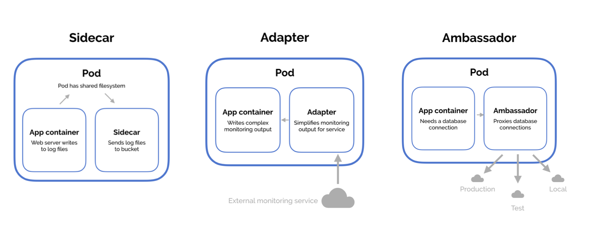

# 5.0 - Application Lifecycle Management

## 5.1 - Rolling Updates and Rollbacks

### Rollout and Versioning

- When first creating a deployment, a rollout is triggered
- Rollout is equivalent to a deployment revision in definition
- When future updates occur, a new rollout will occur creating a new deployment
revision
- This functionality allows tracking of deployment changes
  - Rollback functionality is therefore available in the event of application failure

### Rollout Commands

- To view rollout status:
  - `kubectl rollout status <deployment name>`
- To view rollout history and versioning:
  - `kubectl rollout history <deployment-name>`

### Deployment Strategy

- There are multiple deployment strategies available, the two main versions are:
  - Recreate:
    - When a new version of an application is ready, tear down all instances
currently deployed at once
    - Deploy new versions once "current" version is unavailable
    - Results in significant user downtime
  - Rolling Updates:
    - Destroys current instance and upgrades with a new version one after
another (take down one old version, upload a new version, repeat)
    - Leads to higher availability of the application
    - Upgrade appears "seamless"
- To update a deployment, simply make the changes to the definition file and run
`kubectl apply -f <deployment-definiton-file>.yaml`
  - This triggers a new rollout
- It should be noted, you could also update the deployment via the CLI only, for
example, updating a deployment's image:
  - `kubectl set image deployment <deployment-name> <image>=<image>:<tag>`
    - This method doesn't update the YAML file associated with the
deployment
- You can view deployment strategies in detail via the `kubectl describe deployment <deployment-name>`
  - For the recreate strategy, it can be seen that during the upgrade process the
deployment is scaled from maximum size, to zero, then back again
  - For rolling updates, the pods are scaled individually, one old pod removed,
one new pod added, and so on.
- When a new deployment is created, a new replicaset is automatically created,
hosting the desired number of replica pods
- During an upgrade a new replica set is created
  - New pods with new application added sequentially
  - At the same time, the new old pods are sequentially taken down
- Once upgraded, if a rollback is required, run: `kubectl rollout undo <deployment>`
- The command `kubectl run <deployment> --image=<image>` will create a deployment
  - Serves as an alternative to using a definition file
  - Required replicasets and pods automatically created in the backend
  - It's still highly recommended to use a definition file for editing and versioning
deployments
- Command Summary:
  - To create a deployment from a yaml file:
    - `kubectl create -f <deployment.yaml>`
  - To get a list of all deployments
    - kubectl get deployments
  - To update a deployment, run one of the following two:
    - `kubectl apply -f <deployment.yaml>`
    - `kubectl set image <deployment> <image ID>=<image>:<tag>`
  - To get the status of a deployment rollout:
    - `kubectl rollout status <deployment>`
  - To view the rollout history:
    - `kubectl rollout history <deployment>`
  - To rollback:
    - `kubectl rollout undo <deployment>`

## 5.2 - Commands and Arguments: Docker

- Note: This isn't a requirement for the CKAD/CKA curriculum
- Consider a simple scenario:
  - Run an ubuntu image with Docker: `docker run ubuntu`
  - This runs an instance of the Ubuntu image and exits immediately
- If `docker ps -a` is ran to list the containers, it won't appear
  - Due to the fact that containers aren't designed to host an OS
  - They're instead designed to run a specific task/process e.g. host a web server
  - The container will exist as long as the hosted process is active, if the service is
stopped or crashes, the container exits
- The Dockerfile's CMD section was set as `"bash"`
  - This isn't a command, but a CLI instead
  - When the container ran, Docker created a container based on the Ubuntu
image and launched bash
- Note: By default, Docker doesn't attach a terminal to a container when it's ran
  - Bash cannot find a terminal
  - Container exits as the process is finished
- To solve a situation like this, you can add container commands to the docker run
command, e.g.
  - `docker run ubuntu sleep 5`
- These changes can be made permanent via editing the Docker file either in a:
  - Shell format: `CMD command param1`
  - JSON format: `CMD ["command", "param1"]`
- To build the new image, run: `docker build -t image_name .`
- Run the new image via `docker run <image_name>`
- To use a command but with a different value of parameter to change each time,
change the `CMD` to `"ENTRYPOINT"` i.e. `ENTRYPOINT ["command"]`
- Any parameters specified on the CLI will automatically be appended to the
entrypoint command
- If using entrypoint and a command parameter isn't specified, an error is likely
  - A default value should be specified
- To overcome the problem, use a combination of entrypoints and command in a
JSON format i.e.:
  - `ENTRYPOINT ["command"]`
  - `CMD ["parameter"]`
- From this configuration, if no additional parameter is provided, the CMD parameter
will be applied
- Any parameter on the CLI will override the CMD parameter
- To override the entrypoint command, run:
  - `docker run --entrypoint <new command> <image name>`

## 5.3 - Commands and Arguments: Kubernetes

- Using the previously defined image, one can create a yaml definition file:

```yaml
apiVersion: v1
Kind: Pod
metadata:
  name: pod-name
spec:
  containers:
    name: container-name
    image: container-image
    command: ["command"]
    args: ["10"]
```

- To add anything to be appended to the docker run command for the container, add
args to the container spec
- Pod may then be created using the `kubectl create -f` command as per
- To override entrypoint commands, add "command" field to the pod spec
- To summarise, in Kubernetes Pod Specs:
  - command overrides Dockerfile entrypoint commands
  - args override Dockerfile CMD commands
- Note: You cannot edit specifications of a preexisting pod aside from:
  - Containers
  - Initcontainers
  - activeDeadlineSeconds
  - Tolerations

## 5.4 - Configure Environment Variables in Applications

- For a given definition file, one can set environment variable via the env field under
containers in a pod's spec
- Each environment variable is an array, so each one has its own name, value and is
denoted by a - prior to the name field

```yaml
env:
- name: APP_COLOR
  value: blue
```

- Environment variables can also be referenced via two other methods:
  - Configmaps: rather than env, replace with `valueFrom`, and add
`configMapKeyRef` underneath
  - Secrets: rather than `env`, replace with `valueFrom`, and add `secretKeyRef`
underneath


## 5.5 - Configure ConfigMaps in Applications

- When there are multiple pod definition files, it becomes difficult to manage
environmental data
- This can info can be removed from the definition files and managed centrally via
ConfigMaps
- ConfigMaps used to pass configuration data as key-value pairs in Kubernetes
- When a pod is created, the configmap's data can be injected into the pod, making
the kvps available as environmental variables for the application within the
container
- Configuring the ConfigMap involves 2 phases:
  - Create the ConfigMap
  - Inject it to the Pod
- To create, can run either:
  - `kubectl create configmap <configmap name>`
  - `kubectl create -f <configmap-definition>.yaml`
- By using the first command specified above, you can immediately create key-value
pairs:

```shell
kubectl create configmap <configmap-name> --from-literal=<key>=<value> ... --from-literal=<key>=<value>
```

## 5.6 - Configure Secrets in Applications

- Considering a simple python server:
- The hostname username and passwords are hardcoded in bad practice => high security risk.
- It would be better to store this data as a ConfigMap based on previous discussion - the problem though is that ConfigMap data is stored in a plaintext format.
  - Not applicable for sensitive info like passwords

- Variables like username and passwords are better stored as `secrets` in Kubernetes.
  - These are similar to ConfigMaps, but the values are stored in encrypted format.

- Analagous to ConfigMaps, there are 2 steps:
  - Secret Creation
  - Inject secrets to a pod.

- Secret creation is achieved either imperatively or declaratively:
  - **Declarative:** Use a YAML definition file to "declare" the desired configuration
  - **Imperative:** Use the `kubectl create secret` command to "imply" Kubernetes to create a secret, and let Kubernetes figure out / guestimate the configuration desired.

### Imperative Secret Creation

- `kubectl create secret generic <secret name> --from-literal=<key>=<value>`

- As with ConfigMaps, data can be specified from the CLI in key-value-pairs via the `--from-literal` flag multiple times.

- Example: `kubectl create secret generic app-secret --from-literal=DB_HOST=mysql --from-literal=DB_USER=root --from-literal=DB_PASSWORD=password`

- For larger amounts of secrets, the data can be imported from a file, achieved by using the `--from-file` flag.

- Example: `kubectl create secret generic app-secret --from-file=app-secret.properties`

### Declarative Secret Creation

- Using a YAML definition file:

```yaml
apiVersion: v1
kind: Secret
metadata:
  name: app-secret
data:
  DB_HOST: mysql
  DB_USER: root
  DB_PASSWORD: password
```

- As discussed, the secrets should not be stored in plaintext string format. Typically, Kubernetes secrets are stored in Base64 encrypted format.
- To convert: `echo -n '<secret plaintext value>' | base64`
- Create the secret via `kubectl create -f ....` as normal
- Secrets can be viewed via: `kubectl get secrets`
- Detailed information viewed via: `kubectl describe secrets <secret name>`

- To view secret in more detail: `kubectl get secret <secret name> -o yaml`

- To decode secret: `echo -n '<secret base64 value>' | base64 --decode`

### Secrets in Pods

- With both a pod and secret YAML file, the secret data can be injected as environment variables:

```yaml
spec:
  containers:
  - envFrom:
    - secretRef:
        name: <secret name>
```

- When `kubectl create -f ...` is run, the secret data is available as environment variables in the pod.

- As before, one can inject secrets to pods via environment variables (above) OR a single environment variable (below):

```yaml
spec:
  containers:
  - env:
    - name: DB_PASSWORD
      valueFrom:
        secretKeyRef:
          name: app-secret
          key: DB_PASSWORD
```

### Secrets in Volumes

- Secrets can also be added as volumes attached to pods:

```yaml
volumes:
- name: app-secret-volume
  secret:
    secretName: app-secret
```

- If mounting the secret as a volume, each attribute in the secret is created as a file, with the value being the content.

## 5.7 - Scale Applications

Refer to Rolling Updates and Rollbacks - Section 5.1

## 5.8 - Multi-Container Pods

- Multiple patterns are availablem such as:
  - Ambassador
  - Adapter
  - Sidecar

- In general, it's advised to decouple a monolithic (single-tiered) application into a series of smaller components -> microservices

- Allows ability to independently develop and deploy sets of small reusable code
  - Allows easier scalability and independent modification.

- In some cases, may need services to interact with one another, whilst still being identifiable as separate services
  - Example: web server and logging agent
  - 1 agent service would be required per web server, not merging them together.

- Only the 2 functionalities (or more) need to work together that can be scaled as required:
  - Multi-container pods required

- Multi-container pods contain multiple containers running different services, sharing aspects such asL
  - Network: Can refer to each other via localhost
  - Storage: No need for additional volume setup / integration
  - Lifecycle: Resources are created and destroyed together

- To create a multi-container pod, add the additional container details to the pod's spec in a similar manner to the following:

```yaml
apiVersion: v1
kind: Pod
metadata:
  name: simple-webapp
  labels:
    name: simple-webapp
spec:
  containers:
  - name: simple-webapp
    image: simple-webapp
    ports:
    - containerPort: 8080

  - name: log-agent
    image: log-agent
```

## 5.9 - Multi-Container Pod Design Patterns

- 3 Design patterns available:
  1. Sidecar
  2. Adapter
  3. Ambassador



### Sidecar

- The most common design pattern
- Uses a "helper" container to assist or improve the functionalut of a primary container
- Example: Log agent with a web server

### Adapter

- Used to assist in standardising communications between resources
  - Processes that transmit data e.g. logs will be formatted in the same manner
  - All data stored in centralised location

### Ambassador

- Responsible for handling proxy for other parts of the system or services
- Used when wanting microservices to interact with one another
- Services to be identified by name only via service discovery such as DNS or at an application level.

---

- Whilst the design patterns differ, their implementation is the same, adding containers to the pod definition file spec where required,

## 5.10 - InitContainers

- In multi-container pods, each container will run a process that stays alive for the
duration of the pod's lifecycle
- Example: Consider a multi-container pod that runs a web application in one
container, and a logging agent in another
  - Both containers are expected to stay running at all times (the log agent runs
as long as the web application is running)
  - If either fails, the pod stops
- In some scenarios, would want to run a process that runs to completion in a
container e.g. a process that pulls a code or binary from a repository to be used by
the main application
  - Processes like this are to be ran only one time when the pod is first created,
or to wait for an external service or database to be up and running before
the application starts
- Containers like this are initContainers
- InitContainers are configured in the exact same way as regular containers in a pod's
spec, they are just a separate section to containers
  - When the POD is first created, the initContainer runs its progress to
completion before the main application starts
- Multiple initContainers can be configured in a similar manner to multi-container
pods
  - If this is the case, each initContainer will run one at a time
  - In the event any of the initContainers fail, the pod will repeatedly restart until
they all succeed

## 5.11 - Self-Healing Applications

- Self-healing applications are supported through the use of ReplicaSets and
Replication Controllers
- ReplicationControllers help in ensuring a pod is recreated automatically when the
application within crashes; thus ensuring enough replicas of the application are
running at all times
- Additional support to check the health of applications running within pods and take
necessary actions when they're unhealthy, this is done through Readiness and
Liveness Probes.
- For more information, see section 5.0-5.2 of the written CKAD notes
