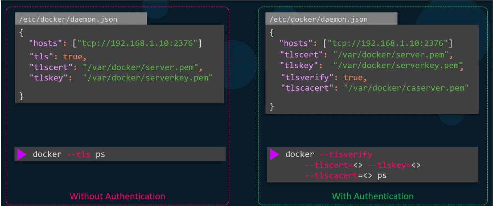

# 3.0 - Cluster Setup and Hardening

## 3.1 - CIS Benchmarks

- **Security Benchmark** - Predefined standards and best practices that should be
implemented for server (or other appropriate device) security.
- **Areas of consideration include:**
  - Physical device configuration and limitation - USB ports that aren't expected to be used frequently / at all must have their access managed appropriately
  - Access configurations - What user accounts need to be configured? Can users log in as root?
    - Recommended that root is disabled by default and admins use sudo where required
    - Leads into only certain users having access to sudo, amongst other configurations
  - Network configuration
    - Firewall & IP Tables
    - Port Security
  - Service configuration
    - Ensure only certain services are allowed
  - Filesystem Configuration
    - All required permissions are set to the desired files
  - Auditing
    - Make sure all changes are logged for auditing purposes
  - Logging
- **CIS** - Centre for Internet Security
  - Commonly used tool to check if security best practices are implemented
  - Available on Linux, Windows, Cloud platforms, Mobile and many other platforms as well as Kubernetes.
- Can be downloaded from `https://www.cisecurity.org/cis-benchmarks/`
- Guides come with predefined instructions for your associated platform(s) best practices and how to implement them (commands included)
- CIS Provide tools such as the CIS-CAT tool to automate the assessment of best
practices implementation
  - If any best practices aren't implemented, they are logged in the resultant HTML output report in a detailed manner.

### Lab - Run CIS Benchmark Assessment Tool on Ubuntu

Q1: What is full form of CIS?
A: Center for Internet Security

Q2: What is not a function of CIS?
A: Monitor Global Internet Traffic

Q3: We have installed the CIS-CAT Pro Assessor tool called Assessor-CLI, under /root.

Please run the assessment with the Assessor-CLI.sh script inside Assessor-CLI directory and generate a report called index.html in the output directory `/var/www/html/`.

Once done, the report can be viewed using the Assessment Report tab located above the terminal.

Run the test in interactive mode and use below settings:

Benchmarks/Data-Stream Collections: : CIS Ubuntu Linux 18.04 LTS Benchmark
v2.1.0
Profile : Level 1 - Server

A:

- Run Assessor-CLI.sh
- Note options:
  - `-i (interactive)`
  - `--rd <reports dir>`
  - `--rp <report prefix>`
- Run Assessor-CLI.sh with options for `/var/www/html/` and
index.html respectively (and `--nts`) and `-i`
- **Note:** Run options in order that they are displayed
- Apply conditions for benchmark setting and profiles

**Q4:** How many tests failed for 1.1.1 Disable unused filesystems?

**A:** View report via tab and note - 6

**Q5:** How many tests passed for 2.1 Special Purpose Services?

**A:** ditto - 18

**Q6:** What parameters should we set to fix the failed test 5.3.10 Ensure SSH
root login is disabled?

**A:** PermitRootLogin no

**Q7:** Fix the failed test - 1.7.6 Ensure local login warning banner is
configured properly?

**A:** Find in CIS Report, run the associated command

**Q8:** Fix the failed test - 4.2.1.1 Ensure rsyslog is installed

**A:** Find area in report and run command

**Q9:** Fix the failed test - 5.1.2 Ensure permissions on /etc/crontab
are configured

**A:** Find area in report and run command

**Q10:** In the previous questions we fixed the below 3 failed tests. Now run
CIS-CAT tool test again and verify that all the below tests pass.

- 1.7.6 Ensure local login warning banner is configured properly
- 4.2.1.1 Ensure rsyslog is installed
- 5.1.2 Ensure permissions on /etc/crontab are configured

Run below command again to confirm that tests are passing now
`sh ./Assessor-CLI.sh -i -rd /var/www/html/ -nts -rp index`

Use below setting while running tests
Benchmarks/Data-Stream Collections: : CIS Ubuntu Linux 18.04 LTS
Benchmark v2.1.0
Profile : Level 1 - Server
A: Copy command and check associated tests pass - revisit questions
if failed

## 3.2 - CIS Benchmarks in Kubernetes

- Kubernetes CIS benchmarks are readily available for download
- At the time of writing, the best practices are defined for versions 1.16-1.18
- The benchmarks are specifically aimed at system and application administrators, security specialists, auditors, help desk and platform deployment personnel who plan to develop, deploy, assess or secure solutions involving Kubernetes.
- Covers various security practices for master/control plane and worker nodes, such as permissions and configurations for API Server pods.
- Additional details provided to check recommended settings are in place and how to
rectify any errors.
- CIS CAT Lite only supports certain OS's and benchmarks like Windows, Ubuntu,
Kubernetes not included.
- CIS-CAT Pro includes Kubernetes support.
- CIS Benchmarks Link: <https://www.cisecurity.org/cis-benchmarks/#kubernetes>
- CIS CAT Tool:
<https://www.cisecurity.org/cybersecurity-tools/cis-cat-pro/cis-benchmarks-supported-by-cis-cat-pro/>

## 3.3 - Kube-Bench

- An open-source tool from Acqua security that can automate assessment of
Kubernetes deployments in line with best practices
- The assessment occurs against the CIS Benchmarks
- To get started can either:
  - Deploy via Docker Container
  - Deploy as a pod in Kubernetes
  - Install the associated binaries
  - Compile from source

### Lab - Kube-Bench

Q1: Kube-Bench is a product of which company?
A: Aqua Security

Q2: What should Kube-Bench be used for?
A: To check whether Kubernetes is deployed in line with best practices for security

Q3: Install Kube Bench in /root - version 0.4.0, Download file:
kube-bench_0.4.0_linux_amd64.tar.gz

A:
`curl -L https://github.com/aquasecurity/kube-bench/releases/download/v0.4.0/kube-bench_0.4.0_l
inux_amd64.tar.gz -o kube-bench_0.4.0_linux_amd64.tar.gz
tar -xvf kube-bench_0.4.0_linux_amd64.tar.gz`

Q4: Run a kube-bench test now and see the results Run below command to run kube bench

`./kube-bench --config-dir <pwd>/cfg --config <pwd>/cfg/config.yaml`

A: Follow instructions

Q5: How many tests passed forEtcd Node Configuration?

A: Review and report back - Section 2 and 7 pass

Q6: How many tests failed for Control Plane Configuration?
A: Review and report back - Section 3 and 0 failed

Q7: Fix this failed test 1.3.1 Ensure that the `--terminated-pod-gc-threshold`
argument is set as appropriate
Follow exact commands given in Remediation of given test

A: Find section in output and follow command

Edit the Controller Manager pod specification file
`/etc/kubernetes/manifests/kube-controller-manager.yaml`
on the master node and set the `--terminated-pod-gc-threshold` to an appropriate
threshold,
for example:
`--terminated-pod-gc-threshold=10`

Q8: Fix this failed test 1.3.6 Ensure that the RotateKubeletServerCertificate
argument is set to true
Follow exact commands given in Remediation of given test

A: Find section and follow instructions: Edit the Controller Manager pod specification file `/etc/kubernetes/manifests/kube-controller-manager.yaml`
on the master node and set the `--feature-gates` parameter to include
RotateKubeletServerCertificate=true.

`--feature-gates=RotateKubeletServerCertificate=true`

Q9: Fix this failed test 1.4.1: Ensure that the --profiling argument is set
to false

A: Follow exact commands given in Remediation of given test

Q10:
Run the kube-bench test again and ensure that all tests for the fixes we
implemented now pass

- 1.3.1 Ensure that the --terminated-pod-gc-threshold argument
is set as appropriate
- 1.3.6 Ensure that the RotateKubeletServerCertificate
argument is set to true
- 1.4.1: Ensure that the --profiling argument is set to false

A: Run command - ./kube-bench --config-dir `pwd`/cfg --config `pwd`/cfg/config.yaml

And verify

## 3.4 - Kubernetes Security Primitives

- Securing the hosts can be handled via methods such as disabling password
authentication and allowing only SSH Key authentication
- Controlling access to API Server is the top priority - All Kubernetes operations
depend upon this.
- Need to define:
  - Who can access the API Server?
  - What can they do with the API Server?
- For access, could use any of:
  - Files
  - Certificates
  - External authentication providers
  - Service Accounts
- For Authorization:
  - RBAC - Role-based access control
  - ABAC - Attribute-based access control
  - Node Authorization
- By default, all pods within a cluster can access one another
- This can be restricted via the introduction of network policies

## 3.5 - Authentication

- In general, there are two types of accounts available:
  - User accounts - Admins, developers, etc
  - Service accounts - machine-based accounts
- All access to Kubernetes is handled via the Kube-API Server
- Authentication Mechanisms Available in Kubernetes for the API Server:
  - Static Password File - Not recommended
  - Static Token File
  - Certificates
  - Identity Services (3rd Party services e.g. LDAT)
- Suppose you have the user details in a file, you can pass this file as an option for authentication in the kube-apiserver.service file adding the flag: `--basic-auth-file=user-details.csv`

```shell
ExecStart=/usr/local/bin/kube-apiserver \\
  --advertise-address=${INTERNAL_IP} \\
  --allow-privileged=true \\
  --apiserver-count=3 \\
  --authorization-mode=Node,RBAC \\
  --bind-address=0.0.0.0 \\
  --enable-swagger-ui=true \\
  --etcd-servers=https://127.0.0.1:2379 \\
  --event-ttl=1h \\
  --runtime-configmap=api/all \\
  --service-cluster-ip-range=10.32.0.0/24 \\
  --service-node-port-range=30000-32767 \\
  --v=2
```

- Restart the service / the server after the change is done.
- If the cluster is setup using Kubeadm, edit the yaml file and add the same options in a similar manner to:

```yaml
## /etc/kubernetes/manifests/kube-apiserver.yaml
apiVersion: v1
kind: Pod
metadata:
  creationTimestamp: null
  name: kube-apiserver
  namespace: kube-system
spec:
  containers:
  - command:
    - kube-apiserver
    - --authorization-mode=Node,RBAC
    - --advertise-address=172.17.0.107
    - --allow-privileged=true
    - --enabke-admission-plugins=NodeRestriction
    - --enable-bootstrap-token-auth=true
    image: k8s.gcr.io/kube-apiserver-amd64:v1.11.3
    name: kube-apiserver
```

- Kubernetes will automatically update the apiserver once the change is made
- To authenticate using the credentials specified in this manner run a curl command similar to: `curl -v -k https://master-node-ip:6443/api/v1/pods -u "username:password"`
- Could also have a token file, specify using --token-auth-file=user-details.csv in the
api server .service or yaml file as appropriate
  - **Note:** the token can also be included in the curl request via --header
`"Authorization: Bearer <TOKEN>"`
- **Note:** These are not recommended authentication mechanisms
  - Should consider a volume mount when providing the auth file in a kubeadm
setup
  - Setup RBAC for new users
- Could also setup RBAC using YAML files to create rolebindings for each user

## 3.6 - Service Accounts

- In Kubernetes there are two types of accounts:
  - User - Used by Humans e.g. Administrators
  - Service - Used by application services for various tasks e.g. Monitoring, CI/CD
tools like Jenkins
- For an application to query the Kubernetes API, a service account is required
- Creation: `kubectl create serviceaccount <serviceaccount name>`
- View: kubectl get serviceaccount
- For detailed information: `kubectl describe serviceaccount <name>`
- When a serviceaccount is created, an authentication token is automatically created
for it and stored in a Kubernetes secret.
  - Serviceaccount token used for application authentication to the kube-api server
  - The secret can be viewed via `kubectl describe secret <secret name>`
  - This token can then be passed as an Authorization Bearer token when
making a curl request.
  - E.g `curl https://<IP-ADDRESS> -insecure --header "Authorization: Bearer <token>"`
- For 3rd party applications hosted on your own Kubernetes cluster:
  - The exporting of the service account token is not required
  - The service account secret can be mounted as a volume inside the pod hosting the application
- For every namespace, a default service account and its token are automatically assigned to a pod unless specified otherwise.
- Secret mounted as a volume for each pod - secret location viewable via `kubectl describe pod`
- **Note:** The default service account can only run basic Kubernetes API queries
- To specify a particular service account for a pod, add in the pod's spec field: `serviceAccount: name`
  - You must delete and recreate a pod if you wish to edit the service account on a pod.

## 3.7- TLS Basics

- Certificates used to guarantee trust between two parties communicating with one
another, leading to a secure and encrypted connection
- Data involved in transmission should be encrypted via the use of encryption keys
- **Encryption Methods:**
  - **Symmetric:** Same key used for encryption and decryption - insecure
  - **Asymmetric encryption:** A public and private key are used for encryption and decryption specifically
    - Private key can only be used for decryption
- SSH Assymetric Encryption: run ssh-keygen
  - Creates `id_rsa` and `id_rsa.pub` (public and private keys)
  - Servers can be secured by adding public key to authorized key file at `~/.ssh/authorized_keys`
  - Access to the server is then allowed via `ssh -i id_rsa username@server`
  - For the same user, can copy the public key to any other servers
- To securely transfer the key to the server, use asymmetric encryption
- Can generate keys with: `openssl genrsa -out <name>.key 1024`
  - Can create public variant with: `openssl rsa -in <name>.key -pubout > <name>.pem`
- When the user first accesses the web server via HTTPS, they get the public key from the server
  - Hacker also gets a copy of it
- The users browser encrypts the servers symmetric key using their public key - securing the symmetric public key from the server
  - Hacker gets copy
- Server uses private key to decrypt user's private key - allows user to access server securely
- Hackers don't have access to the servers private key, and therefore cannot encrypt it.
- For the hacker to gain access, they would have to create a similar website and route
your requests
  - As part of this, the hacker would have to create a certificate
  - In general, certificates must be signed by a proper authority
  - Any fake certificates made by hackers must be self-signed
    - Web browsers have built-in functionalities to verify if a connection is secure i.e. is certified
- To ensure certificates are valid, the Certificate Authorities (CAs) must sign and validate the certs.
  - **Examples: Symanteg, Digicert, GlobalSign**
- To validate a certificate, one must first generate a certificate signing request to be
sent to the CA: `openssl req -new -key <name>.key -out <name>.csr -subj "/C=US/ST=CA/O=MyOrg, Inc./CN=mybank.com"`
- CAs have a variety of techniques to ensure that the domain is owned by you
- How does the browser know what certificates are valid? E.g. if the certificate was assigned by a fake CA?
  - CAs have a series of public and private keys built in to the web browser(s) used by the user,
  - The public key is then used for communication between the browser and CA to validate the certificates
- **Note:** The above are described for public domain websites
- For private websites, such as internal organisation websites, private CAs are generally required and can be installed on all instances of the web browser within the organisation. Organizations previously outlined generally offer enterprise
solutions.
- **Note:**
  - Certificates with a public key are named with the extension .crt or .pem, with the prefix of whatever it is being communicated with
  - Private keys will have the extension of either .key or -key.pem
- **Summary:**
  - Public key used for encryption only
  - Private keys used for decryption only

## 3.8 - TLS In Kubernetes

- In the previous section, three types of certificates were discussed, for the purposes of discussing them in Kubernetes, how they're referred to will change:
  - Public and Private Keys used to secure connectivity between the likes of web browsers and servers: Server Certificates
  - Certificate Authority Public and Private Keys for signing and validating certificates: Root Certificates
  - Servers can request a client to verify themselves: Client Certificates
- **Note:**
  - Certificates with a public key are named with the extension .crt or .pem, with the prefix of whatever it is being communicated with
  - Private keys will have the extension of either `.key` or `-key.pem`
- All communication within a Kubernetes cluster must be secure, be it:
  - Pods interacting with one another
  - Services with their associated clients
  - Accessing the APIServer using the Kubectl utility
- Secure TLS communication is a requirement
- Therefore, it is required that the following are implemented:
- Server Certificates for Servers
  - Client Certificates for Clients
- **Server Components:**
  - Kube-API Server
    - Exposes an HTTPS service that other components and external users use to manage the Kubernetes cluster
    - Requires certificates and a key pair to be generated
      - `apiserver.crt` (public) and `apiserver.key` (private key)
  - ETCD Server:
    - Stores all information about the cluster
    - Requires a certificate and key pair
      - `etcdserver.crt` and `apiserver.key`
  - Kubelet server:
    - Exposes HTTPS API Endpoint that the Kube-API Server uses to interact with the worker nodes
      - `kubelet.crt` and `kubelet.key`
- **Client Certificates:**
  - All of the following require access to the Kube-API Server
  - Admin user
    - Requires certificate and key pair to authenticate to the API Server
    - `admin.crt` and `admin.key`
  - Scheduler
    - Client to the Kube-APIServer for object scheduling pods etc
    - `scheduler.crt` and `scheduler.key`
  - Kube-Controller:
    - `controller-manager.crt` and `controller-manager.key`
  - Kube-Proxy
    - kube-proxy.crt and kube-proxy.key
- **Note:** The API Server is the only component that communicates with the ETCD server, which views the API server as a client
  - The API server can use the same keys as before for serving itself as a service OR a new pair of certificates can be generated specifically for ETCD Server Authentication
  - The same principle applies for the API Server connecting to the Kubelet service
- To verify the certificates, a CA is required. Kubernetes requires at least 1 CA to be present; which has its own certificate and key (`ca.crt` and `ca.key`)

## 3.9 - TLS In Kubernets: Certificates

- Tools available for certificate creation include:
  - EASYRSA
  - OPENSSL - The more common one (used in this example)
  - CFSSL
- **Steps - Server Certificates: CA Example**
  - Generate the private key: openssl genrsa -out ca.key 2048
    - The number "2048" in the above command indicates the size of the private key. You can choose one of five sizes: 512, 758, 1024, 1536 or 2048 (these numbers represent bits).
    The larger sizes offer greater security, but this is offset by a penalty in CPU performance. We recommend the best practice size of 1024.
  - Generate certificate signing request: `openssl req -new -key ca.key -subj "/CN=KUBERNETES-CA" -out ca.csr`
  - **Note:** `"/CN=<NAME>"` outlines the name of the component the certificate is for.
  - Sign certificates, this is self-signed via the ca key pair: `openssl x509 -req -in ca.csr -signkey ca.key -out ca.crt`
    - Results in CA having a private key and root certificate file
- **Client Certificate Generation Steps: Admin User Example**
  - Generate the keys: `openssl genrsa -out admin.key 2048`
  - Generate certificate signing request: `openssl req -new -key admin.key -subj "/CN=kube-admin" -out admin.csr`
  - Sign the certificate: `openssl x509 -req -in admin.csr -CAkey ca.key -out admin.crt`
    - The CA key pair is used for signing the new certificate, thus proving its validity
- When the admin user attempts to authenticate to the cluster, it is the certificate **admin.crt** that will be used for this
- For **non-admin users**, need to add group details to the certificate signing request to signal this.
  - Group called SYSTEM:MASTERS has administrative privileges, to specify this for an admin user, the signing request should be like: `openssl req -new -key admin.key -subj "/CN=kube-admin/O=system:masters" -out admin.csr`
- The same procedure would be followed for client certificates for the **Scheduler**, **Controller-Manager** and **Kubelet** - prefix with SYSTEM
- The certificates generated could be applied in different scenarios:
  - Could use the certificate instead of usernames and password in a REST API call to the api server (via a **curl** request)
    - To do so, specify the key and the certs involved as options following the request e.g. `--key admin.key`, `--cert admin.crt`, and `--cacert ca.crt`
  - Alternatively, all the parameters could be moved to the kube config yaml file, which acts as a centralized location to reference the certificates
- **Note:** For each of the Kubernetes components to verify one another, they need a copy of the CA's root certificate
- **Server Certificate Example: ETCD Server**
  - As ETCD server can be deployed as a cluster across multiple servers, you must secure communication between the cluster members, or peers as they're commonly known as
  - Once generated, specify the certificates when starting the server
  - In the etcd yaml file, there are options to specify the peer certificates

```yaml
- etcd
  - --advertise-client-urls=https://127.0.0.1:2379
  - --key-file=/path-to-certs/etcdserver.key
  - --cert-file=/path-to-certs/etcdserver.crt
  - --client-cert-auth=true
  - --data-dir=/var/lib/etcd
  - --initial-advertise-peer-urls=https://127.0.0.1:2380
  - --initial-cluster=master=https://127.0.0.1:2380
  - --listen-client-urls=https://127.0.0.1:2379
  - --listen-peer-urls=https://127.0.0.1:2380
  - --name=master
  - --peer-cert-file=/path-to-certs/etcdpeer1.crt
  - --peer-client-cert-auth=true
  - --peer-key-file=/etc/kubernetes/pki/etc/peer.key
  - --peer-truster-ca-file=/etc/kubernetes/pki/etcd/ca.crt
  - --snapshot-count=10000
  - --trusted-ca-file=/etc/kubernetes/pki/etcd/ca.crt
```

- **Server Certificate Example: API Server**
  - Same procedure involved, but due to the nature of the API Server, with essentially every operation running via it, and it being referred to by multiple names, requires a lot more information included; requiring an **openssl config file**
    - Using the config file, specify DNS and IP aliases for the components
      - Acceptable names:
        - `kubernetes`
        - `kubernetes.default`
        - `kubernetes.default.svc`
        - `kubernetes.default.svc.cluster.local`
    - When generating the signing request, you can reference the config file by appending: `--config <config name>.cnf` to the signing request command
    - From this, the certificate can be signed using the ca.crt and ca.key file as normal
  - The location of all certificates are passed into the exec start file for the api server or the service's configuration file, specifically:

    ```shell
    ExecStart=/usr/local/bin/kube-apiserver \\
      --advertise-address=${INTERNAL_IP} \\
      --allow-privileged=true \\
      --apiserver-count=3 \\
      --authorization-mode=Node,RBAC \\
      --bind-address=0.0.0.0 \\
      --enable-swagger-ui=true \\
      --etcd-cafile=/var/lib/kubernetes/ca.pem \\
      --etcd-certfile=/var/lib/kubernetes/apiserver-etcd-client.crt \\
      --etcd-keyfile=/var/lib/kubernetes/apiserver-etcd-client.key \\
      --etcd-servers=https://127.0.0.1:2379 \\
      --event-ttl=1h \\
      --kubelet-certificate-authority=/var/lib/kubernetes/ca.pem \\
      --kubelet-client-certificate=/var/lib/kubernetes/apiserver-kubelet-client.crt  \\
      --kubelet-client-key=/var/lib/kubernetes/apiserver-kubelet-client.key
      --kubelet-https=true \\
      --runtime-configmap=api/all \\
      --service-account-key-file=/var/lib/kubernetes/service-account.pem
      --service-cluster-ip-range=10.32.0.0/24 \\
      --service-node-port-range=30000-32767 \\
      --client-ca-file=/var/lib/kubernetes/ca.pem \\
      --tls-cert-file=/var/lib/kubernetes/apiserver.crt \\
      --tls-private-key-file=/var/lib/kubernetes/apiserver.key \\
      --v=2
    ```

    - **etcd:**:
      - CA File = `--etcd-cafile`
      - ETCD Certificate = `--etchd-certfile`
      - ETCD Private Key File = `--etcd-keyfile`
    - **kubelet:**
      - CA File = `--kubelet-certificate-authority`
      - Client Certificate = `--kubelet-client-certificate`
      - Client Key = `--kubelet-client-key`
    - Client CA = `--client-ca-file`
    - API Server Cert and Private Key = `--tls-cert-file`, `--tls-private-key-file`

- **Kubelet Server:**
  - A HTTPS API server on each worker node to help manage the nodes
  - Key-Certificate pair required for each worker node in the cluster
  - Named after each node
  - Must be referenced in the kubelet config file for each node, specifically:
    - **Client CA file**
    - **TLS Certificate file** (kubelet-node01.crt for example)
    - **TLS Private Key File** (kubelet-node01.key for example)
  - Client certificates used to authenticated to the Kube API Server
    - Naming convention should be `system:node:nodename`
  - Nodes must also be added to `system:nodes` group for associated privileges

## 3.10 - View Certtificate Details

- The generation of certificates depends on the cluster setup
  - If setup manually, all certificates would have to be generated manually in a similar manner to that of the previous sections
    - Components deployed as native services in this manner
  - If setup using a tool such as kubeadm, this is all pre-generated
    - Components deployed as pods in this manner
- For **Kubeadm clusters:**
  - Component found in `/etc/kubernetes/pki/` folder
    - Certificate file paths located within component's yaml files
    - Example: `apiserver.crt`
    - Use `openssl x509 -in /path/to/.crt file -text -noout`
  - Can check the certificate details such as name, alternate names, issuer and expiration dates
- **Note:** Additional details available in the documentation for certificates
- Use `kubectl logs <podname>` on kubeadm if any issues are found with the components
- If `kubectl` is unavailable, use Docker to get the logs of the associated container:
  - Run `docker ps - a` to identify the container ID
  - View the logs via `docker logs <container ID>`
- A sample health check spreadsheet can be found here:
<https://github.com/mmumshad/kubernetes-the-hard-way/tree/master/tools>

## 3.11 - Certificates API

- All certificates have an expiration date, whenever the expiry happens, keys and
certificates must be re-generated
- As discussed, the signing of the certificates is handled by the CA Server
- The CA server in reality is just a pair of key and certificate files generated
- Whoever has access to these files can sign any certificate for the Kubernetes
environment, create as many users they want and set their permissions
- Based on the previous point, it goes without saying these files need to be protected
  - Place the files on a fully secure server
  - The server that securely hosts these files becomes the "CA Server"
  - Any time you want to sign a certificate, it is the CA server that must be logged
onto/communicated with
- For smaller clusters, it's common for the CA server to actually be the master node
  - The same applies for a kubeadm cluster, which creates a CA pair of files and
stores that on the master node
- As clusters grow in users, it becomes important to automate the signing of
certificate requests and renewing expired certificates; this is handled via the
Certificates API
  - When a certificate needs signing, a Certificate Signing Request is sent to
Kubernetes directly via an API call
  - Instead of an admin logging onto the master node and manually signing the
certificate, they create a Kubernetes API object called
CertificateSigningRequest
  - Once the API object is created, any requests like this can be seen by
administrators across the cluster
  - From here, the request can be reviewed and approved using kubectl, the
resultant certificate can then be extracted and shared with the user
- Steps:
  - User generates key: `openssl genrsa -out <keyname>.key 2048`
  - User generates certificate signing request and sends to administrator:
`openssl req -new -key <key>.name -subk "/CN=name" -out name.csr`
  - Admin receives request and creates the API object using a manifest file,
where the spec file includes the following:
    - Groups - To set the permissions for the user
    - Usages - What is the user able to do with keys with this certificate to
be signed?
    - Request - The certificate signing request associated with the user,
which must be encoded in base64 language first i.e. cat cert.crt |
base64
    - Admins across the cluster can view certificate requests via:
`kubectl get csr`
    - If all's right with the csr, any admin can approve the request with:
`kubectl certificate approve <name>`
    - You can view the CSR in a YAML form, like any Kubernetes object by
appending -o yaml to the kubectl get command i.e.
`kubectl get csr <user> -o yaml`
- Note: The certificate will still be in base64 code, so run: `echo "CODED CERTIFICATE" | base64 --decode`
- Note: The controller manager is responsible for all operations associated with
approval and management of CSR
- The controller manager's YAML file has options where you can specify the key and
certificate to be used when signing certificate
  - `--cluster-signing-key-file`

```yaml
spec:
  containers:
  - command:
  - kube-controller-manager
  - --address=127.0.0.1
  - --cluster-signing-cert-file=/etc/kubernetes/pki/ca.crt
  - --cluster-signing-key-file=/etc/kubernetes/pki/ca.key
  - --controllers=*,bootstrapsigner,tokencleaner
  - --kubeconfig=/etc/kubernetes/controller-manager.conf
  - --leader-elect=true
  - --root-ca-file=/etc/kubernetes/pki/ca.crt
  - --service-account-private-key-file=/etc/kubernetes/pki/sa.key
  - --use-service-account-credentials=true
```

## 3.12 - KubeConfig

- Files containing information for different cluster configurations, such as:
  - `--server`
  - `--client-key`
  - `--client-certificate`
  - `--certificate-authority`
- The existence of this file removes the need to specify the option in the CLI
- File located at `$HOME/.kube/config`
- KubeConfig Files contain 3 sections:
  - **Clusters** - Any cluster that the user has access to, local or cloud-based
  - **Users** - User accounts that have access to the clusters defined in the previous section, each with their own privileges
  - **Contexts** - A merging of clusters and users, they define which user account can access which cluster
- These config files do not involve creating new users, it's simply configuring what existing users, given their current privileges, can access what cluster
- This removes the need to specify the user certificates and server addresses in each kubectl command
  - `--server` spec listed under clusters
  - User keys and certificates listed in Users section
  - Context created to specify that the user "MyKubeAdmin" is the user that is used to access the cluster "MyKubeCluster"
- **Config file defined in YAML file**
  - ApiVersion = v1
  - Kind = Config
  - Spec includes the three sections defined previously, all of which are arrays
  - Under clusters: specify the cluster name, the certificate authority associated and the server address
  - Under users, specify username and associated key(s) and certificate(s)
  - Under contexts:
    - Name format: `username@clustername`
    - Under context specify cluster name and users
  - Repeat for all clusters and users associated
- The file is automatically read by the kubectl utility
- Use current-context field in the yaml file to set the current context
- **CLI Commands:**
  - View current config file being used: `kubectl config view`
    - Default file automatically used if not specified
    - To view non-default config files, append: `--kubeconfig=/path/to/file`
  - To update current context: `kubectl config use-context <context-name>`
  - Other commands available via `kubectl config -h`
  - Default namespaces for particular contexts can be added also under the context area in the Config file
- **Note:** for certificates in the config file, use the full/absolute path to specify the location
- Alternatively use certificate-authority-data to list certificate in base64 format

## 3.13 - API Groups

- API Server accessible at master node IP address at port 6443:
`curl https://kube-master:6443/`
  - To get the version, append /version to a curl request to the above IP address
  - To get a list of pods, append `/api/v1/pods`
- Kubernetes' API is split into multiple groups depending on the group's purpose such as
  - `/api` - core functionalities e.g. pods, namespaces, secrets
  - `/version` - viewing the version of the cluster
  - `/metrics` - used for monitoring cluster health
  - `/logs` - for integration with 3rd-party logging applications
  - `/apis` - named functionalities added to kubernetes over time such as deployments, replicasets, extensions
    - Each group has a version, resources, and actions associated with them
  - `/healthz` - used for monitoring cluster health
- Use `curl http://localhost:6443 -k` to view the api groups, then append the group and grep name to see the subgroups within
- **Note:** Need to provide certificates to access the api server or use kubectl proxy to view
- **Note:** kubectl proxy is not the same as kube proxy, the former is an http proxy service to access the api server. <br> Kube proxy is used to allow connectivity between kubernetes pods and services across nodes in a cluster.

## 3.14 - Authorization

- When adding users, need to ensure their access levels are sufficiently configured, so they cannot make any unwanted changes to the cluster
- This applies to any physical users, like developers, or virtual users like applications e.g. Jenkins
- Additional measures must be taken when sharing clusters with organizations or teams, so that they are restricted to their specific namespaces
- Authorization mechanisms available are:
  - Node-based
  - Attribute-Based
  - Rule-Based
  - WebHook-based
- **Node-Based:**
  - Requests to the kube-apiserver via users and the kubelet are handled  via the Node Authorizer
  - Kubelets should be part of the system:nodes group i.e. `system:node:nodename`
  - Any requests coming from a user with the name system-node and is part of the system nodes group is authorized and granted access to the apiserver
- **ABAC - Attribute-Based:**
  - For users wanting to access the cluster, you should create a policy in a JSON format to determine what privileges the user gets, such as namespace access, resource management and access, etc - this can then be passed to the API server for authorization
  - Repeat for each users
  - Each policy must be edited manually for changes to be made, the **kube apiserver** must be restarted to make the changes take effect
  - Not generally used as difficult to manage
- **RBAC:**
  - Instead of associating each user with a set of permissions, can create a role which outlines a particular set of permissions
  - Assign users to the role
  - If any changes are to be made, it is just the role configuration that needs to be changed, rather than restarting the entire api server again.
- **Webhook:**
  - Use of third-party tools to help with authorization e.g. Open Policy Agent
  - If any requests are made to say the APIserver, the third party can verify if the request is valid or not
- **Note:** Additional authorization methods are available:
  - AlwaysAllow - Allows all requests without checks
  - AlwaysDeny - Denies all requests without checks
- Authorizations set by `--authorization` option in the apiserver's `.service` or `.yaml`
file
- Can set modes for multiple-phase authorization, use `--authorization-mode` and list the authorization methods
  - Authorization will be done in the order of listing in this option

## 3.15 - RBAC

- To create a role, create a YAML file
- `apiVersion: rbac.authorization.k8s.io/v1`
- Spec replaced with rules
  - Covers apiGroups, resources and verbs
- Multiple rules added by `- apiGroups` for each
  - Create the role using `kubectl create -f`
- To link the user to the role, need to create a Role Binding
- Under metadata:
  - **Specify subjects** - Users to be affected by the rolebinding, their associated apiGroup for authorization
  - **RoleRef** - The role to be linked to the subject
- To view roles: `kubectl get roles`
- To view rolebindings: kubectl get rolebindings
- To get additional details: `kubectl describe role/rolebinding <name>`
- To check access level: `kubectl auth can-i <command/activity>`
- To check if a particular user can do an activity, append `--as <username>`
- To check if an activity can be done via a user in a particular namespace, append `--namespace <namespace>`
- **Note:** Can restrict access to particular resources by adding `resourceNames: ["resource1", "resource2", ...]` to the role yaml file

## 3.16 - Cluster Roles and Rolebindings

- Roles and role bindings are created for particular namespaces and control access to resources in that particular namespace
- By default, roles and role bindings are applied to the default namespace
- In general, resources such as pods, replicasets are namespaced
- Cluster-scoped resources are resources that cannot be associated to any particular namespace, such as:
  - PersistentVolumes
  - Nodes
- To switch view namespaced/cluster-scoped resources: `kubectl api-resources --namespaced=TRUE/FALSE`
- To authorize users to cluster-scoped resources, use **cluster-roles** and **cluster-rolebindings**
  - Could be used to configure node management across a cluster, such as cluster or cluster storage administrator(s).
- Cluster roles and role bindings are configured in the exact same manner as roles and rolebindings; the only difference is the kind (ClusterRole and ClusterRoleBinding)
- **Note:** Cluster roles and role bindings can be applied to namespaced resources, this will allow users to have access to particular resources for anywhere in the cluster.
- Many cluster roles are created via Kubernetes by default.

## 3.17 - Kubelet Security

- Kubelet leads all the activities on a node to manage and maintain the node, carrying out actions such as:
  - Loading or unloading containers based on the kube-schedulers demands
  - Sending regular reports on worker node status to the api server
- Due to the importance of the kubelet, it's highly important to secure it and the communications between the kubernetes master node, api server, and worker nodes are secure.
- To refresh, the Kubelet, in worker nodes:
  - Registers the node with the cluster
  - Carries out instructions to run containers and container runtime
  - Monitor node and pod status on a regular basis
  - The kubelet can be installed as a binary file via a wget
    - Via kubeadm, it is automatically downloaded but not automatically deployed
- The kubelet configuration file varies in appearance. Previously, it was viewable as a .service file:

```shell
ExecStart=/usr/local/bin/kubelet \\
  --container-runtime=remote \\
  --image-pull-progress-deadline=2m \\
  --kubeconfig=/var/lib/kubelet/kubeconfig \\
  --network-plugin=cni \\
  --register-node=true \\
  --v=2 \\
  --cluster-domain=cluster.local \\
  --file-check-frequency=0s \\
  --healthz-port=10248 \\
  --cluster-dns=10.96.0.10 \\
  --http-check-frequency=0s \\
  --sync-frequency=0s
```

- Since kubernetes v1.10, options from --cluster-domain were moved to
kubelet-config.yaml for ease of configuration and management
- In the kubelet.service file, the kubelet-config file path is passed via the --config flag.
  - Note: any flags at CLI-level will override the .service file's value
- The kubeadm tool does not download or install the kubelet, but it can help manage
the kubelet configuration
  - Suppose there is a large number of worker nodes, rather than manually
creating the config file in each of the nodes, the kubeadm tool can help
automatically configure the kublet-config file associated with those nodes
when joining them to the master node.
- Once kubelet is configured, there a number of frequent commands that can be
used, including:
  - View the kubelet options:
    - `ps -aux | grep kubelet`
Views the associated options for the kubelet
    - `cat /var/lib/kublet/config.yaml`
View the config yaml for the kubelet
- Securing the kubelet, at a high level, involves taking actions to ensure the kubelet
responds only to the kube-apiserver's requests
- Kubelet serves on 2 ports:
  - 10250 - Serves API allowing full access
  - 10255 - Serves an API that allows unauthenticated read-only access
- By default, kubelet allows anonymous access to the api, e.g.
  - Running `curl -sk htpps://localhost:10250/pods/` reproduces a list of all the
pods
  - Running `curl -sk https://localhost:10250/logs/syslogs` returns the system
logs of the node that kubelet is running on
- For the service at 10255 - this provides access read-only access to metrics to any
unauthorized clients
- The above two services pose significant security risks, as anyone knowing the host IP
address for the node can identify information regarding the node and cause
damage if desired based on the various API calls available.
- Securing the kubelet boils down to authentication and authorization
  - Authentication determines whether the user can access the kubelet API
  - Authorization determines whether the user has sufficient permissions to
perform a particular task with the API
- **Authentication:**
  - By default, the kubelet permits all requests without authentication
  - Any requests are labelled to be from user groups "anonymous" part of an
unauthenticated group.
  - This can be disabled in either the kubelet.service file or the yaml file by
setting `--anonymous-auth` to false, as shown below:

```shell
## kubelet.service

ExecStart=/usr/local/bin/kubelet \\
    ...
    --anonymous-auth=false \\
    ...
```

```yaml
## kubelet-config.yaml

apiVersion: kubelet.config.k8s.io/v1beta1
kinds: KubeletConfiguration
authentication:
  anonymous:
    enabled: false
```

- Following the disabling of anonymous access, a recommended authentication
method needs to be enabled. Generally there are two to choose from:
  - Certificates (X509)
  - API Bearer Tokens
- Following the creation of a pair of certificates, the ca file should be provided via the following option in the kubelet service file: `--client-ca-file=/path/to/ca.crt` <br> Or to the `kubelet-config.yaml` file as shown below:

```yaml
apiVersion: kubelet.config.k8s.io/v1beta1
kinds: KubeletConfiguration
authentication:
  x509:
    clientCAFile: /path/to/ca.crt
```

- Now that the certificate is configured, the client certificates must be supplied in any
curl commands made to the API i.e.: `curl -sk htpps://localhost:10250/pods/ -key kubelet-key.pem -cert kubelet-cert.pem`
- As far as the kubelet is concerned, the kube-apiserver is a client, therefore the apiserver should also have the kubelet client certificate and key configured in the apiserver's service configuration, as shown below:

```shell
## /etc/systemd/system/kube-apiserver.service

[Service]
ExecStart=/usr/local/bin/kube-apiserver \\
  ...
  --kubelet-client-certificate=/path/to/kubelet-cert.pem \\
  --kubelet-client-key=/path/to/kubelet-key.pem \\
```

- **Remember:** the kube-apiserver is itself a server and therefore has its own set of certificates, all other kubernetes certificates will also require sufficient configurations
- **Note:** Kubeadm also uses this approach when trying to secure the kubelet
- **Note:** If neither of the above authentication mechanisms explicitly reject a request, the default behaviour of kubelet is to allow the request under the username
`system:anonymous` and group `system:unauthenticated`
- **Authorization:**
  - Once the user has access to the kubelet, what can they do with it?
  - By default, the mode AlwaysAllow is set, allowing all access to the API

    ```shell
    # kubelet.service

    ExecStart=/usr/local/bin/kubelet \\
        ...
        --authorization-mode=AlwaysAllow \\
        ...
    ```

    ```yaml
    apiVersion: kubelet.config.k8s.io/v1beta1
    kinds: KubeletConfiguration
    authorization:
    mode: AlwaysAllow
    ```

  - To change / rectify this, the authorization mode can be set to Webhook - the kubelet makes a call to the API server to determine if the request can be granted or not.
- Considering the metrics service running on 10255/metrics:
  - By default, this runs due to the kubelet config or service file having the `--read-only-port` set to 10255
  - If set to 0, the service is disabled and users cannot access it
- **Summary:**
  - By default, the kubelet allows anonymous authentication
  - To prevent this, you can set the `anonymous` flag to false - this can be done
either in the `kubelet.service` or `kubelet-config.yaml` files
  - Kubelet supports two authentication methods:
    - Certification-based authentication
    - API Bearer Tokens
  - By default, the authorization mode is set to "always allow" - this can be prevented by changing the mode to webhook to authorize via webhook calls to the kube-api server
  - By default, the readonly port is set to 10255, allowing unauthorized access to
critical kubernetes metrics, this can be disabled by setting the `--read-only-port` to 0.

## 3.18 - Kubectl Proxy and Port-Forward

- In the CKA Course, it was learned that the kubectl tool can be used to interact with the Kubernetes API server
- No API authentication required as it was applied in the kube config file
- Kubectl can be found anywhere e.g. master node, a personal laptop (with a cluster
in a VM)
- No matter where the cluster is, so long as the kubeconfig is appropriately
configured with the security credentials, the kubectl tool can be used to manage it.
- Note: the api server could also be accessed via a curl command to the IP address
and port 6443
  - If done via this method, would also need to supply the certificate and key files, such that the curl command would be similar to: <br> `curl http://<kube-api-server-ip>:6443 -k --key admin.key --cert admin.crt --cacert car.crt`
- Alternatively, one can start a proxy client using kubectl
Kubectl proxy -> starts to serve on `localhost:8001`
  - Launches a proxy service and uses the credentials from the config file to access the API server
- Proxy only runs on laptop and is only accessible from this device
- By default, accepts traffic from the loopback address localhost -> not accessible from outside of the laptop.
- Can use kubectl proxy to make ANY request to the API server and services running within it.
- Consider an nginx pod exposed as a service only accessible within the cluster (if
clusterIP service):
  - Use kubectl proxy as part of a curl command: `curl http://localhost:8001/api/v1/namespaces/default/services/nginx/proxy/`
  - Allows access to remote clusters as if they were running locally
- Alternative: Port-Forward
  - Takes a resource (pod, deployment, etc) as an argument and specifies a port on the host that you would like traffic to be forwarded to (and the service port)
  - Example: `kubectl port-forward service/nginx 28080:80`
  - The service can then be accessed via curl <http://localhost:28080/>
- Allows remote access to any cluster service you have access to.

## 3.19 - Kubernetes Dashboard

- A kubernetes sub-project used for a variety of functions including:
  - Get a graphical representation of your cluster
  - Monitor resource performance
  - Provision resources
  - View and manage secrets or not easily viewable resources.
- Due to these functionalities, it's important to ensure that the dashboard is secured appropriately.
- In earlier releases, access control was limited - led to many dashboard cyberattacks e.g. Tesla and Cryptocurrency mining.
- Deployment:
  - Can deploy by applying the recommended configuration from `https//<path-to-kubernetes-dashboard>/recommended.yaml`
  - **Deploys:**
    - **Namespace** - kubernetes-dashboard
    - **Service** - kubernetes-dashboard
    - **Secrets** - Certificates associated with the dashboard
  - **Note:** The service is not set to LoadBalancer by default, instead ClusterIP - this is in line with best practices so it is only accessible within the cluster VMs.
- **Accessing the Dashboard:**
  - Would typically want to access from the users laptop / device separate to the
cluster.
  - Access will require the kubectl utility and kubeconfig file, as well as kube
proxy.
  - Run `kubectl proxy` - proxies all the requests to the api server on the cluster to the machine running the proxy
    - Can then access the dashboard via `localhost:8001/<URL to Dashboard>` e.g.: `https://localhost:8001/api/v1/namespaces/kubernetes-dashboard/services/htpps:kubernetes-dashboard:/proxy`
  - Accessing the dashboard via a proxy is not applicable for teams requesting access to the dashboard.
    - Allowing access requires additional configuration to ensure only users of sufficient permissions have access - this is due to the ClusterIP service type.
    - **Possible solution:** set service type to LoadBalancer - not recommended as would make the dashboard public.
    - **Possible solution:** set service type to NodePort
      - This allows the dashboard to be accessible via the ports on the node, more advised than the previous suggestion assuming a sufficiently secure network.
    - Possible solution: Configure an Authentication Proxy e.g. OAuth2
      - Out of scope for the course, but a highly recommended option.
      - If users authenticate appropriately, traffic routed to Dashboard.

## 3.20 - Securing the Kubernetes Dashboard

- Various authentication methods available:
  - **Token:**
    - Requires user creation with sufficient permissions via RBAC
    - Kubernetes dashboard documentation provides instructions for this, but this is particularly geared towards cluster admins only.
    - In general, requires creation of user service accounts, roles and role bindings.
    - Once created, the token can be found by viewing the secret created relating to the service account.
  - **Kubeconfig:**
    - Requires passing of appropriate kubeconfig file that has the sufficient credentials to authenticate.

### References

- <https://kubernetes.io/docs/tasks/access-application-cluster/web-ui-dashboard/>
- <https://redlock.io/blog/cryptojacking-tesla>
- <https://kubernetes.io/docs/tasks/access-application-cluster/web-ui-dashboard/>
- <https://github.com/kubernetes/dashboardhttps://www.youtube.com/watch?v=od8TnIvuADg>
- <https://blog.heptio.com/on-securing-the-kubernetes-dashboard-16b09b1b7aca>
- <https://github.com/kubernetes/dashboard/blob/master/docs/user/access-control/creating-sample-user.md>

## 3.21 - Verify Platform Binaries Pre-Deployment

- Kubernetes platform binaries are available via the Kubernetes Github repo's release
- As part of security best practices, it's important to ensure said binaries are safe for use
  - This can be done by comparing the binary checksum with the checksum
listed on the website.
  - The reason for this check needing to occur is due to the possibility of the download being intercepted by attackers.
  - Even the smallest of changes can cause a complete change to the hash
- Binaries downloaded by curl command i.e. `curl <url> -L -o <filename>`
- Checksum can be viewed by using the shasum utility (Mac): `shasum -a 512 <filename>` or `sha512sum <filename>` (Linux)
  - Checksum can then be compared against the release page checksum
- **Reference Links:**
  - <https://kubernetes.io/docs/setup/release/notes>
  - <https://github.com/kubernetes/kubernetes/tree/master/CHANGELOG>

## 3.22 - Kubernetes Software Versions

- API Versions
  - When installing a Kubernetes cluster, a particular version of Kubernetes is
installed
  - Viewable via Kubectl get nodes
- Kubernetes versions are done via `<Major>.<Minor>.<Patches>`
- This is the standard software release pattern.
- Alpha and Beta versions used to test and integrate features into main stable
releases.
- View Kubernetes GitHub repo's release page for details.
  - Packages contain all the required components of the same version.
  - For components like CoreDNS and ETCD, details on supported versions are
provided as they are separate projects.

- **Reference Links**
  - <https://github.com/kubernetes/kubernetes/releases>
  - <https://github.com/kubernetes/community/blob/master/contributors/design-proposals/release/versioning.md>
  - <https://github.com/kubernetes/community/blob/master/contributors/design-proposals/api-machinery/api-group.md>
  - <https://blog.risingstack.com/the-history-of-kubernetes/>
  - <https://kubernetes.io/docs/setup/version-skew-policy>

## 3.23 - Cluster Upgrade Process

- The kubernetes components don't all have to be at the same versions
  - No component should be at a version higher than the kube-api server
  - If Kube-API Server is version X (a minor release), then the following ranges apply for the other components for support level:
    - **Controller manager:** X-1
    - **Kube-Scheduler:** X-1
    - **Kubelet:** X-2
    - **Kube-Proxy:** X-2
    - **Kubectl:** X-1 - X+1
- At any point, Kubernetes only supports the 3 most recent minor releases e.g. 1.19 - 1.17
- It's better to **upgrade iteratively** over minor releases e.g. 1.17 - 1.18 and so on
- Upgrade process = **Cluster-Dependent**
- If on a cloud provider, built-in functionality available
- If on kubeadm/manually created cluster, must use commands:
  - `kubeadm upgrade plan`
  - `kubeadm upgrade apply`
- Cluster upgrades involve two steps:
  - **Upgrade the master node**
    - All management components go down temporarily during the processes
    - Doesn't impact the current node workloads (only if you try to do anything with them)
  - **Upgrade the worker nodes**
    - Can be done all at once - Results in downtime
    - Can be done iteratively - Minimal downtime by draining nodes as they get upgraded one after another
    - Could also add new nodes with the most recent software versions
      - Proves especially inconvenient when on a cloud provider
- **Upgrading via Kubeadm:**
  - `kubeadm upgrade plan`
    - Lists latest versions available
    - Components that must be upgraded manually
    - Command to upgrade kubeadm
  - **Note:** kubeadm itself must be upgraded first: `apt-get upgrade -y kubeadm=major.minor.patch_min-patch_max`
- Check upgrade success based on CLI output and kubectl get nodes
- If Kubelet is running on Master node, this must be upgraded next the master node and restart the service:
  - `apt-get upgrade -y kubelet=1.12.0-00`
  - `systemctl restart kubelet`
- Upgrading the worker nodes:
  - Use the drain command to stop and transfer the current workloads to other nodes: `kubectl drain <node>`, then upgrade the following for each node (ssh into each one):
    - **Kubeadm** - `apt-get upgrade -y kubeadm=major.minor.patch_min-patch_max`
    - **Kubelet** - `apt-get upgrade -y kubelet=major.minor.patch_min-patch_max`
    - **Node config:** - `kubeadm upgrade node config --kubelet-version major.minor.patch`
  - **Restart the service:** `systemctl restart kubelet`
- Make sure to uncordon each node after each upgrade! `kubectl uncordon <node>`
- Instructions Available Here: [Upgrade A Cluster | Kubernetes](https://kubernetes.io/docs/tasks/administer-cluster/cluster-upgrade/)

## 3.24 - Network Policies

### Traffic Example

- Suppose we have the following setup of servers:
  - Web
  - API
  - Database
- Network traffic will be flowing through each of these servers across particular ports, for example:
- Web user requests and receives content from the web server on port 80 for HTTP
- Web server makes a request to the API over port 5000
- API requests for information from the database over port 3306 (e.g. if MySQL)

- 2 Types of Network Traffic in this setup:
  - **Ingress:** Traffic to a resource
  - **Egress:** Traffic sent out from a resource

- For the setup above, we could control traffic by allowing ONLY the following traffic to and from each resource across particular ports:
  - Web Server:
    - Ingress: 80 (HTTP)
    - Egress: 5000 (API port)
  - API Server:
    - Ingress: 5000
    - Egress: 3306 (MySQL Database Port)
  - Database Server:
    - Ingress: 3306

- Considering this from a Kubernetes perspective:
  - Each node, pod and service within the cluster has its own IP address
  - When working with networks in Kubernetes, it's expected that the pods should be able to communicate with one another, regardless of the olution to the project
    - No additional configuration required
- By default, Kubernetes has an "All-Allow" rule, allowing communication between any pod in the cluster.
  - This isn't best practice, particularly if working with resources that store very sensitive information e.g. databases.
  - To restrict the traffic, one can implement a network policy.

---

- A network policy is a Kubernetes object allowing only certain methods of network traffic to and from resources. An example follows:

```yaml
apiVersion: networking.k8s.io/v1
kind: NetworkPolicy
metadata:
  name: network-policy
spec:
  podSelector:
    matchLabels:
      role: db
  policyTypes:
  - Ingress:
  ingress:
  - from:
    - podSelector:
        matchLabels:
          name: api-pod
    ports:
    - protocol: TCP
      port: 3306
```

- The policy can then be created via `kubectl create -f ....`

- Network policies are enforced and supported by the network solution implemented on the cluster.
- Solutions that support network policies include:
  - kube-router
  - calico
  - romana
  - weave-net

- Flannel doesn't support Network Policies, they can still be created, but will not be enforced.

- Selectors available:
  - podSelector
  - namespaceSelector
  - ipBlock

## 3.24 - Ingress

- To understand the importance of Ingress, consider the following example:
  - Suppose you build an application into a Docker image and deploy it as a pod via Kubernetes.
  - Due to the application's nature, set up a MySQL database and deploy a clusterIP service -> allows app-database communications.
- To expose the app or external access, one needs to create a NodePort service.
  - App can then be accessed via the Node's IP and the port defined.
- To access the URL, users need to go to `http://<node ip>:<node port>`
- This is fine for small non-production apps, it should be noted that as demand increases, the replicaSet and service configuration can be altered to support load balancing.

- For production, users wouldn't want to have to enter an IP and port number every time, typically a DNS entry would be created to map to the port and IP.
- As service node ports can only allocate high numbered ports (`> 30000`):
  - Introduce a proxy server between DNS cluster and point it to the DNS server.

- The above steps are applicable if hosting an app in an on-premise datacenter.
- If working with a public cloud application, NodePort can be replaced by `LoadBalancer`
  - Kubernetes still performs NodePort's functionality AND sends an additional request to the platform to provision a network load balancer.

- The cloud platform automatically deploys a load balancer configured to route traffic to the service ports of all the nodes.

- The cloud provider's load balancer would have its own external IP
  - User request access via this IP.

- Suppose as the application grows and a new service is to be added, it's to be accessed via a new URL.
  - For the new application to share the cluster resource, release it as a separate deployment.
  - Engineers could create a new load balancer for this app, monitoring a new port
    - Kubernetes automatically configures a new load balancer on the cloud platform of a new IP.

- To map the URLs between the 2 new services, one would have to implement a new proxy server on top of those associated with the service.
  - This proxy service would have to be configured and SSL communications would have to be enabled.

- This final proxy could be configured on a team-by-team basis, however would likely lead to issues.

---

- The whole process outlined above has issues, on top of having additional proxies to manage per service, one must also consider:
  - **Cost:** Each additional Load Balancer adds more expense.
  - **Difficulty of Management:** For each service introduced, additional configuration is required for both firewalls and proxies
    - Different teams required as well as time and "person" power.

- To work around this and collectively manage all these aspects within the cluster, one can use Kubernetes Ingress:
  - Allows users access via a single URL
  - URL can be configured to route different services depending on the URL paths.
  - SSL security may automatically be implemented via Ingress
  - Ingress can act as a layer 7 load balancer built-in to Kubernetes clusters
    - Can be configured to act like a normal Kubernetes Object.

- **Note:** Even with Ingress in place, one still needs to expose the application via a NodePort or Load Balancer -> this would be a 1-time configuration.

- Once exposed, all load balancing authenticaiton, SSL and URL routing configrations are manageable and viewable via an Ingress Cotnroller.

- Ingress controllers aren't set up by default in Kubernetes, example solutions that can be deployed include:
  - GCE
  - NGINX
  - Traefik

- Load balancers aren't the only component of an Ingress controller, additionaly functionalities are available for monitoring the cluster for new Ingress resources or definitions.

- To create, write a definition file:

```yaml
apiVersion: extensions/v1beta1
kind: Deployment
metadata:
  name: nginx-ingress-controller
spec:
  replicas: 1
  selector:
    matchLabels:
      name: nginx-ingress
  template:
    metadata:
      labels:
        name: nginx-ingress
    spec:
      containers:
      - name: nginx-ingress-controller
        image: <nginx ingress controller url>
        args:
        - /nginx-ingress-controller
        - --configmap=$(POD_NAMESPACE)/nginx-configuration
        env:
        - name: POD_NAME
          valueFrom:
            fieldRef:
              fieldPath: metadata.name
        - name: POD_NAMESPACE
          valueFrom:
            fieldRef:
              fieldPath: metadata.namespace
        ports:
        - name: http
          containerPort: 80
        - name: https
          containerPort: 443
```

- **Note:** As working with Nginx, need to configure options such as log paths, SSL settings, etc.
  - To decouple this from the controller image, write a separate config map definition file to be referenced:
    - Allows easier modification rather than editing one huge file.

- An ingress service definition file is also required to support external communicationL

```yaml
apiVersion: v1
kind: Service
metadata:
  name: nginx-ingress
spec:
  type: NodePort
  ports:
  - port: 80
    targetPort: 80
    protocol: TCP
    name: http
  - port: 443
    targetPort: 443
    protocol: TCP
    name: https
  selector:
    name: nginx-ingress
```

- The service NodePort definition above links the service to the deployment.

- As mentioned, Ingress controllers have additional functionality available for monitoring the cluster for ingress resources, and apply configurations when changes are made

- For the controller to do this, a service account must be associated with it:

```yaml
apiVersion: v1
kind: ServiceAccount
metadata:
  name: nginx-ingress-serviceaccount
```

- The service account must have the correct roles and role-bindings to work.

- To summarise, for an ingress controller, the following resources are needed:
  - Deployment
  - Service
  - ConfigMap
  - ServiceAccount

- Once an ingress controller is in place, one can create ingress resources:
  - Ingress resources are a set of rules and configurations applied to an ingress controller, linking it to other Kubernetes objects.

- For example, one could configure a rule to forward all traffic to one application, or to a different set of applications based on a URL.
- Alternatively, could route based on DNS.
  - As per, ingress resources are configured via a destination file

```yaml
apiVersion: extensions/v1beta1
kind: Ingress
metadata:
  name: ingress-cluster
spec:
  backend:
    serviceName: wear-service
    servicePort: 80
```

- **Note:** For a single backend like above, no additional rules are required.
- The ingress resource can be created via standard means i.e. `kubectl create -f ....`

- To view ingress resource: `kubectl get ingress`
- To route traffic in a conditional form, use ingress rules e.g. routing based on DNS
- Within each rule, can configure additional paths to route to additional services or applications.

- To implement, adhere to the principles outlined in the following 2-service example:

```yaml
apiVersion: extensions/v1beta1
kind: Ingress
metadata:
  name: ingress-cluster
spec:
  rules:
  - http:
      paths:
      - path: /wear
        backend:
            serviceName: wear-service
            servicePort: 80
      - path: /watch
        backend:
            serviceName: watch-service
            servicePort: 80
```

- Create the ingress resource using `kubectl create -f ...` as per usual.

- To view the ingress's detailed information: `kubectl describe ingress <ingress name>`

- **Note:** In the description, a default backend is described. <br> In the event a user enters a path not matching any of the rules, they will be redirected to that backend service (which must exist!).

- If wanting to split traffic via domain name, a definition file can be filled out as normal, but in the spec, the rules can be updated to point to specific hosts instead of paths:

```yaml
...
rules:
- host: <url 1>
  http:
    paths:
    - backend:
        serviceName: <service name 1>
        servicePort: <port 1>
- host: <url 2>
  http:
    paths:
    - backend:
        serviceName: <service name 2>
        servicePort: <port 2>
...
```

- When splitting by URL, had 1 rule and split the traffic by 2 paths
- When splitting by hostname, used 2 rules with a path for each.

- **Note:** If not specifying the host field, it'll assume it to be a `*` and / or accept all incoming traffic without matching the hostname
  - Acceptable for a single backend

### Additional Reading - Latest Kubernetes Versions


- in k8s version 1.20+ we can create an Ingress resource from the imperative way like this:-
  - Format - `kubectl create ingress <ingress-name> --rule="host/path=service:port"`
  - Example - `kubectl create ingress ingress-test --rule="wear.my-online-store.com/wear*=wear-service:80"`
  - Find more information and examples in the below reference link:
    - <https://kubernetes.io/docs/reference/generated/kubectl/kubectl-commands#-em-ingress-em->
- **References:**
  - <https://kubernetes.io/docs/concepts/services-networking/ingress>
  - <https://kubernetes.io/docs/concepts/services-networking/ingress/#path-type>

#### Ingress - Annotations and Rewrite-Target

- Different ingress controllers have different options that can be used to customise the way it works. NGINX Ingress controller has many options that can be seen [here](https://kubernetes.github.io/ingress-nginx/examples/).
- I would like to explain one such option that we will use in
our labs. The[Rewrite target](https://kubernetes.github.io/ingress-nginx/examples/rewrite/) option.

- Our watch app displays the video streaming webpage at `http://<watch-service>:<port>/`
- Our wear app displays the apparel webpage at `http://<wear-service>:<port>/`
- We must configure Ingress to achieve the below. When user visits the URL on the left, his request should be forwarded internally to the URL on the right.
  - Note that the `/watch` and `/wear` URL path are what we configure on the ingress controller so we can forwarded users to the appropriate application in the backend.
  - The applications don't have this URL/Path configured on them: <br> `http://<ingress-service>:<ingress-port>/watch -> http://<watch-service>:<port>/` <br> `http://<ingress-service>:<ingress-port>/wear -> http://<wear-service>:<port>/`

- Without the rewrite-target option, this is what would happen:
  - `http://<ingress-service>:<ingress-port>/watch` -> `http://<watch-service>:<port>/watch`
  - `http://<ingress-service>:<ingress-port>/wear -> http://<wear-service>:<port>/wear`
- Notice watch and wear at the end of the target URLs. The target applications are not configured with /watch or /wear paths.
  - They are different applications built specifically for their purpose, so they don't expect `/watch` or `/wear` in the URLs.
    - As such the requests would fail and throw a 404 not found error.
- To fix that we want to **"ReWrite"** the URL when the request is passed on to the watch or wear applications.
- We don't want to pass in the same path that user typed in. So we specify the `rewrite-target` option.
  - This rewrites the URL by replacing whatever is under `rules->http->paths->path` which happens to be `/pay` in this case with the value in rewrite-target. This works just like a search and replace function.
- For example: replace(path, rewrite-target)
  - In our case: replace(`"/path"`,`"/"`)

```yaml
apiVersion: extensions/v1beta1
kind: Ingress
metadata:
  name: test-ingress
  namespace: critical-space
  annotations:
    nginx.ingress.kubernetes.io/rewrite-target: /
spec:
  rules:
  - http:
    paths:
    - path: /pay
      backend:
        serviceName: pay-service
        servicePort: 8282
```

In another example given here, this could also be:
`replace("/something(/|$)(.*)", "/$2")`

```yaml
apiVersion: extensions/v1beta1
kind: Ingress
metadata:
  annotations:
    nginx.ingress.kubernetes.io/rewrite-target: /$2
  name: rewrite
  namespace: default
spec:
  rules:
  - host: rewrite.bar.com
    http:
      paths:
      - backend:
          serviceName: http-svc
          servicePort: 80
        path: /something(/|$)(.*)
```

## 3.26 - Docker Service Configuration

- Docker service can be managed via the systemctl command:
  - **Start** - start the service
  - **Status** - check the service status
  - **Stop** - stop the service
- The Docker Daemon can be started manually via running dockerd
  - Usually done for troubleshooting or debugging purposes
  - Prints dockerd logs
  - Additional logs printable via the `--debug` flag
- The docker daemon starts and listens on an internal unix socket at `/var/run/docker.sock`
  - Unix Socket = Inter-Process Communication (IPC) mechanism used for
communication between different processes on the same host
  - Implies the docker daemon is only intractable within the same host and docker CLI is only configured to interact with the docker daemon on this host.
- In the event you want to establish connection to the docker daemon from another host running the Docker CLI e.g. a Cloud VM running docker daemon.
  - Not set up by default.
  - One can instruct the daemon to listen on a TCP interface by adding a flag to the dockerd command: `--host=tcp://<IP>:2375`
  - The host at IP can now interact with the Docker Daemon using the Docker CLI, first by setting the environment variable `DOCKER_HOST="tcp://<IP>:2375"`
  - **Note:** This is disabled by default - For good reason! This is because by making the API server available on the internet, anyone can create and manage containers on the Daemon host - no security is set up by default.
  - Docker Daemon sets unencrypted communication by default, to set:
    - Create a pair of TLS certificates
    - Add the following flags to the dockerd command:
      - `--tls=true`
      - `--tlscert=/var/docker/server.pem` (path to certificate)
      - `--tlskey=/var/docker/serverkey.pem`(path to private key)
  - With TLS enabled, the standard port becomes 2376 - encrypted traffic; 2375 remains for unencrypted traffic.
- All the options specified in this section can be added to a configuration file for ease of use; typically located at `/etc/docker/daemon.json`
  - This must be created if it doesn't already exist; it's not included by default
  - Note: Hosts is an array i.e. `["host 1", "host 2", .... ]`
  - This configuration can be referenced when using the systemctl utility to start the Docker server.

## 3.27 - Securing the Docker Daemon

- The Docker Daemon / Engine / API Service needs to be secured appropriately, otherwise unauthorized users could:
  - Delete existing containers hosting applications
  - Delete volumes storing data
  - Run containers of their own e.g. bitcoin mining
  - Gain root access to the host system via a privileged container
    - Can lead to targeting of other systems in the infrastructure
- **Reminder:**
  - The Docker Daemon is by default exposed on the host only on a UNIX socket at `/var/run/docker.sock`
  - No one outside of the host can access the docker daemon by default
  - **Note:** The applications can still be accessed so long as the ports are published
- First Area of Security Consideration - Host:
  - Actions that can be taken include:
    - Disable Password-based authentication
    - Enable SSH key-based authentication
    - Determine which users need access to the servers
    - Disabling unused ports
  - External access needs to be configured only if absolutely necessary - achievable by adding to the "hosts" array in the docker daemon json configuration file.
    - Any hosts added must be private and only accessible within your organisation
    - TLS Certificates must also be configured for the server in this scenario, requiring:
      - A certificate authority
      - A TLS certificate
      - A TLS Key
    - TLS Configuration requires setting the port value for hosts in the config file to 2376 for encrypted TLS communication; as well as tls = true.
    - On the host accessing the docker daemon, the following must also be set as environment variables:
      - `DOCKER_TLS=true`
      - `DOCKER_HOST="tcp://<IP>:2376"`
- The configurations so far are acceptable but no authentication is enforced. To do so, certificate-based authentication can be enabled by copying the certificate authority to the docker daemon server.
  - The docker daemon config file can have the following added:
    - `tlsverify = true` - enforces the need for clients to authenticate
    - `tlsecacert = "path/to/cacert.pem"`
- To authenticate, clients need to have their own certificates signed by the CA, generated to give client.pem and clientkey.pem
  - Sharing these with the cacert on the host
- On the client side, these can be passed via `--tlscert`, `--tlskey`, `--tlscacert` flags or added to the `./docker` folder on the system.
- **Summary:**
  - TLS alone only enforces encryption, TLS verify enforces authentication


