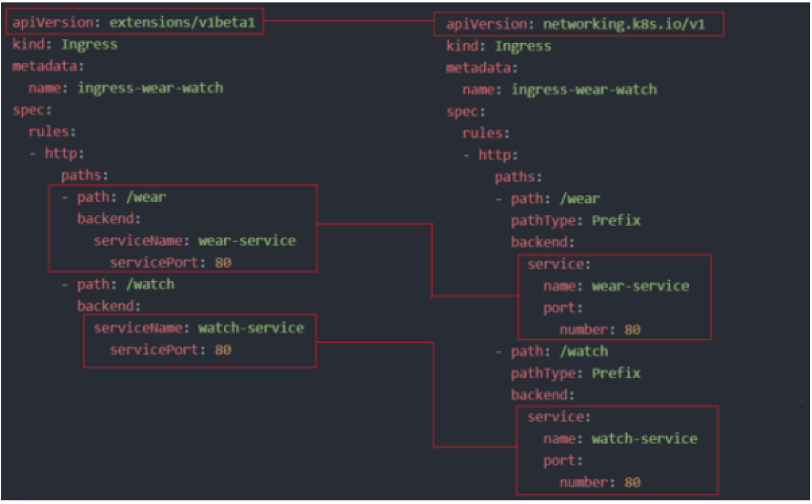

# 3.24 - Ingress

- To understand the importance of Ingress, consider the following example:
  - Suppose you build an application into a Docker image and deploy it as a pod via Kubernetes.
  - Due to the application's nature, set up a MySQL database and deploy a clusterIP service -> allows app-database communications.
- To expose the app or external access, one needs to create a NodePort service.
  - App can then be accessed via the Node's IP and the port defined.
- To access the URL, users need to go to `http://<node ip>:<node port>`
- This is fine for small non-production apps, it should be noted that as demand increases, the replicaSet and service configuration can be altered to support load balancing.

- For production, users wouldn't want to have to enter an IP and port number every time, typically a DNS entry would be created to map to the port and IP.
- As service node ports can only allocate high numbered ports (`> 30000`):
  - Introduce a proxy server between DNS cluster and point it to the DNS server.

- The above steps are applicable if hosting an app in an on-premise datacenter.
- If working with a public cloud application, NodePort can be replaced by `LoadBalancer`
  - Kubernetes still performs NodePort's functionality AND sends an additional request to the platform to provision a network load balancer.

- The cloud platform automatically deploys a load balancer configured to route traffic to the service ports of all the nodes.

- The cloud provider's load balancer would have its own external IP
  - User request access via this IP.

- Suppose as the application grows and a new service is to be added, it's to be accessed via a new URL.
  - For the new application to share the cluster resource, release it as a separate deployment.
  - Engineers could create a new load balancer for this app, monitoring a new port
    - Kubernetes automatically configures a new load balancer on the cloud platform of a new IP.

- To map the URLs between the 2 new services, one would have to implement a new proxy server on top of those associated with the service.
  - This proxy service would have to be configured and SSL communications would have to be enabled.

- This final proxy could be configured on a team-by-team basis, however would likely lead to issues.

---

- The whole process outlined above has issues, on top of having additional proxies to manage per service, one must also consider:
  - **Cost:** Each additional Load Balancer adds more expense.
  - **Difficulty of Management:** For each service introduced, additional configuration is required for both firewalls and proxies
    - Different teams required as well as time and "person" power.

- To work around this and collectively manage all these aspects within the cluster, one can use Kubernetes Ingress:
  - Allows users access via a single URL
  - URL can be configured to route different services depending on the URL paths.
  - SSL security may automatically be implemented via Ingress
  - Ingress can act as a layer 7 load balancer built-in to Kubernetes clusters
    - Can be configured to act like a normal Kubernetes Object.

- **Note:** Even with Ingress in place, one still needs to expose the application via a NodePort or Load Balancer -> this would be a 1-time configuration.

- Once exposed, all load balancing authenticaiton, SSL and URL routing configrations are manageable and viewable via an Ingress Cotnroller.

- Ingress controllers aren't set up by default in Kubernetes, example solutions that can be deployed include:
  - GCE
  - NGINX
  - Traefik

- Load balancers aren't the only component of an Ingress controller, additionaly functionalities are available for monitoring the cluster for new Ingress resources or definitions.

- To create, write a definition file:

```yaml
apiVersion: extensions/v1beta1
kind: Deployment
metadata:
  name: nginx-ingress-controller
spec:
  replicas: 1
  selector:
    matchLabels:
      name: nginx-ingress
  template:
    metadata:
      labels:
        name: nginx-ingress
    spec:
      containers:
      - name: nginx-ingress-controller
        image: <nginx ingress controller url>
        args:
        - /nginx-ingress-controller
        - --configmap=$(POD_NAMESPACE)/nginx-configuration
        env:
        - name: POD_NAME
          valueFrom:
            fieldRef:
              fieldPath: metadata.name
        - name: POD_NAMESPACE
          valueFrom:
            fieldRef:
              fieldPath: metadata.namespace
        ports:
        - name: http
          containerPort: 80
        - name: https
          containerPort: 443
```

- **Note:** As working with Nginx, need to configure options such as log paths, SSL settings, etc.
  - To decouple this from the controller image, write a separate config map definition file to be referenced:
    - Allows easier modification rather than editing one huge file.

- An ingress service definition file is also required to support external communicationL

```yaml
apiVersion: v1
kind: Service
metadata:
  name: nginx-ingress
spec:
  type: NodePort
  ports:
  - port: 80
    targetPort: 80
    protocol: TCP
    name: http
  - port: 443
    targetPort: 443
    protocol: TCP
    name: https
  selector:
    name: nginx-ingress
```

- The service NodePort definition above links the service to the deployment.

- As mentioned, Ingress controllers have additional functionality available for monitoring the cluster for ingress resources, and apply configurations when changes are made

- For the controller to do this, a service account must be associated with it:

```yaml
apiVersion: v1
kind: ServiceAccount
metadata:
  name: nginx-ingress-serviceaccount
```

- The service account must have the correct roles and role-bindings to work.

- To summarise, for an ingress controller, the following resources are needed:
  - Deployment
  - Service
  - ConfigMap
  - ServiceAccount

- Once an ingress controller is in place, one can create ingress resources:
  - Ingress resources are a set of rules and configurations applied to an ingress controller, linking it to other Kubernetes objects.

- For example, one could configure a rule to forward all traffic to one application, or to a different set of applications based on a URL.
- Alternatively, could route based on DNS.
  - As per, ingress resources are configured via a destination file

```yaml
apiVersion: extensions/v1beta1
kind: Ingress
metadata:
  name: ingress-cluster
spec:
  backend:
    serviceName: wear-service
    servicePort: 80
```

- **Note:** For a single backend like above, no additional rules are required.
- The ingress resource can be created via standard means i.e. `kubectl create -f ....`

- To view ingress resource: `kubectl get ingress`
- To route traffic in a conditional form, use ingress rules e.g. routing based on DNS
- Within each rule, can configure additional paths to route to additional services or applications.

- To implement, adhere to the principles outlined in the following 2-service example:

```yaml
apiVersion: extensions/v1beta1
kind: Ingress
metadata:
  name: ingress-cluster
spec:
  rules:
  - http:
      paths:
      - path: /wear
        backend:
            serviceName: wear-service
            servicePort: 80
      - path: /watch
        backend:
            serviceName: watch-service
            servicePort: 80
```

- Create the ingress resource using `kubectl create -f ...` as per usual.

- To view the ingress's detailed information: `kubectl describe ingress <ingress name>`

- **Note:** In the description, a default backend is described. <br> In the event a user enters a path not matching any of the rules, they will be redirected to that backend service (which must exist!).

- If wanting to split traffic via domain name, a definition file can be filled out as normal, but in the spec, the rules can be updated to point to specific hosts instead of paths:

```yaml
...
rules:
- host: <url 1>
  http:
    paths:
    - backend:
        serviceName: <service name 1>
        servicePort: <port 1>
- host: <url 2>
  http:
    paths:
    - backend:
        serviceName: <service name 2>
        servicePort: <port 2>
...
```

- When splitting by URL, had 1 rule and split the traffic by 2 paths
- When splitting by hostname, used 2 rules with a path for each.

- **Note:** If not specifying the host field, it'll assume it to be a `*` and / or accept all incoming traffic without matching the hostname
  - Acceptable for a single backend

## Additional Reading - Latest Kubernetes Versions



- in k8s version 1.20+ we can create an Ingress resource from the imperative way like this:-
  - Format - kubectl create ingress <ingress-name> --rule="host/path=service:port"
  - Example - `kubectl create ingress ingress-test --rule="wear.my-online-store.com/wear*=wear-service:80"`
  - Find more information and examples in the below reference link:
    - https://kubernetes.io/docs/reference/generated/kubectl/kubectl-commands#-em-ingress-em-
- **References:**
  - https://kubernetes.io/docs/concepts/services-networking/ingress
  - https://kubernetes.io/docs/concepts/services-networking/ingress/#path-type

### Ingress - Annotations and Rewrite-Target

- Different ingress controllers have different options that can be used to customise the way it works. NGINX Ingress controller has many options that can be seen [here](https://kubernetes.github.io/ingress-nginx/examples/).
- I would like to explain one such option that we will use in
our labs. The[Rewrite target](https://kubernetes.github.io/ingress-nginx/examples/rewrite/) option.

- Our watch app displays the video streaming webpage at `http://<watch-service>:<port>/`
- Our wear app displays the apparel webpage at `http://<wear-service>:<port>/`
- We must configure Ingress to achieve the below. When user visits the URL on the left, his request should be forwarded internally to the URL on the right.
  - Note that the `/watch` and `/wear` URL path are what we configure on the ingress controller so we can forwarded users to the appropriate application in the backend.
  - The applications don't have this URL/Path configured on them: <br> `http://<ingress-service>:<ingress-port>/watch -> http://<watch-service>:<port>/` <br> `http://<ingress-service>:<ingress-port>/wear -> http://<wear-service>:<port>/`

- Without the rewrite-target option, this is what would happen:
  - `http://<ingress-service>:<ingress-port>/watch` -> `http://<watch-service>:<port>/watch`
  - `http://<ingress-service>:<ingress-port>/wear -> http://<wear-service>:<port>/wear`
- Notice watch and wear at the end of the target URLs. The target applications are not configured with /watch or /wear paths.
  - They are different applications built specifically for their purpose, so they don't expect `/watch` or `/wear` in the URLs.
    - As such the requests would fail and throw a 404 not found error.
- To fix that we want to **"ReWrite"** the URL when the request is passed on to the watch or wear applications.
- We don't want to pass in the same path that user typed in. So we specify the `rewrite-target` option.
  - This rewrites the URL by replacing whatever is under `rules->http->paths->path` which happens to be `/pay` in this case with the value in rewrite-target. This works just like a search and replace function.
- For example: replace(path, rewrite-target)
  - In our case: replace(`"/path"`,`"/"`)

```yaml
apiVersion: extensions/v1beta1
kind: Ingress
metadata:
  name: test-ingress
  namespace: critical-space
  annotations:
    nginx.ingress.kubernetes.io/rewrite-target: /
spec:
  rules:
  - http:
    paths:
    - path: /pay
      backend:
        serviceName: pay-service
        servicePort: 8282
```

In another example given here, this could also be:
`replace("/something(/|$)(.*)", "/$2")`

```yaml
apiVersion: extensions/v1beta1
kind: Ingress
metadata:
  annotations:
    nginx.ingress.kubernetes.io/rewrite-target: /$2
  name: rewrite
  namespace: default
spec:
  rules:
  - host: rewrite.bar.com
    http:
      paths:
      - backend:
          serviceName: http-svc
          servicePort: 80
        path: /something(/|$)(.*)
```