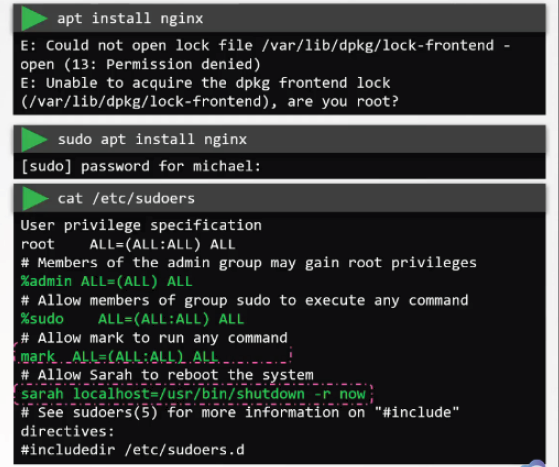
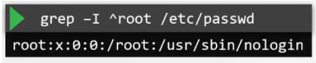

# 4.5 - Privilege Escalation in Linux

- Following disabling of root user access via ssh, need to consider when users may need root / administrative access credentials; this is provided by the `sudo` functionality (prefixed before any command)
- Default configuration for sudo is under `/etc/sudoers`; it can only be edited via `visudo`
- The sudoers file defines user privileges for `sudo`

- Administrators can give granular permissions
  - User mark has all permissions
  - User sarah has sudo permissions only for restarting the system
- Any sudo commands ran are executed in the users local shell rather than root shell -> can eliminate the need for ever logging in as a root user directly
- This can be done by editing the `/etc/passwd` for root user like below

- Sudoers syntax
  - Anything beginning with `# or $` is a comment
  - Content split into fields:
    - User or group the privilege(s) are to be granted to,
      - Groups are prefixed with `%`
    - Host the user can make use of the privileges on
      - By default, set to all, applies to localhost in most cases
    - Users and Groups the user in field 1 can run the command as
    - Command(s) runnable by the user(s) via `sudo`