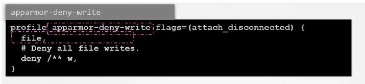
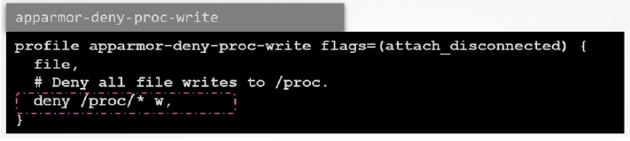

# 4.16 - AppArmor

- Although Seccomp works well to restrict the syscalls a container makes (or pods/objects in Kubernetes), it cannot be used to restrict a programs access to objects like files and directories.
- **Apparmor** = Linux Security module, used to confine a program to a limited set of resources
  - Installed by default for most distributions
  - Use systemctl status apparmor to check status
  - To use, the associated Kernel module must first be loaded on all nodes
where containers can run
    - Check enabled file under: `/sys/module/apparmor/parameters/enabled`   Shows Y or N depending on enablement
  - Similar to Seccomp, apparmor is applied via profiles, which must be loaded into the Kernel; checkable via `/sys/kernel/security/apparmor/profiles`
  - Profiles are simple text files that determines what capabilities are allowed or restricted

- **Example:**

- Above contains two rules:
  - File -> allow file system -> allows complete access to filesystem
  - Deny rule -> denies write access to all files under root system including subdirectories

- **Example 2: Deny Write Access to Only Files Under a Particular Subdirectory**

- Apparmor profiles can be created via various tools
- The status of the profiles loaded can be checked using aa-status
- Profiles can be loaded in 3 modes:
  - Enforce - Apparmor will enforce the rules on any application that fits the profile
  - Complain - Apparmor will allow the actions without restrictions but the actions are logged as events
  - Unconfined - Any tasks are allowed and no logging occurs
