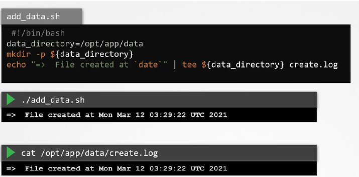

# 4.17 - Creating AppArmor Profiles

- Example Script used in lecture - creates a directory and writes a file to said directory, the event of creation is logged in "create.log"

- Tools provided by apparmor can be used to facilitate the creation of apparmor profiles
- To install the utilities for apparmor: `apt-get install -y apparmor-utils`
- Once done, can generate a profile via: `aa-genprof /path/to/script.sh`
  - This prepares apparmor to develop an accurate profile by scanning the system during the application's runnin
  - Once the application has run in a separate window, in the original window, enter "S" to scan the system for AppArmor events
    - This will generate a series of questions that the user must answer to help develop the profile
- E.g. for the example above, need to think about allowing the script access to the mkdir command or the tee command
  - Each event is reviewed on severity level of 1-10 (10 = most severe)
  - Resultant actions can be allowed/denied/inherited etc as required
  - The new profile can be viewed and validated by `aa-status`
  - The profiles are stored under `/etc/apparmor.d/`
- It's often advised to rerun the application with slightly different parameters to check the enforcement of the apparmor profile.
- To load a profile:
  - `apparmor_parser path/to/profile`
    - No output = success
- Disable profile:
  - `apparmor_parser -R path/to/profile`
    - No output = success
  - Need to create a symlink to the profile and the apparmor disable directory:
    - `ln -s /path/to/profile /etc/apparmor.d/disable/`