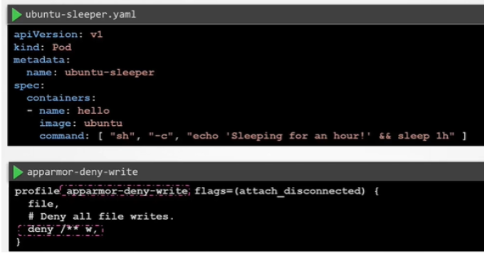

# 4.18 - AppArmor in Kubernetes

- AppArmor can also be used to restrict the functions of containers orchestrated by Kubernetes
- At the time of writing / when the recording was done, Kubernetes support for it was in beta
- **Prerquisites:**
  - The AppArmor Kernel module must be enabled on all nodes in the K8s
cluster where pods are expected to run
  - AppArmor profiles must be loaded in the Kernel
  - The container runtime should support AppArmor - Generally expected,
Docker know to support.
- **Example:**



- Ensure that the profile is loaded on all the nodes with aa-status if the profile is listed
in the required director
- As the support is only in beta, need to link it by annotations:

  ```yaml
  ...
  metadata:
    annotations: container.apparmor.security.beta.kubernetes.io/<container_name>:localhost/<profile name>
  ...
  ```

- When the pod is created, you can inspect and test the pods capabilities to test the profile enforcement.
