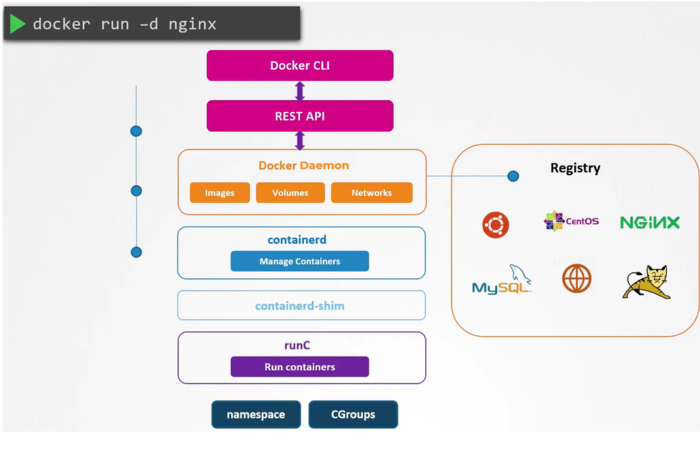

# 5.11 - Runtime Classes

- When running a container, the following steps from Docker CLI are applied

1. Docker client converts command to a REST API
2. REST API request passed to Docker Daemon
3. If the image is not present in the local system, it is pulled from the Docker registry
4. The call is made to containerd to start the container -> containerd converts image to OCI-compliant bundle
5. The OCI-compliant bundle is passed to the containerd-shim, triggering the runtime runC to start the container
6. RunC interacts with the Kernel's namespaces and CGroups on the Kernel to create the container

- RunC is referred to the default container runtime and adheres to OCI standards for format and runtime
- With runc installed on a server, containers could be ran on their own via `runc run <image>`
  - Without docker's features e.g. image management, managing the container would be very tough
  - runC is the default container runtime for many container systems
- Kata and gVisor use their own runtimes that are OCI-compatible
  - The OCI-compatibility means that kata and runsc (gvisor) could be used with
Docker without issue by adding a `--runtime <runtime>` to the `docker run` command.