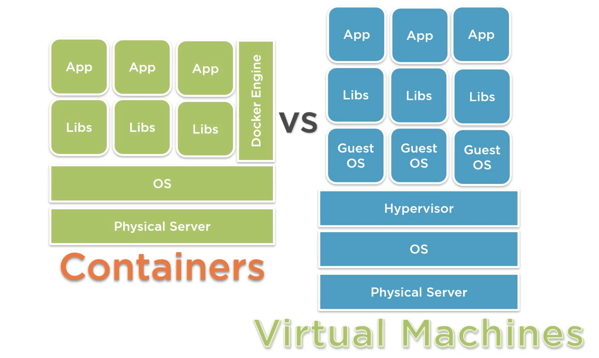

# 1.0 - Introduction

## 1.1 - Containers and Kubernetes Overview

- **Containers:**
  - An abstraction of the application layer in an isolated user-space instance
  - Share the OS Kernel Storage and Networking from the host they run on
  - Can be thought of like the core components needed for an application running as a process.
  - Allow the packaging of an application and its dependencies in one instance.
  - Allows engineers to develop applications into a repeatable and lightweight manner.
  - Allows applications to integrate more easily with CI/CD pipelines, providing greater flexibility and agility.

- Because the containers share the OS Kernel storage, etc. and do not require a hypervisor or leverage a guest operating system, they are more lightweight and easier to deploy than virtual machines.

- If using Docker as the container runtime, common commands include:
  - Login to Dockerhub: `docker login localhost`
  - Run a hello world container: `docker run hello world`

- **Kubernetes:**
  - Open-source container orchestration platform.
  - Used to automate, deploy, manage and scale workloads
  - Abstracts the complexity of a multi-container environment
  - Combines compute, networking and storage components that hundreds (or more) containers rely on.
  - Works on a declarative management model - users describe the desired configuration for deployment.
    - It's this which ArgoCD aims to enforce.

## 1.2 - Helm and Kustomize Overview

**Helm:**

- Package manager for Kubernetes - apps are packaged into charts for deployments
- A deployment tool for automating creation, pacakging, configuration and deployment of apps and configurations to Kubernetes clusters.

**Kustomize:**

- A standalone tool to customize the creation of Kubernetes objects through a file called `kustomization.yaml`
- A template-free way to customize application configuration that is built into kubectl.
- Traverses a Kubernetes manifest to add, remove or update configuration options without forking or actual YAML files.

## 1.3 - GitOps Core Concepts

## 1.4 - ArgoCD Overview

## 1.5 - ArgoCD Core Concepts and Architectures

## 1.6 - Supported Tooling with ArgoCD