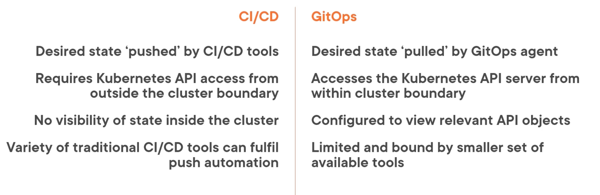
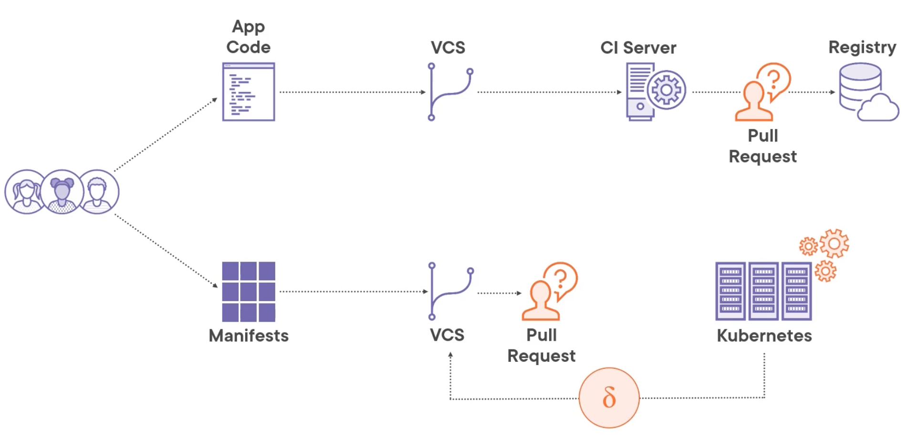

# 2.0 - Using the GitOps Approach for Automating Deployments

- [2.0 - Using the GitOps Approach for Automating Deployments](#20---using-the-gitops-approach-for-automating-deployments)
  - [2.1 - GitOps Principles](#21---gitops-principles)
  - [2.2 - GitOps in the Wild](#22---gitops-in-the-wild)
  - [2.3 - Introducing Flux](#23---introducing-flux)
    - [Note](#note)
    - [Toolkit Components](#toolkit-components)
    - [Flux CLI](#flux-cli)
  - [2.4 - Installing Flux](#24---installing-flux)

## 2.1 - GitOps Principles

- GitOps is a discipline governed by a set of principles that:
  - Uses version-controlled, declarative configuration to describe a desired state
  - Establishes the desired state in a target system through the use of software automation

- **Key Principles:**
  - **Declarative:** A system managed by GitOps must have its desired state expressed declaratively in a common syntax.
    - Done by usage of a common syntax
    - Supports human readability, code ingestible-ness, and recovery.
  - **Versioned and Immutable:** The desired state is stored in a way that enforces immutability, versioning and retains a complete version history
    - Helps avoid configuration drift, allow for rollbacks, and auditing of a changelog.
  - **Pulled Automatically:** Software agents automatically pull the desired state declarations from source.
    - Pull can be achieved by ways including: source polling, webhook triggers, and image reflections
  - **Continuous Reconcilliation:** Software agents continuously observe actual system state and attempt to apply the desired state.
    - Software agents supporting GitOps continuously observe the actual state to ensure the desired state is applied.

## 2.2 - GitOps in the Wild

- GitOps is not only for Kubernetes, but has grown significantly in this area.
- Desired state storage does not have to be git-based, it could be helm charts or S3-compatible storage.
- GitOps doesn't replace CI/CD pipelines, rather supports them.

- **CI/CD vs GitOps:**

- **GitOps Workflow**

- Sample tools:
  - Jenkins X
  - ArgoCD
  - Flux

## 2.3 - Introducing Flux

- Flux is implemented as a set of Kubernetes controllers that implement the GitOps principles as defined by the GitOps project
- It handles configurations provided by YAML, Kustomize Overlays, or Helm charts to achieve the desired state.
- Offers optional support for monitoring repositories in single container registries for new application images
- Can be used with other tools to support automated progressive deployments e.g. canary releases or blue/green deployments.

### Note

- Flux v2 is predated by an earlier, much different solution for GitOps, titled Flux v1.

- The different controllers that comprise the Flux solution, are also collectively known as the GitOps toolkit

### Toolkit Components

- **Source Controller:** Responsible for fetching the desired state from a suitable source e.g. Git repository, S3 Bucket, etc.
  - It will periodically check the source for any changes to the desired state.
- **Kustomize Controller:** Reconciles the differences between the current and desired state.
  - Generates and validates manifests before application (if configuration is defined in Kustomize overlays)
- **Helm Controller:** Similar to the Kustomize controller, but focuses on using Helm charts for deployment
- **Notification Controller:** Receives events from systems outside the cluster and allows the events to be processed by other members of the GitOps toolkit.
  - Can also send out alerts from other GitOps toolkits to external tools e.g. deployment success/failures to Slack
- **Image Reflector Controller:** Monitors specific container repositories and reflects the tags used within the cluster.
- **Image Automation Controller:** Writes the latest available tag to the manifest, which is committed and pushed to source.

### Flux CLI

- A fully-featured CLI utility for working with the GitOps toolkit and for managing GitOps workflows.
- Supports:
  - **Provisioning** - Enables flux to be bootstrapped to an existing cluster
  - **Management** - Allows for ongoing management of a Flux deployment
  - **Querying** - Provides a means for retrieving status information.

## 2.4 - Installing Flux

- Flux can be installed via either:
  - Flux CLI
  - Flux Helm Chart
  - Flux Kubernetes Manifests

- Installing via the Flux CLI is advised as it:
  - Allows bootstrapping of the GitOps toolkit
  - Establishing the 'Single Source of Truth'

- **Note:** Instructions were done on a K3D Cluster.

- Install the Flux CLI via the following [link](https://fluxcd.io/flux/cmd/).
- Bootstrap and install subcommands offered, the bootstrap will in addition to the installation, create a remote repository to store the toolkit component configuration
  - Allows Flux to effectively manage itself according to GitOps principles.

- Check the env meets the prerequisites: `flux check --pre`
- A Github PAT token is needed for the bootstrap repo - it needs to be used as a private repo.
- Set via `export GITHUB_TOKEN="$(cat /path/to/file)"`
- Run: `flux bootstrap github --repository <repository name> --owner <github username> --personal true --components-extra=image-reflector, image-automation-controller`

-
