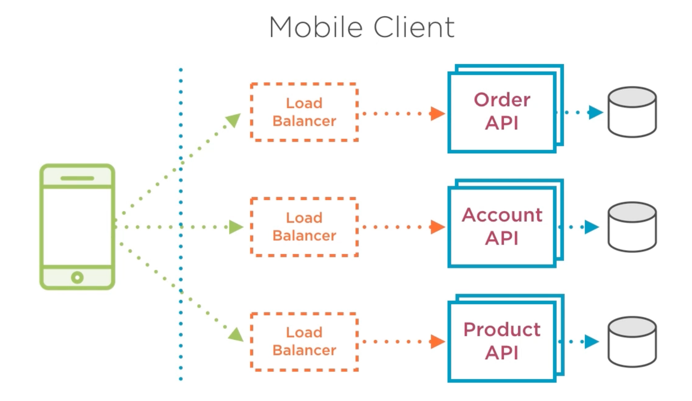
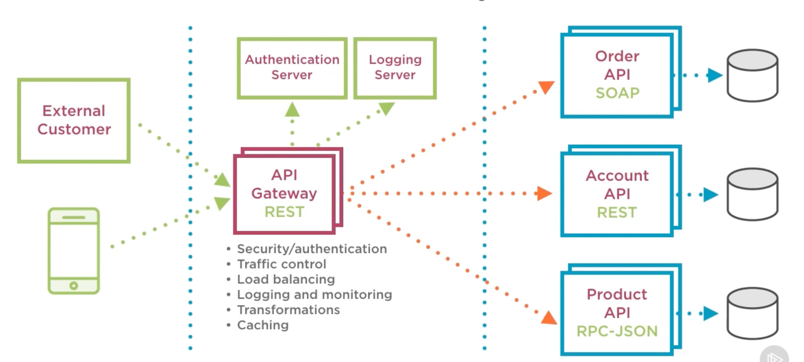

# 6.0 - How to Centralize Access to Microservices Using an API Gateway

- [6.0 - How to Centralize Access to Microservices Using an API Gateway](#60---how-to-centralize-access-to-microservices-using-an-api-gateway)
  - [6.1 - Introduction](#61---introduction)
  - [6.2 - Need for Centralized Access](#62---need-for-centralized-access)
  - [6.3 - API Gateway](#63---api-gateway)
  - [6.4 - API Gateway Example](#64---api-gateway-example)
  - [6.5 - Kong API Gateway](#65---kong-api-gateway)

## 6.1 - Introduction

- Centralizing access to microservices = central component to route to separate microservices
  - Typically defined as an API gateway
  - Avoids separate access to microservices

- Microservices support decoupled architecture, such that components can independently be changed and deployed.
  - Now that the functionality is distributed, it becomes more complex to update records, multiple APIs may have to be called e.g. for an ecommerce app, orders and stock levels
  - Data is distributed across the architecture - each microservice has its own data that is likely managed by its own API(s).
  - Security is distributed at a microservice level.
- Each of the above complexities must be managed by client applications:
  - Consolidating API data, functionalities, and managing security.

- API gateways aim to resolved this by centralizing these various components being managed.

## 6.2 - Need for Centralized Access

- Considering the architecture above, the mobile client application has to remember endpoints for each API required e.g. order, account and product, to manage and work with data.
  - With this, credentials will need to be supplied each time.
  - This reduces performance and may result in coupling or duplication of efforts.
  - Eventually this will also reduce customer experience.

## 6.3 - API Gateway

- A component to provide access to APIs; it's an API in itself, consumed by client applications.
- Typically defined as a RESTful API
  - Provides a number of endpoints for the client applications and external consumers to call
  - Gateway takes in this traffic and routes it to the appropriate microservice
- Can also offer:
  - Security/authentication
  - Traffic control
  - Load balancing
  - Logging and monitoring
  - Transformations
  - Circuit Breaker
  - Caching

## 6.4 - API Gateway Example

## 6.5 - Kong API Gateway

- Advised to use POSTman for API calls.
- Kong is an open-source API gateway
- Offers additional plugins for functionality e.g authentication and traffic control.
  - A popular one is the Correlation ID plugin, to help track requests through multiple APIs.
- Kong has a built-in admin API callable via curl, or a separate package called Kong Dashboard can be used.

- Configuration can be easily managed in the dashboard, covering timeouts and allowed methods, amongst other parameters.
