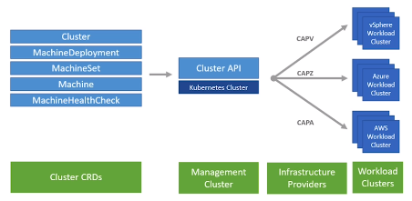
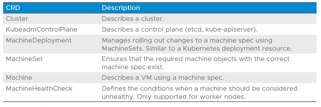
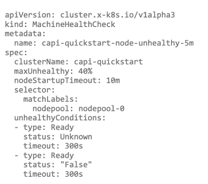
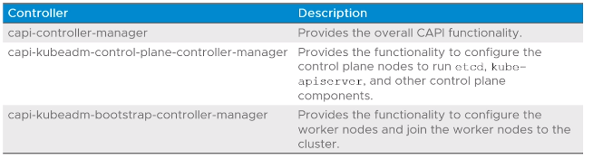
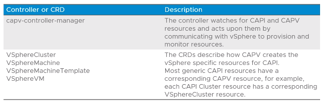

# 1.5 - Cluster API

- [1.5 - Cluster API](#15---cluster-api)
  - [Objectives](#objectives)
  - [Introduction](#introduction)
  - [Cluster API Custom Resource Definitions (CRDs)](#cluster-api-custom-resource-definitions-crds)
  - [Machine Health Checks](#machine-health-checks)
  - [Cluster API Components](#cluster-api-components)
    - [Bootstrap Provideers](#bootstrap-provideers)
    - [Infrastructure Providers](#infrastructure-providers)
  - [Cluster API Controllers](#cluster-api-controllers)
    - [vSphere Cluster API Provider (CAPV)](#vsphere-cluster-api-provider-capv)
  - [Summary](#summary)

## Objectives

- Describe Cluster API
- List infrastructure providers
- Detail Cluster API controllers
- List the Cluster API Custom Resource definitions

## Introduction

- Cluster API is a Kubernetes project to provide declarative Kubernetes-styled APIs to cluster provisioning, configuration and management
- Cluster API controllers running on a Kubernetes cluster receives Cluster API definitions that specify the desired state of the new cluster
- They also send requests to the cloud/IaaS provider(s) to create the new cluster by using the required provider configurations.



```shell
CRD = Custom Resource Definition
```

## Cluster API Custom Resource Definitions (CRDs)

- Cluster API provides custom resource definitions (CRDs) to management clusters to help the management cluster know what to deploy to the particular workload cluster(s).



## Machine Health Checks

- Allows cluster API to monitor the health of cluster nodes
- A timeout is specified for each of the conditions that can be checked
- If any of the conditions are met for the duration of the timeout, the machine is remediated
- The action of remediating a machine triggers a new machine to be created to replace the old one.



- **Note: This is equivalent to the traditional Readiness and Liveness probe functionalities available in Kubernetes for deployments.

## Cluster API Components

- Logic in the Cluster API is divided per component
- **Bootstrap providers** - perform the steps to configure and start the Kubernetes processes that make up a cluster
- **Infrastructure providers** - perform the steps to create cloud resources e.g. VMs
  - Basically like how providers work in Terraform

### Bootstrap Provideers

- Responsible for turning a machine into a Kubernetes Node
- Cluster API bootstrap provider `kubeadm` is a bootstrap provider implementation that utilises `kubeadm` to perform machine configuration to set up a Kubernetes Cluster (management in this case).

### Infrastructure Providers

- All in format **CAP<First letter of/associated with IaaS provider>**
- E.g. CAPV = vSphere, CAPA = AWS, CAPD = Docker
- Only some of these are supported by Tanzu Kubernetes Grid 1.3 directly:
  - **CAPV** - vSPhere
  - **CAPA** - AWS
  - **CAPZ** - Azure

## Cluster API Controllers

- Responsible for watching the Kubernetes API for cluster API (CAPI) resources and perform the required steps to provision clusters



**Note:** This is analagous to the traditional kube-system deployments like kube-scheduler, kube-controller-manager, etc.

### vSphere Cluster API Provider (CAPV)

- An infrastructure provider that provides the following controller and custom resource definitions



---

## Summary

- **Note:** Cluster API ONLY runs on the Management Cluster

- **Note:** You can think of them equivalent to the traditional kube-system deployments
